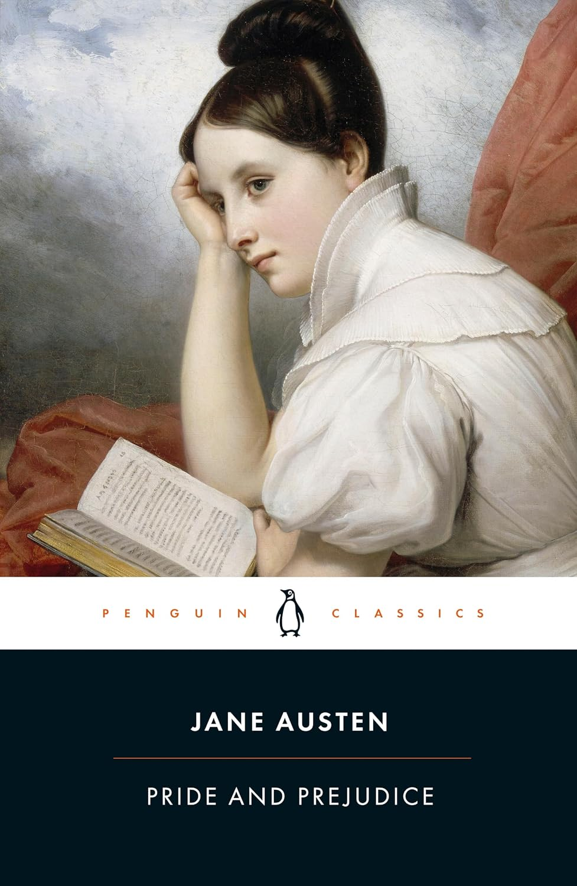
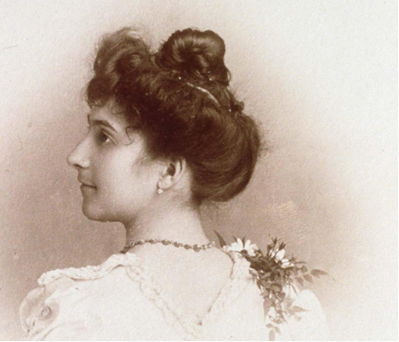

# Unit 5: Estates

<!-- 
**Commentary**
 -->

!!! danger "Kim Comment"

    This week we start with the materials for Week 5, and I am looking forward to reading your TWO discussion posts (which are due by end of day **Tuesday, October 13, 2026** - you have an extra day due to the Thanksgiving holiday on Monday).

    For Unit 5 we are tackling the concept of estates (our first look at "uses"), and you should be well versed in each of the following topics:

    - **Freehold Estates**
        - appreciate the distinction between freehold estates and leasehold estates
        - understand the three types of freehold estates: fee simple, fee tail, and life estates
    - **The Fee Simple**
        - appreciate how fee simple equates to ownership
        - understand how this language creates a fee simple inter vivos transfer "to A and his/her heirs"
        - understand how this language "to A" is modified by statute
        - what are the economic advantages of perpetual ownership rights? do you agree?
    - **Life Estates**
        - understand the difference between pur sa vie and pur autre vie
        - how do the courts decide who has the better claim - i.e. in Re Walker, Re Taylor, and Christensen v Martini Estate?
    - **Powers and Obligations of Life Tenants**
        - what are the rights of life tenants verses the holder of the reversionary or remainder interest?
        - what is the doctrine of waste and how does this apply to life tenants?

    We have one more unit (Unit 6) to complete before the midterm is distributed on **Friday, October 23, 2026 at 9am Pacific** (which is due on Monday, **October 26, 2026 at 5pm Pacific**).

    As a heads up, you will just need to complete **ONE (1) discussion post for Unit 6** (which will be due on Monday, **October 19, 2026**).

**The doctrine of estates** is another foundational feature of real property in the common law system. 

**Tenure** (introduced in Unit 2) permitted what may be described as a vertical division of interests in land between people within a social hierarchy, with the Crown at its apex. 

**The doctrine of estates** permits **a horizontal division** of interests in land, **a division of interests over time**. Unit 5 introduces the two principal categories of estates, **freehold** estates and **leasehold** estates, and then focuses on the two remaining types of freehold estate: the **fee simple and the life estate**. 

We turn to the particular characteristics of **leasehold estates in Unit 10**. 

## 5.1 Freehold Estates

The different estates in the common law are divided into two broad categories: 

- **freehold** estates, and 
- **leasehold** estates. 

A third category, **copyhold** estates, dealt with land held as ‘unfree tenure’ (i.e. where the tenurial obligations were not known in advance) and was **never introduced into Canada**.

There are **three types of freehold** estates: 

- **fee simple**, 
- **fee tail**, and 
- **life estates**. 

The **defining feature** of these freehold estates is that **their duration is defined but their actual length is uncertain**. In other words, the conditions that will cause one of these estates to come to an end are clear, but when and, in the case of fee simple and fee tail estates, if those conditions will arise are unknown. 

By contrast, **a leasehold estate is for a fixed duration**, such as 1 year or 99 years or 999 years, or may be terminated with sufficient notice at any time. We will look at the particular features of leasehold estates in Unit 10.

The characteristic of a freehold estate as defined in length, but also of uncertain length, is perhaps most obvious in a **life estate**. As the name suggests, this is an estate that **is defined by the length of a life**. Its duration is definite in the sense that the circumstances under which the estate will end are clear, but the date at which it will end are unknown.

**The fee simple and the fee tail are both inheritable estates**, meaning that they can be transferred to another party on death. 

- In the case of the fee tail, the pool of potential inheritors was **limited to direct descendants**. 
- The holder of an estate in fee simple is not similarly constrained. In effect, the fee simple estate can be **left to anyone**. 

In terms of their status as freehold estates, **both the estate in fee tail and fee simple have a defined duration**, they end the moment at which there is **nobody to inherit the estate**, but when, or even if that will occur, is unknown.

The idea of the doctrine of estates as parcelling out time in land is perhaps most famously captured in this passage from *Walshingham’s Case*:

the land itself is one thing, and the estate in land is another thing, for an estate in the land is a time in the land, or land for a time, and **there are diversities of estates, which are no more than diversities of time**, 

for he who has a **fee-simple** in land has a time in the land without end, or the land for a time without end, 

and he who has land **in tail** has a time in the land or the land for time as long as he has issues of his body, 

and he who has an estate in **land for life** has no time in it longer than for his own life, and so of him who has an estate in land for the life of another, or for years.

~ *Walsingham’s Case* (1573) 2 Plowd. 547 at 555, 75 ER 805 at 816-17.

**The estate in fee tail no longer exists in Canada.** It was formally abolished in British Columbia in 1921 (*Property Law Ac*, section 10). We focus on the fee simple and the life estate.

!!! note "Activity"

    Read the introduction to the chapter and then the excerpt from Gray and Gray on estates as “the fourth dimension of land” in the *Reader*, **385-391**. 

As Gray and Gray indicate, owners of land are, in the common law, owners of estates in land:

The notional entity of the estate was interposed between the tenant and the land, with the consequence that each tenant owned (and still owns) not land itself but an estate in land, each estate being graded with reference to its temporal duration. (387)

**The doctrine of estates displaces the possibility of absolute or allodial title in the common law.** 

The effect is to put the focus on relationships between people with respect to land and to avoid, as Gray and Gray put it, “the absolutist dogma that a person could have any direct relation of ownership with physical land” (386). 

**Only the Crown holds something resembling allodial title**, although the Crown’s interest is labelled “radical title” and amounted to what we might understand as territorial sovereignty rather than beneficial ownership. The Crown was sovereign such that all interests in land within the common law derived from the Crown. 

- The doctrine of tenure (discussed in Unit 2) described the **quality of the interest in terms of the obligations owed**; 
- the doctrine of estates defines the **quantity of the interest in terms of time**.

## 5.2 Fee Simple

**A. Introducing the Fee Simple**

The estate in fee simple is the largest interest in land in the common law. To hold an estate in fee simple is to come **as close to absolute ownership** as is possible in the common law. 

“**Fee**” describes an estate that is **inheritable**， it can be transferred to another party on death. “**Simple**” signifies that the property can descend to the largest range of heirs contemplated by the law. In other words, there are the **fewest restrictions on who can inherit** the interest. The person who holds the fee simple interest in a parcel of land is commonly understood as its “owner”.

!!! note "Activity"

    Read the excerpt from Richard Ellickson on the economic advantages of perpetual ownership rights in the *Reader*, **391-393**. 

What do you think Ellickson means when he describes the fee simple as “a low transaction cost device” for ensuring the conservation of resources?

But the preeminent advantage of an infinite land interest is that it is a low transaction cost device for inducing a mortal landowner to conserve natural resources for future generations…

The fee simple in land cleverly harnesses human selfishness to the cause of altruism toward the unborn, a group not noted for its political clout or bargaining power.

Think back to the material in Unit 1 on the justifications for private property. Ellickson is drawing on which justification?

!!! note "Activity"

    Then read Jessica Shoemaker’s deconstruction of the fee simple (pages **393-95**) in which she points to the distributional consequences of an initial grant of “forever rights” and the social consequences of an abstract conception of ownership detached from the physical land.

**B. Transferring Fee Simple Interests**

The discussion of gifts in Unit 4 focussed on the importance of delivery. However, most *inter vivos* (between living parties) transfers of interests in land, including transfers of the fee simple interest, occur by contract. There are **two key stages in the transfer of land**:

- a **contract** of purchase and sale; and
- the **transfer**.

The key elements in the contract are the:

- parties (seller and buyer);
- property;
- price; and
- **completion date** (the date at which the transfer occurs).

You will find each of these elements in the standard form contract for the purchase and sale of land in British Columbia.

In British Columbia’s title registration system, **the transfer instrument for a fee simple interest** is a document known as the **Form A**. The basic responsibility of **the vendor** in the transfer of a fee simple interest is **to deliver clear and unencumbered title, represented by the Form A, to the purchaser.** For their part, the purchaser must transfer the purchase price to the vendor.

The vendor and the purchaser sign the contract of purchase and sale, but **only the vendor signs the Form A**, which serves as the transfer instrument. **A lawyer or notary must also witness the vendor’s signature.** 

- **At common law, the transfer occurs when the transfer instrument is signed and sealed by the vendor and delivered to the purchaser.** 

    Stevie Wonder immortalized this moment in **“Signed, Sealed, Delivered, I’m Yours”**, although he was signing about interests of the heart, not land. Take a break and listen to the incomparable Stevie Wonder.

    **Before title registration systems**, the transfer instrument was known as a **title deed**. The Form A is a standardized and much simplified version of a title deed.

- **In a title registration system**, where interests in land are recorded in a central registry and the state guarantees the veracity of that registry, **the transfer of a fee simple interest occurs at the moment when the purchaser registers the Form A signed by the vendor.** The title registration is the focus of Unit 7 and you do not need to focus on its detail in this unit.

!!! note "Activity"

    Find the Form A for freehold or fee simple transfers in the list of forms provided by the Land & Title Survey Authority, which manages the title registration system in British Columbia.

    Then read the excerpted version of ***Thomas v Murphy*** from New Brunswick’s Court of Queen’s Bench, and the first two comments that follow it in the *Reader*, **395-398**. 

The case involves a disputed title deed and the nature of the interest conferred. Note the crucial distinction outlined in the case between **“words of purchase”** and **“words of limitation.”** 

- The words of purchase describe the recipient of the interest; 
- the words of limitation denote the duration of the interest. 

The vendors who sold to Thomas had themselves acquired their interest from a deed under a will with the following terms:

> To have and to hold the said lot, piece and parcel of land and premises hereby granted, bargained and sold, or meant, mentioned or intended so to be, and every part and parcel thereof with the appurtenances unto the said Grantees... their successors and assigns for the purpose of granting, bargaining, selling, alienating, releasing and conveying by Deed the lands and premises hereinabove described...

!!! danger ""

    Thomas' lawyer, Murphy, had provided Thomas with an opinion that the vendors had the fee simple interest to transfer. However, what words were missing?

    **Answer:** "and heirs"

The court ruled that the strict rule of law, **only the words “and heirs” transfer a fee simple interest, is relaxed where the transfer occurs in a will** rather than an *inter vivos* transfer. Instead of a rule of law, the court adopted **a rule of construction, which creates a presumption that can be rebutted with evidence of intention.**

The important distinction between words of purchase and words of limitation is revealed in the ancient *D’Arundel’s Case* (1225), at 398. The snippet that remains of this dispute makes it clear that **Radulf**, the “son and heir”, received nothing, at least not from the initial transfer of the property interest to his father. Why? Because the language of “son and heir” in the grant to **Roger** (Radulf’s father) is included only to denote the nature of the interest that Roger acquired, the estate in fee simple, and not to grant anything to the son.

!!! note "Activity"

    You will see reference to statutory changes to the common law in New Brunswick in ***Thomas v Murphy***. There is also an explanation of the changes in note 3 of the *Reader*, **398-399**.

Review a similar set of changes in British Columbia in:

- the *Property Law Act*, [RSBC 1996, c 377](https://www.bclaws.gov.bc.ca/civix/document/id/complete/statreg/96377_01){:target=" \_blank"}, ss 10 & 19;
- the *Wills, Estates and Succession Act*, [SBC 2009, c 13](https://www.bclaws.gov.bc.ca/civix/document/id/complete/statreg/09013_01){:target=" \_blank"}, s 41(3); and
- the *Land Title Act*, [RSBC 1996, c 250](https://www.bclaws.gov.bc.ca/civix/document/id/complete/statreg/96250_00){:target=" \_blank"}, s 186(4) - (8).

!!! danger ""

    After the statutory changes in British Columbia, if the person who holds a fee simple interest makes an *inter vivos* transfer and uses the words “to A” in the transfer instrument, without words of limitation, then what interest transfers?

    **Answer:** the estate in fee simple.

## 5.3 Life Estates

Life estates are the least of the freehold estates, meaning they are of a shorter duration than either the fee simple or the fee tail, both of which are inheritable interests. **A life estate (but for one exception discussed below) is not an inheritable estate.**

At common law no special language is required to create a life estate. Indeed, a failed attempt to transfer a fee simple interest created a life estate. However, the statutory changes, the *Property Law Act*, [RSBC 1996, c 377](https://www.bclaws.gov.bc.ca/civix/document/id/complete/statreg/96377_01){:target=" \_blank"}, **section 19(2)** in particular, 

create a **presumption** that the transferor transfers the fee simple interest (or largest estate held by the transferor) unless expressly stated otherwise.

As a result, it is now important that the language in a transfer instrument indicate clearly the intention to create a life estate.

The language creating a life estate is not complicated:

"to A for life"

This creates a life estate *pour sa vie*: **an estate for the life of the person holding the interest.**

The other type of life estate, a life estate *pour autre vie*, is created when the measuring life, *cestui que vie*, is other than the life of the person who holds the estate. Such an estate can be created with the following language:

"to A for the life of B"

A life estate *pour autre vie* is an **inheritable estate**. In this case, on A’s death the estate would go to A’s heirs, but the estate still only lasts for the life of B. Here the words “for the life of B” are understood as the words of limitation. As a result, B does not acquire anything, even when A dies. B is simply the life that defines the life estate.

Life estates are usually carved out of a larger fee simple interest. Remember that we are dealing with time in the land when discussing estates. **A fee simple has the potential to last forever; a life estate will last for the measuring life.** 

When a life estate is carved out of a fee simple, **what do we call that interest which is not part of the life estate?** 

- Where there is no instruction about what happens when the life estate ends, then the right of possession reverts to the transferor: the transferor holds **a reversionary interest**. 
- Where there is a grant of a life estate and an additional grant of the fee simple on to someone else when the life estate ends, then the additional grant is known as the **remainder interest.** 
    - In this example, “to Pepper for life and then to Eleanor and her heirs”, Pepper holds a life estate, Eleanor holds the remainder in fee simple.

!!! note "Activity"

    Read the excerpts from Re Walker, Re Taylor, and ***Christensen v Martini Estate*** in the *Reader*, **399-412**, each of which deal with the issue of repugnancy within a will.

Although the statutory changes have modified the common law, they have not eliminated problems associated with poor drafting. **What occurs when two conflicting provisions are contained in a will?** For example, what happens when an estate or portion thereof is left to one person, but apparently also to another? The courts must decide which party has the better claim.

How do the courts respond when a second set of instructions about the disposition of property appears repugnant to the first? Note that the **guiding rule is to give effect to the testator’s intention.** In searching for intention, the courts will turn to the will as a whole and even, in the case of ***Christensen v Martini Estate***, to the surrounding circumstances and the relationships between the parties involved.

!!! note "Activity"

    Finally, read the Comments in the *Reader*, **412-13**, on the fee tail estate and then on the strict settlement, an inter-generational contract that combined the life estate and fee tail in an effort to ensure that land remained in the hands of a family.

For those of you who are fans of Jane Austen, the plot in *Pride and Prejudice* is driven by **a fee tail male**, an estate in which the land can only be inherited by male descendants. As a result of a fee tail male, the Bennett family’s house and lands will go to a distant cousin, the insufferable Mr. Collins (shown below on the right), and not to any of the five daughters of Mr. and Mrs. Bennett. Mrs. Bennett is determined, therefore, to see each of her five daughters well married.

## 5.4 Powers and Obligations of Life Tenants

If we divide the value of a property interest into an income stream and the capital, then it is helpful to think of a life tenant as having a right to the income stream and the person holding the reversionary or remainder interest as having a right to the capital.

A life estate gives its holder the right to possession of the property. As a result, **a life tenant has the right to occupy the property, to use the property, to an income from the property, and to make *inter vivos* transfers of their possessory interest.** Remember that life estates can be transferred, but the measuring life remains the same.

You may have heard of Jeanne Louise Calment, a French woman and one of the longest-lived persons. In 1965, aged 90, she sold her apartment to André-François Raffray. However, she retained the right to possession of her apartment and Raffray committed to pay her 2500 francs/month for the rest of her life. When Raffray died in 1995, Calment was still alive at 120. He had been making payments for 30 years and his widow would continue doing so for another two years until Calment died in 1997. Raffray never enjoyed possession of the apartment.

> Jeanne Louise Calment, aged 20 (1895). She was reported to be the longest-lived human when she died in 1997, age 122 years, although there has been discussion of the possibility that her daughter, Yvonne, might have assumed her identity in 1935, when Jeanne actually died (according to some) in order to avoid inheritance taxes. 
> Source: Phil Hoad, “‘People are caught up in magical thinking’: was the oldest woman in the world a fraud?” The Guardian, 30 November 2019.

As **a general rule**, the **life tenant is responsible for all current expenses**, including **property taxes** and **interest payments** on mortgage debt (if any). The division of responsibility for payments of mortgage debt reveals the different interests of the life tenant and the party holding the remainder or reversionary interest in fee simple. 

While the life tenant is responsible for interest on that debt as a current expense, the **party holding the remainder** or reversionary interest is responsible for the **payments made towards the principal**, or for paying down the debt. 

**A life tenant has no obligation to insure the property, and no duty to repair beyond regular wear and tear.** These expenses, as with the payments on the principle of the mortgage debt, go to preserving the capital, so would default to the person who holds the succeeding reversionary or remainder interest. 

However, these are presumptions about who bears particular obligations; **they can be modified in the instrument creating the interest, or by the agreement of the parties involved.**

One of the challenging issues with life estates is to find **an appropriate balance** between the interests of those in present possession of property under the life estate and those who hold the succeeding interest—the reversionary or remainder interest in fee simple. This is where the **doctrine of waste** comes into play.

!!! note "Activity"

    Read the excerpt from the Ontario Law Commission and the comments that follow it in the *Reader*, **414-16**. 
    
Note the different types of waste, **permissive waste**, **voluntary waste**, **ameliorating waste**, and **equitable waste**, and the different liability of a life tenant for each. See also the [*Law and Equity Act*](https://www.bclaws.gov.bc.ca/civix/document/id/complete/statreg/00_96253_01){:target=" \_blank"}, section 11, and the extra hurdle it creates in order to avoid liability for equitable waste. 

!!! warning "s. 11"

    **Equitable waste**
    
    11  An estate for life without impeachment of waste does not confer and is deemed not to have conferred on the tenant for life a legal right to commit equitable waste, unless an intention to confer that right expressly appears by the instrument creating the estate.

In brief, **a life tenant** will be liable for **equitable waste** unless the instrument creating the life estate expressly excludes liability for equitable waste.

Why does the doctrine of waste apply to life estates, but not to an estate in fee simple? It may be helpful to think of the doctrine of waste as providing one **solution** to an example of **the tragedy of the commons**.

!!! note "Activity"

    Then read the excerpt from ***Powers v Powers Estates*** and the comments that follow it, pages **416-22**. 

The disputed will granted a life estate with the power to encroach to Susanna Powers, the remained for life with the power to encroach to Raymond Powers, and the remainder in fee simple to Ronald Powers. The dispute between brothers Raymond and Ronald involved who was responsible for certain expenses.

## Textbook Summary

**Chapter 5. Common Law Estates and Aboriginal Rights in Land**

Absolute ownership of land is, in theory, unavailable because, under the **doctrine of tenures**, **all land is held of a lord, and ultimately of the Crown**.

... the **doctrine of estates** established the quantity of the interest held, measured **in terms of time**.

At the upper echelons of the feudal structure, land was held under what are called **freehold estates**. It is also common to refer to an entitlement under a lease as a **leasehold estate** (to be studied in Chapter 8). A third form, *copyhold*, is now obsolete in England and was never part of the law of real property in Canada.

The common law recognizes three freehold estates: the **fee simple**, the **fee tail**, and the **life estate**.

!!! info "K. Gray & S.F. Gray, *Elements of Land Law - The fourth dimension of land*"

    The **first three dimensions** of land in English law relate essentially (although not entirely) to the world of **physical reality**. The idea of land was taken into a fourth, more cerebral, dimension with the introduction of a theory of notional estates in land. 

    **The doctrine of estates**

    It followed that the king's subjects, be they ever so great, occupied their lands on the terms of **some grant derived ultimately from the largesse of the crown**. It was not initially clear what (if anything at all) the individual tenant could say he “owned”, but an answer was eventually found in the **doctrine of estates**. 

    The interposed **abstraction of the estate**

    The object of each tenant's ownership was instead an artificial proprietary construct called an “estate”. At this point the law of real property becomes distanced from the physical reality of land and enters a world of considerable conceptual abstraction.

    The crown's radical title is, in truth, no proprietary title at all, but merely an expression of the Realpolitik which served historically to hold together the medieval theory of land tenure. **The empirical fact of territorial sovereignty should not be equated with some notion of absolute beneficial ownership of the land.**

    The doctrine of estates gave expression to the idea that each landholder owned not land but a slice of time in the land. ... each estate comprising a time-related segment of the rights and powers exercisable over the land.

    The estate in **fee simple** has long been the primary estate in land. As an estate of potentially unlimited duration, it represents the amplest estate which any tenant can hold. ... the plenary rights of the fee simple can **endure for ever**. The fee simple estate is capable, more or less indefinitely, of transfer *inter vivos* or of devolution on death.

    The life estate, A life interest in land, is plainly coextensive and coterminous with **the life of its grantee**. A life interest comprises a transferable asset but, if conveyed to a stranger, ranks merely as an interest *pur autre vie*: it still endures only for the lifetime of the original grantee. 

    Each successive interest had an **immediate jural existence** as of the date of grant; each was freely commerciable (ie mortgageable) long before the estate in question came to vest “in possession”.

    **The doctrine of waste**

    Precisely because the doctrine of estates recognised the possibility of successive estates in the same land, rules were developed both at common law and in equity in order to **restrain the current estate owner** (usually the tenant for life) **from prejudicing the value of the land** in the hands of any successor (or “remainderman”). 
    
    These rules took the form of a doctrine relating to waste, **“waste” being defined as any action or inaction on the part of the estate owner which permanently altered the physical character of the land.** 
    
    Waste can be committed in several ways, although not all forms of waste lead to any legal remedy. The courts have been unwilling, for instance, to restrain the commission by a tenant for life of **“ameliorating” waste**, which merely has the effect of improving the land and of enhancing its value. 
    
    A tenant for life is liable for such waste **unless the terms of his grant give him specific exemption** by declaring him unimpeachable for waste.

Gray & Gray mention that there is **no doctrine of “estates in automobiles”**, because, unlike land, automobiles are not around long enough for the time dimensions of ownership to matter much.

The common law rule is subject to several **substantial qualifications**. 

- **First**, the granting of a temporary interest in a chattel, a bailment, is possible. 
    - Borrow a book from the library for two weeks and you will hold a possessory estate, like interest. 
- **Second**, equity will recognize time-limited gifts of personalty contained in a trust. 
    - For instance, funds or stocks and bonds might be given to trustees to hold for the benefit of a succession of beneficiaries. 
- **Third**, it is accepted that the dividing up of the legal title of personalty under a will is valid. 
    - If a chattel is bequeathed ‘to A for life, then to B absolutely’, this creates a type of future interest in B. If the gift is of money, the likely interpretation is that A is entitled only to the interest that the fund generates during the currency of the first interest.

For all intents and purposes, the **fee tail no longer exists in Canada**.

!!! info "RC Ellickson, *Property in Land: The Advantages of Perpetual Land Ownership*"  
    
    Perpetual ownership rights greatly simplify land-security transactions. But the preeminent advantage of an infinite land interest is that **it is a low transaction cost device** for **inducing a mortal landowner to conserve natural resources for future generations**.  
    
    The current market value of a fee in Blackacre is the discounted present value of the eternal stream of rights and duties that attach to Blackacre. A rational and self-interested fee owner therefore adopts an infinite planning horizon when considering how to use his parcel, and is spurred to install cost-justified permanent improvements and to avoid premature exploitation of resources. **The fee simple in land cleverly harnesses human selfishness to the cause of altruism toward the unborn**, a group not noted for its political clout or bargaining power.

!!! info "J.A. Shoemaker, *Fee Simple Failures: Rural Landscapes and Race*"

    **Perpetual duration** is a core feature of fee simple ownership. The fee simple estate is endless.

    Although the fee's perpetual nature now seems inevitable and essential to American property, this is a choice that deviates from other land-tenure organizations. Numerous **Indigenous governance** structures recognized individual, exclusive use and possession rights but only so long as the possessor was actually actively using and maintaining the land. **Abandonment, non-use, or violation of community-imposed limitations could all result in forfeiture of the land to the community**, permitting redistribution consistent with group needs.

    The second land-tenure feature that negatively impacts equity on rural landscapes is the construction of the fee simple as **a divisible set of legal rights that can be commodified and separated from the physical land itself**.

    This conception of property as a divisible and disembodied bundle of legal rights **perpetuates our racialized agricultural system** in at least three ways. 
    
    - First, it **facilitates persistent claims** of absentee heirs of original owners, even when they do not remain to farm. 
    - Second, it **allows the concentration of land ownership** beyond what a single farmer could actively possess and manage. This concentration further limits new entrants' market access. 
    - Finally, by sanctioning the depopulation that coincides with this concentrated and absentee ownership, we further obscure the on-the-ground, material, and deleterious effects of modern (and often industrial) agriculture into a distant, shadowed place.

Transfers of interests in land can happen in various ways, including an *inter vivos* transfer (a transfer between living parties) or a transfer, a demise, on **death**. 

At one time, the transfer of a fee simple interest could only be effected with very specific language. The dispute in ***Thomas v Murphy***, between a lawyer and his client, arose because “the magic words” had not been used in the purported transfer of a fee simple interest.

!!! info "*Thomas et al. v. Murphy*, [1990 CanLII 11564 (NB QB)](https://canlii.ca/t/gcpc2){:target=" \_blank"}
<!-- 
    The grant of the property was **to the grantees, their successors and assigns**, in trust in their capacity as executors and trustees with specific power of sale for such price and pursuant to such terms as they may in their discretion determine.

    The plaintiffs maintained that because the grantees in this deed did **not receive a grant to themselves and their heirs**, they could not dispose of a fee simple to the property and accordingly the title the plaintiffs subsequently received was defective and had to be repaired by further quit claim conveyances from the beneficiaries. -->

    The only issue here is **whether the grantees in the trust deed received a fee simple interest in the property which they could convey**.

    The plaintiffs argue that because the property was conveyed to the **trustees as grantees, their successors and assigns**, rather than to the **trustees as grantees, their heirs, successors and assigns**, they therefore took and could only grant **something less than a fee simple** to the property and an interest remained vested in the beneficiaries as grantors.

    ... use of the word “heirs” in the grant is a matter of limitation of title not a question of succession to title, and absent the word “heirs” the fee simple is found at law not to have been granted.

    The legislature has attempted to deal with this anarchism [sic] in the law by passage of section 12(3) of the *Property Act*, [R.S.N.B. 1973, c. P-19](https://laws.gnb.ca/en/document/cs/p-19/20230101){:target=" \_blank"}:

    > In a conveyance, it is not necessary in the limitation of an estate in fee simple to use the words “heirs”, but it is sufficient if the words “in fee simple” are used.

    I am satisfied that the conveyance taken as a whole clearly explains the intention of the parties to the conveyance and that the requirement of words of limitation in the grant should be seen to have been **supplied by the clear intention in the deed to pass the fee simple interest** of the grantors.

    More importantly, as our Court of Appeal stated in ***Wheeler v. Wheeler and Wheeler's Estate (No. 2)***, [1979 CanLII 3245 (NB CA)](https://canlii.ca/t/j5lms){:target=" \_blank"} at p. 378:

    > It is a fundamental principle of construction applicable to any written instrument that the instrument will be construed as a whole in order to ascertain the true meaning of its several clauses.

    Accordingly, the appeal is allowed and the **plaintiffs' action is dismissed**.

Statutory provisions have significantly altered the traditional and technical approach to drafting transfers of interests in land. However, as can be seen from ***Thomas v Murphy***, New Brunswick made only limited changes to the common law rule: the word “heirs” is no longer essential in the creation of a fee simple by deed; the use of the term “fee simple” will do.

In ***Thomas v Murphy***, the court refers to the broader language of Ontario's *Conveyancing and Law of Property Act*, [RSO 1990, c C.34](https://www.ontario.ca/laws/statute/90c34){:target=" \_blank"}:

**5 (1)** In a conveyance, it is not necessary, in the limitation of an estate in fee simple, to use the word “heirs”. 
**(2)** For the purpose of such limitation, it is sufficient in a conveyance to use the words “in fee simple” or any other words sufficiently indicating the limitation intended.

This provision applies only to *inter vivos* transfers (i.e., only to transfers between living parties and not to transfers made following death in a will). However, a comparable principle, set out in the section 26, *Succession Law Reform Act*, [RSO 1990, c S.26](https://www.ontario.ca/laws/statute/90s26){:target=" \_blank"}, applies to testamentary gifts.

These statutory rules create greater flexibility than the common law. Under these provisions, **one presumes a fee simple if there are no words of limitation**, but that presumption may be rebutted.

**5:11 The Life Estate**

The duration of a life estate is determined by reference to the continued existence of a life or lives. A gift of land **“To A for life”** confers on A what is termed an estate *pur sa vie*. It lasts so long as A is alive. 

Such an interest is **fully transferable**, though the initial designation of the measuring life (the *cestui que vie*) is fixed at the time that the interest is conferred. Therefore, where A owns a life interest, **a transfer to B gives to the latter a life estate for the life of A**; this is called an estate *pur autre vie* (for the life of another).

Creating a life estate is not difficult, but **the language in the grant needs to be explicit** following the statutory changes which provide that, where there are no words of limitation, the transfer is of the largest interest that the transferor has to convey. The decision of the Ontario Court of Appeal in ***Re Walker*** reveals the challenges when a will appears to leave everything to the first named beneficiary, but then to attempt a gift over to another beneficiary.

!!! info "*Re Walker*, [1923 CanLII 458 (ON SCHCD)](https://canlii.ca/t/gw810){:target=" \_blank"}"

    John Walker died on the 27th March, 1903. By his will he provided as follows:

    > ... should any portion of my estate still remain in the hands of my said wife at the time of her decease undisposed of by her such remainder shall be divided as follows... 

    The Court has then to endeavour to give such effect to the wishes of the testator as is legally possible, by ascertaining which part of the testamentary intention **predominates** and by giving effect to it, rejecting the **subordinate intention as being repugnant** to the dominant intention.

    So the cases fall into two classes: the **first**, in which the gift to the person first named prevails and the gift over fails as repugnant; the **second**, in which the first named takes a life-estate only, and so the gift over prevails. **Subject to an apparent exception to be mentioned**, there is no middle course, and in each case the inquiry resolves itself into an endeavour to apply this rule to the words of the will in question. 

    I have referred to an apparent exception to the rule which might be regarded as constituting **a third class** of cases into which some fall. These are cases in which all that is given to the first taker is **a life estate**, but the life tenant is given a power of sale which may be exercised at any time during the currency of his estate. There is no doubt that this may be validly done. It is not uncommon in cases where property is held in trust. In such cases power of sale is frequently vested in trustees who are empowered to sell and pay the purchase money to the life tenant for his maintenance.

    Turning now to the will before the Court. I agree with the judgement in review that the words **“undisposed of” do not refer to a testamentary disposition by the widow but refer to a disposal by her during her lifetime.** I am, however, unable to agree with the construction placed upon the will otherwise. It appears to be plain that there is here an attempt to deal with that which remains undisposed of by the widow, **in a manner repugnant to the gift to her**. I think the gift to her must prevail and the attempted gift over must be declared to be repugnant and void.

!!! info "*Taylor Estate, Re*, [1982 CanLII 2290 (SK SU)](https://canlii.ca/t/g7m29){:target=" \_blank"}"

    ... portion of the last will and testament of John Hillyard Taylor namely:

    > I give, devise and bequeath all my real and personal estate of which I may die possessed to my wife Kathleen Taylor, to have and use during her lifetim.

    > Any estate of which she may be possessed at the time of her death is to be divided equally between ...

    The question raised in this case is **whether the [wife] takes an absolu interest under the will of John Hillyard Taylor or only a life interest.**

    In my view, the meaning to be given to these clauses is clear. The language used evinces an intention on the part of the testator to **give to his wife a life interest coupled with a power to encroach on capital** for her own proper maintenance.

    I have no hesitation in reaching the conclusion that the line of reasoning advanced by counsel for the executors should be rejected. **The initial premise on which the argument rests cannot be supported.** It assumes that because **the same result** can be achieved by a gift of an absolute interest and by a gift of a life interest with a power to encroach on capital, **the two interests are identical**.

    The form of words used by the testator in this case evince **a clear intention to give to the donee a life interest.** The words “during her lifetime” operate as words of limitation. They define the size of the estate which the donee is to take. In their grammatical sense, they qualify the words “to have and to use”. It is difficult to see how more apt words could be used to create a life interest.

    ... to accomplish two things which cannot logically stand one with the other; that is the true sense of the **doctrine of repugnancy**.

    Logically viewed, I cannot see why a gift over of what remains at the death of the donee should have the effect of giving an absolute interest to the donee. Where the testator uses clear words to indicate an intention to give only a life interest and then makes a gift over of what remains at the death of the donee, **the gift over is no more than the logical result of an express intention to give a limited interest**.

    The fundamental rule to be applied by a court in construing a will is that **the intention of the testator is to be ascertained from a consideration of the will taken as a whole.** Where that intention is plain the court must give effect to it without being diverted by rules of construction which if applied, would produce a result which could not have been intended by the testator.

    Counsel for the executors also relies on the case of ***Re Walker***, *supra*. In that case the testator gave all his property to his wife excepting only certain items of personalty which were made the subject of specific bequests. This was followed by a gift over “should any portion of my estate still remain in the hands of my said wife at the time of her death undisposed of by her ... ”. **It was held that the wife took an absolute interest.** Middleton, J.A., took the view that the initial words of gift operated to pass the entire interest of the testator to his wife and that, therefore, the gift over should be rejected as repugnant. **The testator was found to have had an intention to give an absolute interest and at the same time an intention to give a limited interest.** This was said to give rise to **a problem of repugnancy** which could only be resolved by giving effect to what appeared to be the dominant intention of the testator.

    **No such difficulty arises here.** There is no logical inconsistency requiring the court to choose between two alternative intentions which are opposed. The testator has used clear words to indicate an intention to give only a limited interest, and the gift over, far from being repugnant, completes **the intention of the testator to dispose of all his property in the event that any should be left when the prior life interest comes to an end at the death of the donee.**

    The effect of these two cases is to distinguish between **those cases** where the testator has so described the interest to be taken so as to leave the impression that the donee is to have an absolute interest but where at the same time the testator purports to engraft onto the prior absolute gift a gift over, with the result that the gift over cannot be given effect to; and **those cases** where the testator uses **clear words to indicate an intention to give only a limited interest so that the gift over presents no problem of repugnancy**. **This instant case falls into the latter class of cases.**

    ... the proposition that **a life interest becomes enlarged to an absolute interest when it is coupled with a wide power to encroach on capital cannot rest on any logical ground.**

    In the present case there is **no power of disposition** *inter vivos* attached to the life interest of the donee. The donee in this case has a power to encroach on capital for purposes of her own proper maintenance. She has no power to divest herself of corpus of the estate by transfer *inter vivos*. 

    If a life interest coupled with a power of disposition does not change character even though the entire corpus of the estate may be depleted by the exercise of the power, **I find it difficult to see how a life interest coupled with a power to encroach on capital becomes an absolute interest because it may have that result.**

!!! info "*Martini (Estate) v. Christensen*, [1999 ABCA 111 (CanLII)](https://canlii.ca/t/5s7v){:target=" \_blank"}"

    This case concerns the **interpretation of a specific bequest** in a will. 

    [part of] the will is as follows: "I give to my wife **Sharie Raby** of Calgary 2203 31 Ave S.W. Calgary for her use. When she no longer needs 2203 31 Ave S.W. Calgary that she give said property to **Sandra** and **Sonya Christensen** of the city of Calgary."

    Issue(s): **what are the respective interests in the property of Martini and the Christensens?**

    It is trite law that, in interpreting provisions in a will, **a court should endeavour to give effect to the testator’s intentions as ascertained** from the expressed language of the instrument and the surrounding circumstances.

    > Leading principle of construction. The only principle of construction which is applicable without qualification to all wills and overrides every other rule of construction is that **the testator’s intention is collected from a consideration of the whole will** taken in connection with any evidence properly admissible, and the meaning of the will and of every part of it is determined according to that intention.

    Courts will also endeavour to **reconcile apparently conflicting provisions in a will, rather than ignore one of them or finding one of them void for uncertainty.**

    In my view, the most likely interpretation is that the testator intended **Martini** to have **a life estate without a power of encroachment**, with a gift over to the **Christensens**. It is apparent that he intended that the **Christensens** ultimately receive the property, because of his reference in clause 4(c) to the “said property”. If the gift is interpreted as a life estate to **Martini** with a power of encroachment, “the said property” could be significantly diminished by the time it comes into the hands of the Chr**i**stensens. That does not appear to be what the testator intended, given his choice of language.

    I do not think the absence of the words such as “during her lifetime” necessarily means that the testator did not intend to grant his wife a life estate. The use of such words evidently would have rendered easier the task of interpreting the will. But the testator was a lay person who, it appears, drafted the will himself. Under such circumstances, I think it would be inappropriate to decide the case based upon a standard that would normally be applied to a will drafted by someone with legal training. ***Feeney***, *supra*, at 17.

    As for the argument that clause 4(c) seems to anticipate the property going to the **Christensens** during the lifetime of **Martini**, I agree that such an interpretation is possible. But it is equally plausible that the testator, a lay person, would assume that **Martini** would “no longer need” the gifted property upon her death. Additionally, there is no mechanism to force **Martini** to make an inter vivos transfer of the property to the **Christensens**. **In other words, if it is up to her to decide when she “no longer needs” the property, it is extremely possible that she would not make that determination during her lifetime in any event.**

The "fee tail" is another form of freehold estate. 

The fee tail, one of the ancient freehold estates, was an interest in land impressed with a special rule of descent: **it passed to the heirs of the body of the first taker until the particular line of descent became extinct.** 

From the fact that decedents’ collateral relatives were excluded the fee tail took its peculiar name from the French *tailler*, “to cut”. 

... if the line of descent of the estate in tail became extinct, the land reverted to the original grantor or his heirs. The fee simple did not, on the contrary, revert on the complete failure of heirs; it **escheated**.

Consider also this description of the **family "settlement" in England**:

[T]hrough a system of making and remaking settlements each generation between father and son, a family estate might be made to descend generation after generation from one life tenant to another....

The scenario runs thus: The legal situation between father and son, as the son came to marry, was that under a settlement that had been made a generation earlier on the father’s marriage, the father was possessed of an estate for life and the son was possessed of an estate tail, that is, an entail. Or in other words, the one was tenant for life and the other tenant in tail. 

If the son were to succeed to the inheritance still possessed of the entail, he would be able to make himself owner in fee simple, entails being barrable. Before he succeeded, however, father and son acting together was what made for settlement’s aspect of entail. 

In this manner the estate would descend in the family generation after generation with an absolute owner in possession.

For all intents and purposes, **the fee tail no longer exists in Canada**. 

**5.17 Powers and Obligations of a Life Tenant**

Balancing the rights of **a life tenant and a remainderperson**, who holds the interest that follows the life estate, is essential. The **doctrine of waste** mediates this balance by prohibiting conduct by the life tenant that would permanently impair the inheritance, whether through destructive acts, neglect, or failure to maintain, while still permitting ordinary use consistent with the nature of the estate.

!!! info "Ontario Law Reform Commission, Report on Basic Principles of Land Law"

    Where different persons are entitled to successive interests in property, **a system of rules is required to balance the interests** of those in present possession against the interests of those who will or may become entitled to possession in the future. Outside of the law of trusts, the main body of law designed to do this balancing is **the law of waste**.

    The *Conveyancing and Law of Property Act*, [R.S.O. 1990, c. C.34](https://www.ontario.ca/laws/statute/90c34){:target=" \_blank"} provides as follows:

    > 29. A dowress, a tenant for life or for years, and the guardian of the estate of a minor; are impeachable for waste and liable in damages to the person injured.

    > 30. An estate for life without impeachment of waste does not confer upon the tenant for life any legal right to commit waste of the description known as equitable waste, unless an intention to confer the right expressly appears by the instrument creating the estate.

    > 31. Tenants in common and joint tenants are liable to their co-tenants for waste, or, in the event of a partition, the part wasted may be assigned to the tenant committing the waste at the value thereof to be estimated as if no waste had been committed.

    > 32. Lessees making or suffering waste on the demised premises without license of the lessors are liable for the full damage so occasioned.

    **Ameliorating waste** is defined as follows by *Anger and Honsberger's Law of Real Property*:

    > Any act which changes the character of property is, technically, waste. **Ameliorating waste is that which results in benefit and not in an injury**, so that it in fact improves the inheritance. Examples of this kind are the turning of pasture land into arable land and vice versa and the conversion of rundown dwellings into modern, productive shops. Unless the character of the property is completely changed, it is unlikely that a court will award damages or grant an injunction for ameliorating waste as between a life tenant and remainderman.

    **Permissive waste** connotes failure to act, for example, allowing buildings to become dilapidated by failing to repair. A tenant for life is, it seems, **not impeachable for such waste, unless** a duty to repair is provided by the instrument of grant.

    **Voluntary waste** connotes the committing of a positive, wrongful action. It may be, for example, an act of voluntary waste to tear down and remove a building.

    Where a tenant for life is so exonerated for liability for waste, there was no liability for waste at common law. Nevertheless, where the waste amounts to **acts of wanton destruction**, the tenant for life could be restrained, in equity, by injunction. Activity of this character came to be called equitable waste. Section 30, the *Conveyancing and Law of Property Act*.

    The **remedies** available for waste are summarized as follows by *Anger and Honsberger's Law of Real Property*:

    > If a life tenant commits waste he is liable in **damages** which generally amount to the decrease in the value of the reversion, less an allowance for immediate payment. In certain cases, exemplary damages may be awarded. Alternatively, or in addition, an **injunction** may be granted to prevent threatened or apprehended waste or the repetition of waste. However, as an injunction is discretionary, it may be refused where the waste is minor and not likely to be repeated. If the waste has resulted in a profit to the life tenant, for example, by the sale of minerals or timber, the money can be recovered by an accounting. **Whether waste has been committed is a question of fact and the onus is on the plaintiff to prove the damage.**

!!! info "*Powers v. Powers Estate*, [1999 CanLII 19149 (NL SCTD)](https://canlii.ca/t/2f13p){:target=" \_blank"}"

    Cameron JA:

    I held, in a decision of January 7, 1988 that by virtue of the last will and testament of Gordon Eric Powers, the **applicant** had received an equitable life interest and that the **executor** was given additional powers:

    > at his discretion, to **encroach upon the assets of the estate for the limited purpose of maintaining and providing services to the property** in which the plaintiff [applicant] may reside. The word “assets” is broad enough in meaning to include all types of property. **Encroachment upon the estate for the general purpose of maintaining the plaintiff is not permitted by the will.**

    > the plaintiff may exercise the usual incidents of a life tenant. He may occupy [the Carpasian Road property] or he may lease it and collect the rents. Of course, being the life tenant is not without responsibilities.

    [C]ounsel for the applicant concedes that on the application of the common law, **normally the cost of heating a property would be borne by the life tenant.** She submits, however, that in this case, the will requires the executor to pay this amount out of the capital of the estate. I am unable to accept that suggestion.

    The provisions of the will do not, in my view, alter the general law relating to the responsibilities to be born by the holder of a life estate. It permits the executor to encroach upon the capital in his “absolute discretion” and in the absence of evidence that these powers are being exercised unfairly, the court will not interfere (See: ***Courage's Will, Re*** (1975), 10 Nfld. & P.E.I.R. 511 (Nfld. T.D.))

    In ***Dwyer, Re***, [1930] 2 D.L.R. 897 (N.S. S.C.) the court held that **repairs** necessary for the proper preservation of the building should be **paid out of capital**. Those of a recurrent or “periodical” nature were to be paid from income. In ***Woods, Re*** (1926), [1927] 1 D.L.R. 63 (Ont. Surr. Ct.) a similar division of costs was made.

    ... counsel for the executor states that the executor should and did pay the expense of replacement of the furnace and the re-shingling of the roof out of the capital of the estate. I agree that these expenses are directed to the preservation of the house and therefore should be paid out of capital. **Repair should be paid out of income.**

    **Insurance**

    - At common law there is **generally no obligation on a life tenant to insure**, although the life tenant must pay certain other recurring expenses such as the taxes imposed on the land. (See: ***Kingham v. Kingham***, [1897] 1 I.R. 170.) **However, if the life interest is in a leasehold estate, then the life tenant assumes the duty to pay the rent and the insurance if that is required by the lease.**
    - The ***Trustee Act* does not impose an obligation to insure on the life tenant.** That is, the life tenant is not directed by the *Act* to obtain fire insurance nor to pay the premiums on fire insurance purchased by the trustee.
    - In England, at least historically, there was **no obligation on the trustee to insure**. However, if the executors were directed to insure the trust property against loss or damage by fire then the income payable to a party under the will would be net income after payment of certain expenses, including insurance.
    - The ***Trustee Act* does not impose a duty on a trustee to insure**. Rather, it grants the trustee the power to insure in the manner and to the extent specified in the Act.
    - However, **in Canada, the failure of a trustee to insure for loss by fire would probably be seen as negligence in the performance of ones duties as a trustee.** See ***Gamble, Re*** (1925), 57 O.L.R. 504 (H.C.) and ***Jeffery Estate v. Rowe*** (1989), 36 E.T.R. 217 (Ont. H.C.).

    In Canada, at least two approaches can be identified in the cases. The first, and more frequently expressed view, consistent with the view expressed in the early English cases that there is **no obligation on the life tenant to insure**, is that **premiums are a capital outlay**. Others have expressed the view that premiums should be apportioned upon equitable principles as between the life tenant and the reversioner. (See: Middleton, J.A. in ***Rutherford***.)

    Since the enactment of the *Trustee Act*, the law, at least in Canada, has developed to require a trustee to insure against loss by fire. It seems to me that the approach to payment should be the same whether the trustee is directed to insure by the testator or does so as a prudent trustee in accordance with his duty imposed by law. **The premiums should be paid from income.** This is consistent with the directive of the legislature under s. 18 and, on the reasoning used in the American cases, is **a modern day expense like taxes or interest on mortgage**.

    

