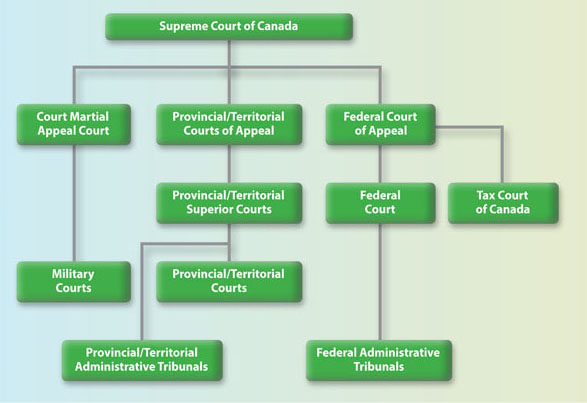

# Components of Canadian Government

## 2.1 Parliament and the Legislative Process

The **Canadian Parliament** has three constituent parts:

- The **Monarch** of the United Kingdom.  According to Canada's constitution, many of the monarch's powers are to be exercised by the **governor general**, who is appointed on the advice of the prime minister.
- The **Senate**.  The upper chamber of Parliament is called the Senate.  Senators are appointed by the governor general, on the advice of the prime minister.
- The **House of Commons**.  The lower chamber of Parliament is the House of Commons.  **Members of the House of Commons are elected.**

An overview of fundamental features of all three components of Parliament.

    <!-- Copy & Pasted from YouTube -->
    <iframe width="1262" height="710" src="https://www.youtube.com/embed/YSO27QPieTs" title="What is Parliament?" frameborder="0" allow="accelerometer; autoplay; clipboard-write; encrypted-media; gyroscope; picture-in-picture; web-share" referrerpolicy="strict-origin-when-cross-origin" allowfullscreen></iframe>

### I. The Monarch

Canada’s system of government is a constitutional monarchy, meaning the **King is recognized as the formal Head of State**. While the Monarch’s role is largely symbolic, it represents the legal authority behind Canada’s institutions and the continuity of the state. Day-to-day responsibilities tied to the Crown are carried out by representatives like the **Governor General at the federal level** and **Lieutenant Governors in the provinces**.

!!! note "Read & Answer"

    - Read [Monarch and Governor General](https://learn.parl.ca/understanding-comprendre/en/people-in-parliament/monarch-and-governor-general/?utm_){:target=" \_blank"} and [Role and Responsibilities | The Governor General of Canada](https://www.gg.ca/en/governor-general/role-and-responsibilities){:target=" \_blank"} and [The Lieutenant Governors - Canada.ca](https://www.canada.ca/en/canadian-heritage/services/crown-canada/lieutenant-governors.html?utm_){:target=" \_blank"}.
    - Read ***Galati v. Canada (Governor General)***, [2015 FC 91](http://canlii.ca/t/gg59f){:target=" \_blank"} (paras. **1-12, 32-48**)
        - [1] The applicants seek to set aside the decision of His Excellency the Right Honourable David Johnston Governor General of Canada on June 19, 2014 to grant royal assent to Bill C-24, the Strengthening Canadian Citizenship Act, S.C. 2014, c. 22 (Strengthening Citizenship Act).
        - [5] The threshold statutory question is whether the Governor General, in granting royal assent, was a “federal board, commission or other tribunal” within the meaning of subsection 2(1) of the *Federal Courts Act*, R.S.C., 1985, c. F-7 (Federal Courts Act). Put otherwise, was the Governor General, in assenting to Bill C-24, **exercising a power or jurisdiction conferred** under “an Act of Parliament or by or under an order made pursuant to a prerogative of the Crown” as required by subsection 2(1).
        - [32] ... For the reasons that follow, I conclude that the Governor General’s grant of royal assent was a legislative act and, in consequence, the issue of whether the Governor General exceeded his constitutional authority in granting royal assent to the Strengthening Citizenship Act is not justiciable.
        - [33] Each of the branches of Canada’s government—the legislature; the executive and the judiciary—play a discreet role. ... No branch should overstep its bounds and each must show “proper deference for the legitimate sphere of activity of the other”. **Justiciability** is one of the legal devices or doctrines by which the courts give effect to **this principle**.
        - [34] The courts cannot intervene in the legislative process. ... courts “come into the picture when legislation is enacted and not before..."
        - [35] ... To review the Governor General’s act of granting royal assent, as the applicants request, would conflate the constitutionally discreet roles of the judiciary and the legislature, affecting a radical amendment of the Constitution Act, 1867 ...
        - [41] ... As such, **the Governor General serves as Canada’s formal head of state and the representative of the Queen in Canada, while the political head of state in Canada is the Prime Minister.**
        - [46] While section 55 confers discretion on the Governor General whether to assent, **that discretion is wholly constrained by the constitutional convention of responsible government.** In granting assent, the Governor General does not exercise an independent discretion. He acts on the advice of the Prime Minister.
        - [48] ... The Governor General may signify royal assent in writing, and in my view, everything up to the ink used to signify assent being dry is a legislative act and not justiciable. The application fails on this basis alone.
    - Guiding questions: What are the legislative powers exercised by the Governor General of Canada? Is the exercise of those powers justiciable (i.e. can it be challenged/reviewed in the courts)?

### II. The Senate

!!! note "Read"

    Read the following article about the role and composition of the Senate: [The Role of the Senate](https://learn.parl.ca/understanding-comprendre/en/how-parliament-works/the-role-of-the-senate/?utm_){:target=" \_blank"} then read this article about the history of the Senate: [The Road to Renewal | Senate GRO](https://senate-gro.ca/timeline/senate-history/){:target=" \_blank"}

Canada is unusual for a modern democracy in having an **unelected upper chamber** of the federal legislature.  The members of the Canadian Senate are **appointed by the governor general, on the advice of the prime minister**.  The constitution specifies a certain number of senators to be appointed from each province and territory of Canada.  Therefore, the senate plays a role in providing regional representation in Parliament.  

In 1980, the Legal and Constitutional Affairs Committee's Report on Certain Aspects of the Canadian Constitution listed four roles of the Senate, all of which were complimentary to the functions of the House of Commons. They were:

- a **revising** legislative role; 
- an **investigative** role; 
- a **regional** representative role and 
- a protector of **linguistic** and other **minorities** role.  

The Senate has also been the source of political controversy in Canadian politics almost since its establishment.  In the early 20th century, one such controversy surrounded the question of the eligibility of women to sit in the senate. 

Wishing to avoid this complex process of constitutional reform, the government of Canada referred a number of questions to the Supreme Court of Canada to determine whether it had the authority to **make certain reforms to the Senate without amending the Constitution**. The SCC responded in a case that has important implications for understanding the role of the Senate in Canadian law and democracy.

!!! note "Read & Answer"

    - Read *Reference re Senate Reform*, [2014 SCC 32](https://canlii.ca/t/g6mfs){:target=" \_blank"}.  Focusing on paragraphs. **1-20**, and **49-112**
    - Guiding questions:
        - The Court finds that implementing “consultative elections” for Senators would “modify the Senate’s role within our constitutional structure as a complementary legislative body of sober second thought.”  Why?
        - The Court also finds that imposing fixed terms for Senators would fundamentally change the nature of the Senate.  Why?
        - What are the historical justifications for the net worth and real property qualifications for Senators?  How well do these justifications stand up in contemporary Canada?  What alternative justifications are available?
        - At several points, the Court writes that the arguments of the Attorney General of Canada “privilege form over substance.”  What does this mean?  Do you agree?

### III. The House of Commons

!!! note "Read & Answer"

    - Read the following overview of the House of Commons: [The Role of the House of Commons](https://learn.parl.ca/understanding-comprendre/en/how-parliament-works/the-role-of-the-house-of-commons/){:target=" \_blank"}.  Then read about the functions of the house at [Members of the House of Commons: their role(BP-56E)](https://publications.gc.ca/Collection-R/LoPBdP/BP/bp56-e.htm?utm_){:target=" \_blank"}, then this [Guide](https://publications.gc.ca/collections/collection_2012/parl/X9-26-2011-eng.pdf){:target=" \_blank"} to the House of Commons.
    - Guiding questions:
        - What are the requirements of “effective representation” that are guaranteed by section 3 of the Charter of Rights? Do they include absolute parity of voting power? 
        - How is the number of seats in the House of Commons determined, and what principles guide their distribution among the provinces?
        - What are the main responsibilities of the House of Commons in Canada’s system of responsible government?
        - How does the House of Commons hold the executive branch accountable on a regular basis?
        - Why is the House of Commons considered more democratically legitimate than the Senate?

The House of Commons is responsible for the following:

- **Forming a government:** After a federal election, the political party with the most seats usually forms the government. The leader of that party becomes the Prime Minister, who chooses Cabinet ministers to lead different government departments and policy areas. Together, the Prime Minister and the Cabinet make decisions about government policy and potential new laws to introduce.
- **Passing bills:** The main role of the House of Commons is to introduce, debate and pass bills. This process involves many steps, both in the chamber and in committee.
- **Government accountability:** Members of Parliament (MPs) who belong to political parties other than the governing party form the **opposition**. Their role is to provide alternative perspectives and policies, debate ideas, and question the government about its actions and decisions.
- **Budgets and taxes:** The House of Commons decides how taxpayer money is redistributed across Canada. Budgets, estimates (the spending requirements for ministries) and funding issues are debated and resolved in the House.
- **Representing Canadians:** Each MP represents one of Canada’s 343 constituencies (also called ridings). They ensure that different perspectives – particularly those of the people living in their constituencies – are considered when making decisions.

The Role of MPs in the House of Commons.

- **The Speaker:** The Speaker presides over debates in the chamber, maintains order, and interprets the rules and traditions of the House of Commons in an impartial way. The Speaker is an MP who is elected to the role by other MPs.
- **Prime Minister:** As the Head of Government, the Prime Minister advances the government’s ideas in the chamber. They answer questions during Question Period, promote bills and debate the opposition.
- **Cabinet ministers:** These are MPs from the governing party who are chosen by the Prime Minister to oversee government departments (also called ministries) such as Finance, National Defence, Global Affairs, Indigenous Services, and Agriculture and Agri-Food. In the chamber, they introduce bills related to their ministries and answer questions about their areas of responsibility.
- **Opposition members:** MPs from political parties other than the governing party form the opposition. Their role is to ask the government questions and to provide alternative perspectives on issues.
- **“Backbenchers”:** The majority of MPs are known as “backbenchers.” (This term comes from the British Parliament, where MPs sit on benches rather than at individual desks.) They participate in debates, Question Period and committees, and they represent their constituents’ views in the chamber.

## 2.2 The Exercise of Executive Power

In Canada, the executive branch is made up of a broad collection of institutions responsible for implementing laws, delivering public services, and carrying out government decisions. The executive includes constitutionally recognized actors, like the **Crown**, the **Prime Minister**, and **Cabinet**, as well as a wide array of other bodies, such as **public servants**, independent **tribunals**, **Crown corporations**, **law enforcement**, and **municipalities**. These bodies may be politically controlled or operate independently but share the common function of carrying out governmental responsibilities.

### Core Functions of the Executive

- **Rule-making (delegated legislation)**: creating regulations under the authority of enabling statutes.
- **Revenue collection and spending**: collecting taxes and allocating public funds.
- **Dispute resolution**: through administrative tribunals or regulatory bodies.
- **Determining entitlements or obligations**: such as eligibility for government benefits or compliance with regulations.
- **Enforcement decisions**: such as inspections, penalties, or prosecutions.
- **Service delivery**: including transportation, health care, licensing, and more.

### Sources of Executive Power

**1. Prerogative Powers**

These are **historic powers inherited from the Crown** and exercised without statutory basis—such as appointing ministers, declaring war, or conducting foreign affairs. While courts have acknowledged that these powers continue to exist, they are increasingly subject to constitutional limits. In some cases, the courts have declined to review prerogative powers on the grounds that they raise political rather than legal questions (i.e., they are “**non-justiciable**”).

**2. Statutory Powers**

Most executive power today comes from **legislation**. Parliament and provincial legislatures frequently delegate authority to executive actors through statutes. These powers are exercised by government departments, agencies, boards, and commissions. While statutory powers often involve broad discretion, they remain **subject to legal constraints and judicial oversight**.

### Constitutional Constraints on Delegation

While Canadian legislatures have broad authority to delegate their powers, there are important constitutional limits. **Delegated powers must comply with the Canadian Charter of Rights and Freedoms, and they cannot authorize actions that are arbitrary, overly vague, or inconsistent with democratic principles.** Courts play an important role in reviewing the scope and use of delegated powers to ensure that executive decision-makers remain within legal boundaries.

### The Range of Executive Institutions

#### 1. Politically Directed Bodies

At the core of the executive are politically controlled institutions such as **Cabinet and government departments**. These bodies are led by ministers who are accountable to Parliament and, by extension, to the public. Cabinet sets the overall direction of government policy, while departments and public servants carry out day-to-day administration. The Prime Minister plays a central role in choosing Cabinet ministers and shaping the government’s priorities.

#### 2. Independent Administrative Agencies

These agencies are **created by statute** and tasked with administering specific areas of public policy, such as regulating health professionals, broadcasting, or financial markets. Although they carry out executive functions, they are designed to be **independent from direct political control** in order to protect impartiality and expertise. Their structure and mandate determine the degree of independence they enjoy, which varies significantly from one agency to another. Some are closer to the political executive, while others operate more autonomously. **Their decisions are usually subject to judicial review.**

#### 3. Crown Corporations

Crown corporations are **publicly owned entities that deliver services or engage in commercial activities**, such as **VIA Rail**, **Canada Post**, or **BC Hydro**. They often operate in sectors where public goals (like accessibility or national service) must be balanced with financial sustainability. Crown corporations typically have their own boards of directors and follow corporate governance models, but ministers may still issue directives in the public interest. Their level of independence depends on the statute that creates them and the nature of their mandate.

#### 4. Law Enforcement and Prosecutorial Bodies

**Police forces and prosecutors** are part of the executive in that they enforce and apply the law. However, legal principles such as the independence of the police from political interference in operational matters are essential to maintaining public trust. The Attorney General, while a member of Cabinet, is expected to exercise prosecutorial discretion independently, especially in politically sensitive matters.

#### 5. The Public Service

The public service supports Cabinet and ministers in implementing laws and delivering services. While public servants are expected to be impartial and serve whichever government is in power, some senior officials are appointed by ministers. There is an ongoing tension between **responsiveness to government direction** and the need to **maintain political neutrality**. This neutrality is especially important in areas like law enforcement, intelligence, and public prosecutions.

#### 6. Municipalities and Other Local Governments

Municipalities and school boards are local bodies that perform executive functions like managing local services and infrastructure. While they are governed by elected councils and may appear autonomous, they are not constitutionally protected. **Provinces can reorganize, amalgamate, or even dissolve municipalities without their consent**, as confirmed in cases like ***Toronto (City) v. Ontario (Attorney General)***, [2021 SCC 34](https://canlii.ca/t/jjc3d){:target=" \_blank"}. This subordinate status distinguishes them from federal and provincial governments, despite their democratic character.

## 2.3 The Role of the Judiciary

### I. Structure of the Canadian Court System

!!! note "Read & Answer"

    - Read the following articles published by the Department of Justice Canada:
        - How Does Canada's Court System Work? - [Canada's Court System](https://www.justice.gc.ca/eng/csj-sjc/ccs-ajc/01.html){:target=" \_blank"}.
    - Guiding questions:
        - What are some of the differences between Provincial/Territorial Courts, and Provincial/Territorial Superior Courts?
        - Under what circumstances can a case make its way to the Supreme Court of Canada?

The **provinces** and **territories** are responsible for providing everything the **courts under their jurisdiction** need, from building and maintaining the courthouses, to providing staff and resources, such as interpreters, court reporters to prepare transcripts, sheriffs, and registry services, to paying provincial/territorial court judges. 

The **federal** government appoints and pays judges for the **superior courts in each province**, as well as judges at the **federal level**. It is also responsible for the administration of the **Supreme Court of Canada** and **federally created courts**.

Canada has four levels of court:

- **Provincial and territorial (lower) courts**: These courts handle most cases that come into the system. They are established by provincial and territorial governments.
- Provincial and territorial **superior courts**: These are courts of plenary, or complete, jurisdiction established under [*section 96 of the Constitution Act, 1867*](http://laws-lois.justice.gc.ca/eng/const/page-5.html){:target=" \_blank"}. They deal with more serious crimes and also hear appeals from provincial and territorial courts. **The Federal Court is on the same level**, but is responsible for deciding civil matters assigned to it by statute, such as **immigration** and **patents**.
- Provincial and territorial **courts of appeal** and the Federal Court of Appeal.
- The **Supreme Court of Canada**, which is the final court of appeal for Canada.

**Provincial/territorial courts**

- most criminal offences, except the most serious ones;
- family law matters (e.g., child support, child protection, adoption, but not divorce);
- young persons from 12 to 17 years old in conflict with the law;
traffic and bylaw violations;
- provincial/territorial regulatory offences;
- claims involving money, up to a certain amount (set by the province or territory in question);
- small claims (civil cases that resolve private disputes involving limited sums of money); and
- *all preliminary inquiries* (hearings to determine whether there is enough evidence to justify a full trial in serious criminal cases).

**Provincial/territorial superior courts**

The superior courts try the most serious criminal and civil cases. The jurisdiction of superior courts originally came from the first courts in England, whose authority over government actions was based on ***Magna Carta***.

The superior courts also act as a court of first appeal for the provincial and territorial courts that the provinces and territories maintain. **Although the provinces and territories administer superior courts, the federal government appoints and pays the judges.**

**Family courts**

In most provinces and territories, **the superior court has special divisions, such as the family division**. Some superior courts have established specialized family courts to deal with specific family law matters, including divorce and property claims.

**Provincial/territorial courts of appeal**

These courts hear appeals from the decisions of the superior courts and the provincial/territorial courts. Appeals are usually heard by **a panel of three judges**. The courts of appeal also hear **constitutional questions** that may be raised in appeals involving individuals, governments, or governmental agencies.

**The Federal Court**

The federal court system runs **parallel** to the provincial and territorial court systems and consists of the Federal Court and the Federal Court of Appeal. The judges of these courts (as well as the Tax Court of Canada, described below) are **based in Ottawa**, but travel across the country to hear cases. They deal with certain matters specified in federal statutes (laws), such as **immigration and refugee law**, **navigation** and **shipping**, **intellectual property**, and **tax**.

The Federal Court is Canada’s national trial court. It hears and decides federal legal disputes whose subject matter has been assigned to the Court by Parliament. These disputes include:

- claims against the Government of Canada;
- civil suits between private parties in federally-regulated areas; and
- reviews of the decisions of most federal tribunals.

**The Federal Court of Appeal**

The Federal Court of Appeal hears appeals from the Federal Court and the Tax Court of Canada, and judicial reviews of certain federal tribunals listed in the Federal Courts Act. The Court hears most legal matters under federal jurisdiction or that involve the federal government.

**Specialized Federal Courts**

The federal government has created specialized courts to deal more effectively with certain areas of the law. These include the Tax Court of Canada and the courts that serve the military justice system: the military courts and the Court Martial Appeal Court of Canada. 

**The Tax Court of Canada** is a superior court that determines cases and appeals about matters that arise under federal tax and revenue legislation. The Tax Court of Canada hears disputes between the federal government and taxpayers after the taxpayer has pursued all other avenues provided for by the Income Tax Act. The Tax Court is independent of the Canada Revenue Agency and all other government departments.

**Military courts, or courts martial**, are established under the National Defence Act to hear cases involving the *Code of Service Discipline*. **The Court Martial Appeal Court** of Canada hears appeals from military courts. 

**The Supreme Court of Canada**

The Court consists of **a Chief Justice** and **eight other justices**. Members of the Court are appointed by the federal government as new vacancies occur. Three judges traditionally come from **Ontario**, two from **Western** Canada, and one from the **Atlantic** provinces. In addition, the Supreme Court Act requires that at least three judges must come from **Quebec**.

!!! note "Did you know?"

    The Supreme Court sits in Ottawa for **three sessions** a year, winter, spring, and fall. Each year the Supreme Court considers an average of between 500 to 600 applications for leave to appeal and hears 65 to 80 appeals.

The Supreme Court can also be asked by the Governor in Council to **hear references**. These are important questions of law, such as the constitutionality or interpretation of federal or provincial legislation, on which the Court is asked to give its opinion before an actual legal dispute arises.

**Administrative Tribunals and Boards**

Administrative tribunals are less formal than courts and are not part of the court system. However, they play an essential role in resolving disputes in Canadian society. Decisions of administrative tribunals may be reviewed in court to ensure that tribunals act fairly and according to the law.

**Judicial independence**

!!! note ""

    - **Security of tenure:** Once appointed, a judge is eligible to serve on the bench until retirement (age 75 for federally appointed judges, age 70 in some provincial/territorial jurisdictions). Judges can be removed by a joint address of Parliament or a provincial legislature, only after an independent and impartial investigation shows that there is good reason (see Judicial Conduct, below).
    - **Financial security:** Judges must be guaranteed sufficient compensation (including salary and pension) so they are not subject to pressure for financial considerations. In Canada, governments cannot change judges’ salaries or benefits without first receiving the recommendations of an independent compensation commission.
    - **Administrative independence:** No one can interfere with how courts manage the legal process and exercise their judicial functions. For example, only the chief justice can choose how cases are assigned to the judges of his or her court.

### II. Judicial Appointments

Judges in British Columbia are appointed through different processes depending on the level of court. *The Constitution Act*, 1867 divides responsibility between the provincial and federal governments: 

the **province** appoints judges of the **Provincial Court**,  
while the **federal** government appoints judges to the **Supreme Court of British Columbia** and the British Columbia **Court of Appeal**.

??? note "A.  Provincial Court of British Columbia (BCPC)"

    - Eligibility: Candidates must be lawyers in good standing with the Law Society of British Columbia and typically have at least **five years** of practice, although most successful candidates have significantly more experience.
    - Application and Screening
        - Candidates apply directly to the **Judicial Council** of BC, a body created under the Provincial Court Act.
        - The Judicial Council is made up of judges, lawyers, and lay representatives.
        - The Council carefully reviews applicants, looking not only at professional qualifications but also at qualities such as integrity, judgment, community reputation, temperament, and interpersonal skills.
        - Background checks are conducted, which may include review of credit, criminal, and driving records, as well as consultation with the Law Society and professional associations.
        - The Judicial Council places a strong emphasis on ensuring the bench reflects the diversity of British Columbia in terms of gender, ethnicity, regional practice, and language skills.
    - Selection and Appointment
        - Approved candidates are forwarded to the provincial **Attorney General**.
        - The Attorney General recommends names to the **provincial Cabinet**.
        - The **Lieutenant Governor** in Council (effectively the provincial Cabinet acting with the Lieutenant Governor’s formal approval) makes the final appointment.

??? note "B.  Supreme Court of British Columbia (BCSC)"

    - The Supreme Court is the province’s **superior trial court** with general jurisdiction. It hears serious criminal matters, major civil claims, family law cases, and some appeals from the Provincial Court.
    - Constitutional Basis: **Judges** of the Supreme Court are **federally appointed** under **Section 96** of the *Constitution Act*, 1867. This ensures that superior courts maintain independence from provincial governments.
    - Eligibility and Screening
        - Candidates must be members of the bar of a province or territory and usually have at least **ten years** of legal practice.
        - Applications are reviewed by a **regional Federal Judicial Advisory Committee**. Each committee includes representatives from the judiciary, the Canadian Bar Association, the provincial law society, and members of the public.
        - The committee evaluates applicants based on professional excellence, fairness, personal integrity, and community awareness.
        - Applicants are assessed as “highly recommended,” “recommended,” or “unable to recommend.”
    - Selection and Appointment
        - The committee forwards its assessments to the federal Minister of Justice.
        - The Minister reviews the list and makes recommendations to the federal Cabinet.
        - The **Governor General of Canada** formally appoints the judges on the advice of Cabinet.
    - The Supreme Court also has judicial officers called “Masters” (now known as **Associate Judges**), who handle interlocutory matters such as pre-trial motions. These Associate Judges are **appointed provincially**, by the Lieutenant Governor in Council, on the recommendation of the Attorney General after consultation with the Chief Justice.

??? note "C.  British Columbia Court of Appeal (BCCA)"

    - The Court of Appeal is the highest court in British Columbia. It hears appeals from the Supreme Court, certain tribunals, and occasionally directly from the Provincial Court when statutes allow. Its decisions are binding on all lower courts in the province unless overturned by the Supreme Court of Canada.
    - Constitutional Basis: Like the Supreme Court, the Court of Appeal is a superior court. Its justices are appointed federally under **Section 96** of the *Constitution Act*, 1867.
    - Eligibility and Screening
        - Candidates are typically senior judges from the Supreme Court of BC or highly experienced lawyers with distinguished careers.
        - The same Federal Judicial Advisory Committee process applies as for the Supreme Court.
        - Candidates are evaluated on legal ability, judgment, writing and reasoning skills, and ability to handle complex appellate work.
    - Selection and Appointment
        - The Minister of Justice considers the recommendations of the Judicial Advisory Committee.
        - Appointments are made by the Governor General on the advice of the federal Cabinet.
        - The Court of Appeal is led by the **Chief Justice** of British Columbia and includes a full complement of justices, plus supernumerary judges (semi-retired judges who still sit part-time).

??? note "D.  Supreme Court of Canada (SCC)"

    - The process for appointing judges to the highest court has been the subject of many political debates about what qualifies a person as a supreme court judge, the proper scope of the appointing prime minister's judgment, and whether it is appropriate to think about judges as being “representative” in some sense, and if so, representative of whom. 
    - One very important consideration in relation to the composition of the Supreme Court of Canada is the **requirement**, found in the *Supreme Court Act*, that
        - **three** of the nine judges of the Supreme Court of Canada must be appointed “from among the judges of **the Court of Appeal or of the Superior Court of the Province** of **Quebec** or from among the advocates of that Province” (**s. 6**).  

!!! note "Read & Answer"

    - Read the following article: [The Judiciary - Canada's Court System](https://www.justice.gc.ca/eng/csj-sjc/ccs-ajc/05.html){:target=" \_blank"}.
    - Read: *Reference re Supreme Court Act*, ss. 5 and 6, [2014 SCC 21](https://canlii.ca/t/g67w2){:target=" \_blank"} - headnote only (up to where they list all the cited cases)
    - Guiding questions:
        - What are the purposes of s. 6 of the Supreme Court Act?
        - What characteristics of the Supreme Court of Canada are protected by the constitution?

> The case Reference re Supreme Court Act, ss. 5 and 6  is about the process of appointing judges to the Supreme Court.  But it is also about testing the boundaries of executive and judicial power. 

### III.  Judicial Independence

**A. Core Characteristics and Dimensions**

The three core characteristics of judicial independence were first identified in ***Valente v. The Queen*** (1985). 

- The first is **security of tenure**. Judges must not be subject to arbitrary removal, as they hold office until the mandatory retirement age and can only be removed through a formal and rigorous process. This ensures that judges are free to make decisions based on law and principle without fear of losing their position. 
- The second characteristic is **financial security**. Judges’ salaries cannot be altered at the whim of the executive or legislature. Instead, their remuneration is set and maintained by law, typically through an independent process. This protects judges from being swayed by threats of reduced pay or enticed by the promise of increased benefits. 
- The third characteristic is **administrative independence**. Judges must retain control over matters that relate directly to the adjudicative function, including the assignment of cases and the management of courtrooms. This prevents external interference in the judicial process. 

Judicial independence also has two dimensions. 

- The first is **individual independence**, which refers to the ability of each judge to decide cases free from external influence. This dimension ensures that the judgment of a particular case is not compromised by political, financial, or administrative pressures. 
- The second is **institutional independence**, which relates to the judiciary as a whole. Courts must be protected as an institution from interference by the executive or legislative branches of government. This dimension preserves the separation of powers and ensures that the judiciary can function as a co-equal branch of government.

**B. The Marshall Inquiry**

The Commissioners emphasized that judicial independence requires strong protection, but it cannot insulate judges from all accountability. They set out a high **threshold for removal** that has since become central to Canadian law:

“Is the conduct alleged so manifestly and profoundly destructive of the concept of the impartiality, integrity and independence of the judicial role, that public confidence would be sufficiently undermined to render the judge incapable of executing the judicial office?”

This test makes clear that removal is not justified by legal errors or unpopular decisions, which are matters for appeal. Instead, it is reserved for serious misconduct or incapacity that so erodes public confidence in the judiciary that the judge can no longer perform the role with the impartiality and integrity expected of the office.

The Supreme Court of Canada later reaffirmed this principle in ***Therrien (Re)***, [2001 SCC 35](https://canlii.ca/t/521j){:target=" \_blank"}.

!!! note "Read"

    - [Judicial Independence](https://www.bccourts.ca/about_the_courts/Judicial%20Independence%20Final%20Release.pdf){:target=" \_blank"}.
    - s.80 of the [Judges Act](https://canlii.ca/t/56c08){:target=" \_blank"}, RSC 1985, c J-1.

