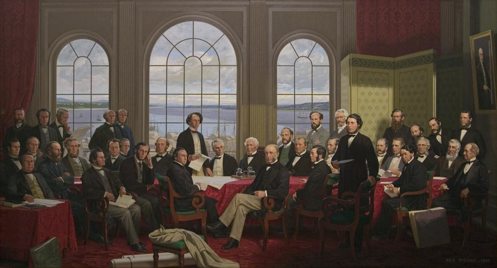

# Federalism

Canada is a federal state. This means that political power is shared between two orders of government: the federal government and the provincial governments. Each government is assigned different spheres of jurisdiction by the Constitution Act, 1867, most importantly in **ss. 91 and 92**.

!!! info "Fathers of Confederation"

    **Robert Harris**’s Fathers of Confederation, perhaps Canada’s best-known historical painting, was destroyed in the 1916 fire at the original Parliament Building. An aging Harris had declined to reproduce the work, and in 1964 the Confederation Life Assurance Co. hired Toronto artist **Rex Woods** to create a version of the original composition. Woods increased the dimensions to 3.5 meters by two metres, added three figures and, in the background, a portrait of Harris.

    The original painting pictured delegates to the **Charlottetown** and **Quebec** conferences that laid the ground for the confederation of Canada in 1864. The sobriquet “Fathers of Confederation” arose later and eventually became the title of the painting.

## 4.1 Introduction to the Division of Powers

!!! note "Readings"

    Constitutional Law: Chapter 4 (pp. 94-97), Chapter 7 (pp. 165-173) including Simeon article, Chapters 4 (pp. 73-80) and Chapter 6 (pp. 148-151).

If legislative supremacy was a fundamental constitutional principle, how could courts review statutes and declare them to be void? **WJ Ritchie**, Chief Justice of New Brunswick, responded at **_The Queen v. Chandler_**; In re Hazleton, [1869 CanLII 96](https://canlii.ca/t/jkjkv){:target=" \_blank"}, at 556-557:

> We must recognize the undoubted legislative control of the British Parliament, and give full force and effect to the statute of the Supreme Legislature, and ignore the Act of the sub-ordinate, when ... they are repugnant and in conflict.

That is, courts would interpret the BNA Act to determine whether it gave the power to enact the statute. Chief Justice **Ritchie**’s views, however, quickly took hold in the Canadian legal imagination, and thereafter judicial review was so firmly established that it needed little or no explanation or justification.

**_Citizens Insurance Co of Canada v Parsons (1881)_**, 7 App Cas 96, [1881-5] All ER Rep 1179 (UKJCPC), rev’g _Citizens’ and The Queen Insurance Cos v Parsons_, [1880 CanLII 6](https://canlii.ca/t/1ttzb){:target=" \_blank"}. SIR MONTAGUE SMITH:

> It could not have been the intention that a conflict should exist; and, in order to prevent such a result, the two sections (ss. 91, 92) must be read together, and the language of one interpreted, and, where necessary, modified, by that of the other.
>
> The first question to be decided is, whether the Act [provincial legislature] ... falls within any of the classes of subjects enumerated in s. 92, ... for if it does not, it can be of no validity.
>
> [Second], whether, notwithstanding this is so, the subject of the Act does not also fall within one of the enumerated classes of subjects in s. 91, and whether the power of the provincial legislature is or is not thereby overborne.

**THE NATURE OF FEDERALISM**

A federal state is a political contrivance intended to reconcile national unity and power with the maintenance of “state rights.” For the method by which federalism attempts to reconcile ... consists of the formation of a constitution under which the **ordinary powers of sovereignty** are elaborately **divided** between the **common or national government** and the **separate states**.

Whatever concerns the nation as a whole should be placed under the control of the national government. All matters which are not primarily of common interest should remain in the hands of the several States.

**Three leading characteristics** of completely developed federalism:

- the **supremacy** of the constitution
- the **distribution** among bodies with limited and co-ordinate authority of the different powers of government
- the authority of the Courts to act as **interpreters** of the constitution.

**THE COMPACT THEORY**

Thomas Jean Jacques Loranger, a Quebec judge, set out the elements of the “federal compact”:

1. In constituting themselves into a confederation, the provinces did not intend to renounce, and in fact never did renounce their autonomy. ... it is from these provincial powers that has arisen the federal government, to which the provinces have ceded a portion of their rights, property and revenues.
2. The federal compact did not create a single new power. The part now belonging to the federal government was taken from the jurisdiction of the provinces.

**THE POWER OF DISALLOWANCE**

The power, as expressed in ss 56 and 90 of the Constitution Act, 1867, entitles the governor general, acting on the advice of the federal Cabinet, to **disallow (or veto)** any enactment of the **provincial legislatures**.

By the mid-20th century, the federal power of disallowance fell into **disuse**.

!!! note "Canada (AG) v Ontario (AG)"

    - *Canada (Attorney General) v Ontario (Attorney General)*, [1937 CanLII 362 (UK JCPC)](https://canlii.ca/t/grlg9){:target=" \_blank"}, on appeal from *References re the Weekly Rest in Industrial Undertakings Act, The Minimum Wages Act, And The Limitation of Hours of Work Act*, [1936 CanLII 24](https://canlii.ca/t/fslfw){:target=" \_blank"}.
    - Within the British Empire there is a well-established rule that the making of a treaty is an executive act, while the performance of its obligations, if they entail alteration of the existing domestic law, requires legislative action.
    - The first ground upon which counsel for the Dominion sought to base the validity of the legislation was s. 132 ... it was not contemplated in 1867 that the Dominion would possess treaty-making powers, it is impossible to strain the section so as to cover the un-contemplated event. It appears that all the members of the Supreme Court **rejected** the contention based on **s. 132**, and their Lordships are in full agreement with them.
    - the validity of the legislation can only depend upon ss. 91 and 92. If the new functions affect the classes of subjects enumerated in s. 92, legislation to support the new functions is in the competence of the Provincial Legislatures only. If they do not, the competence of the Dominion Legislature is declared by s. 91 and existed *ab origine*. In other words, the Dominion cannot, merely by making promises to foreign countries, clothe itself with legislative authority inconsistent with the constitution which gave it birth.
    - But the legislative powers remain **distributed**, and if in the exercise of her new functions ... when they deal with provincial classes of subjects, be dealt with by the totality of powers, in other words by **co-operation between the Dominion and the Provinces**.

## 4.2 Interpreting the Division of Powers: Validity

!!! note "Readings"

    Constitutional Law: Chapter 8 (pp. 173-184), (pp. 184-191) and (pp. 191-225)

There are **three** kinds of arguments that can be made to challenge a law on the ground of division of powers.

- First, if the dominant characteristic of a law relates to a matter that is beyond the enacting **legislature's jurisdiction**, the law is **invalid**.
- Second, even if the law is validly enacted, it may have to **be limited in its application** in order that it not touch upon matters at the core of the other level of government's jurisdiction (this is known as the doctrine of "**inter-jurisdictional immunity**").
  - used more to limit provincial power rather than federal's.
  - the inter-jurisdictional immunity doctrine runs against the dominant tide of modern, flexible Canadian federalism. Court has downgraded the importance of this doctrine.
- Finally, even if a provincial law is valid, and even if it is applicable, it will be made inoperative if it conflicts a valid federal statute that relates to the same facts (this is the doctrine of **federal "paramountcy"**).

!!! info "Challenges to the validity"

    Challenges to the validity of legislation can generally be made equally against either federal or provincial legislation and are resolved on the basis of three doctrines that the courts have fashioned over time to help them work their way through the different kinds of legal issues that such challenges can pose:

    - the **pith and substance** doctrine,
    - the **double aspect** doctrine, and
    - the **ancillary powers** doctrine.

What do judges take into account when identifying the most important characteristic, or the “**pith and substance**” of a law?

- **social and economic effects** of the law, possibly including the way it is actually administered in
  practice
- **purpose** of the law as revealed by political debates in the legislature
- broad **principles and values** about Canadian federalism

Sections 91 & 92 grant each level of government the power to enact laws in relation to all matters coming within the classes of subjects enumerated. The items on the lists are the “**classes of subjects**” that fall within the jurisdiction of each level of government.

If a legislature enacts laws that relate to matters that do NOT fall within one of the classes of subjects over which it has jurisdiction, that law is **INVALID**. The enacting legislature did not have the constitutional authority to create that legislation. The process of assessing the validity of a law is described as a process of “**classification**.” The law has to be matched up with a matter that falls within one of the classes of subjects in section 91 or 92.

The process of classification has three steps.

1. **Identification** of the matter of the statute
2. **Delineation** of the scope of the competing classifications
3. **Determination** of the class into which the challenged statute falls

There are **three things to note** in particular about the classification process.

- First, the lists in **sections 91 and 92 do not encompass everything** that a government could potentially want to legislate about. For example, given that the lists were created in the 19th century, courts had to decide subsequently where to assign jurisdiction over things like radio and
  aeronautics.
- Second, it is often the case that the **definition of the “matter” of a statute is determinative of the outcome** of the challenge. Judges are aware of this, and so the identification of the matter is not a neutral exercise of logic. Rather, it often involves consideration of many important **constitutional values and exercise of judgment** about how the federal system should work.
- Finally, in federalism cases, the impugned legislation benefits from a **presumption of constitutionality**. This means that if there are competing plausible interpretations of the law, the court will choose the one that supports the validity of the law.

!!! info "Richard E Simeon, “Criteria for Choice in Federal Systems”"

    - Federalism can be evaluated first from the perspective of **community**. Second, federalism can be evaluated from the perspective of **democratic theory**. Third, federalism can be assessed from the vantage point of **functional effectiveness**.
    - In the present context, the competing images of community can be summarized in terms of a conflict between three drives: **country-building**, **province-building**, and **two-nation or Quebec nation-building**.
    - We focus on nation and province because it is these communities which have been institutionalized, and which have governments with the capacity to define and articulate community interests. ... For this reason, arguments about **political community** in Canada tend to focus on the relative **role and power of federal and provincial authorities**.
    - The second set of criteria may be labelled **functional**. Powers are allocated, according to a division of labour criterion: which level can most efficiently and effectively carry out any given responsibility of contemporary government?
    - The third perspective is that of democratic theory.
        - The first approach is primarily concerned with protecting citizens from governments ... its fundamental purpose is to minimize the possibility of tyranny, especially **majority tyranny**, by ensuring that power would be fragmented among competing governmental authorities. However, Federalism does not resolve the classic problem of **majority versus minority** rights.
        - A second strand of democratic theorizing stresses the **advantages of smaller units** in terms of governmental responsiveness and citizen participation. A small unit may also pose a difficult **dilemma**: one may be able to achieve influence, but that may be negated by the inability of the unit itself to achieve one’s goal because it lacks the resources
    - Note that the decision to select one of Simeon’s three criteria of choice as most appropriate for a particular kind of federalism dispute **does not mean** that that dispute is going to be resolved in a particular manner, that is, in favour of either the provincial or the federal level of government.
    - Is it possible to generalize about the appropriateness of using one criterion rather than another in certain kinds of cases? Could we argue, for example, that **community should be preferred when the impugned legislation relates to the social sphere**, **functional efficiency when the impugned legislation relates to the economic sphere**, and **democracy when the impugned legislation relates to the political sphere**? Is it even possible to categorize legislation in such a manner?

### VALIDITY: CHARACTERIZATION OF LAWS

#### A. PITH AND SUBSTANCE

The function of this doctrine is to assist courts in determining what the true “**matter**” of the impugned legislation should be understood to be. Once they have determined the matter, judges can then turn their minds to which of the competing federal and provincial classes of subjects that matter can be said to come within (often referred to as “**classification**”).

!!! info "Katherine Swinton, The Supreme Court and Canadian Federalism: The Laskin-Dickson Years"

    - Every federal system requires a distribution of legislative powers between the national and regional governments, and sections 91 and 92 perform that function in Canada.
    - It can, be broken down into three steps: **identification** of the “matter” of the statute, **delineation** of the scope of the competing classes, and then a **determination** of the class into which the challenged statute falls.
    - In determining the meaning or matter of legislation (first step), the starting place is the **statutory context**. In addition, a court may look to the **purpose** of the legislation. The **effects** of the legislation may also be relevant. The **dominant form of inquiry is into purpose**, that is, to the problem underlying the legislation which the legislature is trying to address.
    - Despite the reference to the “exclusivity” of the classes in sections 91 and 92, there is opportunity for extensive overlapping regulation. Similar laws may fit within both federal and provincial heads of power. The courts often uphold such legislation using the “**double aspect doctrine**,” whereby they acknowledge that some laws may have both federal and provincial purposes.
    - there are **competing perspectives** of the ideal system, with views about the proper distribution of legislative powers shaped by the individual’s belief in other values promoted or protected by federalism, such as a stronger national or regional community responsive to the country’s needs or loyalties, or increased economic efficiency.

!!! info "William R Lederman, “Classification of Laws and the British North America Act”"

    - the categories of laws enumerated in sections 91 and 92 are **not** in the logical sense **mutually exclusive**; they **overlap or encroach** upon one another in many more respects than is usually realized.
    - When a particular rule has features of meaning relevant to both federal and provincial classes of laws, then the question must be asked, **is it better for the people that this thing be done on a national level, or on a provincial level**? Inevitably, widely prevailing beliefs in the country about these issues will be influential and presumably the judges should strive to implement such beliefs.
    - the challenged law will have features of meaning relevant to both federal and provincial classes of laws. Then our judges must rather ask, Who is the better physician to prescribe in this way for this malady?
    - The principles of *stare decisis* are important in our courts, but the degree of certainty and predictability their operation can provide is often much **overestimated or misconceived**.

The Supreme Court of Canada’s general approach to questions of validity in the federalism context was summarized recently by Wagner CJ in **_References re Greenhouse Gas Pollution Pricing Act_**, [2021 SCC 11](https://canlii.ca/t/jdwnw){:target=" \_blank"}:

> [51] At the first stage of the division of powers analysis, a court must consider the **purpose and effects** of the challenged statute or provision in order to identify its “pith and substance,” or true subject matter.

**_R. v. Morgentaler_**, [1993 CanLII 74](https://canlii.ca/t/1fs14){:target=" \_blank"}, continues to illustrate the kinds of factors a court can take into account in determining the matter or the **pith and substance** of a law.

!!! info "_R. v. Morgentaler_"

    - The question in this appeal is whether the *Nova Scotia Medical Services Act*, RSNS 1989, c. 281, and the regulation made under the Act, NS Reg. 152/89, are ***ultra vires*** the province of Nova Scotia on the ground that they are in pith and substance criminal law.
    - On the basis of the analysis that follows I conclude that the *Medical Services Act* and *Medical Services Designation Regulation* are criminal law in pith and substance and consequently *ultra vires* the province of Nova Scotia. The appeal must therefore be dismissed.
    - A law’s “matter” is its leading feature or true character, often described as its **pith and substance**. There is no single test for a law’s pith and substance. While both the **purpose** and **effect** of the law are relevant considerations, it is often the case that the legislation’s **dominant purpose or aim** is the key to constitutional validity.
    - Evidence of the “effect” of legislation can be relevant in two ways: to establish “**legal effect**” and to establish “**practical effect.**”
    - In determining the background, context and **purpose** of challenged legislation, the court is entitled to refer to extrinsic evidence of various kinds provided it is relevant and not inherently unreliable.
    - Provincial legislation has been held invalid when it employs language “virtually indistinguishable” from that found in the Criminal Code. The **duplication** of Criminal Code language may raise an inference that the province has stepped into the realm of the criminal law; **the more exact the reproduction, the stronger the inference**.
    - The **primary objective** of the legislation was to prohibit abortions outside hospitals as socially undesirable conduct, and any concern with the safety and security of pregnant women or with health care policy, hospitals or the regulation of the medical profession was merely **ancillary**.

When the courts determine that legislation on its face addresses matters that are within its jurisdiction, but in pith and substance it is directed at matters outside its jurisdiction, they normally say the legislation is “**colourable**.”

In its decision in **_Reference re Fire-arms Act (Can)_**, [2000 SCC 31](https://canlii.ca/t/5251){:target=" \_blank"}, the Supreme Court of Canada provided the following description of the **colourability doctrine** in the context of a broader discussion of the way in which a law’s effects are taken into account in the characterization process:

> [18] Determining the legal effects of a law involves considering how the law will operate and how it will affect Canadians. ... the inquiry is directed to how the law sets out to achieve its purpose in order to better understand its “total meaning”. In some cases, the effects of the law may suggest a purpose other than that which is stated in the law. In other words, a law may say that it intends to do one thing and actually do something else. Where the effects of the law **diverge** substantially from the stated aim, it is sometimes said to be “**colourable**.”

The law with respect to the evidence that can be brought to bear in characterizing legislation has recently been summarized by Karakatsanis J in **_Reference re Genetic Non-Discrimination Act_**, [2020 SCC 17](https://canlii.ca/t/j8l59){:target=" \_blank"}:

> [34] To determine a law’s purpose, a court looks to both **intrinsic and extrinsic evidence**. Intrinsic evidence includes the text of the law, and provisions that expressly set out the law’s purpose, as well as the law’s title and structure. Extrinsic evidence includes statements made during parliamentary proceedings and drawn from government publications: **_Reference re Firearms Act (Can.)_**, [2000 SCC 31](https://canlii.ca/t/5251){:target=" \_blank"}, at para. 17.

Courts are still on occasion asked to define the scope and meaning of one of the heads of power in s 91 or 92. That occurred in a reference by the Quebec government to the Quebec Court of Appeal that ended up in the Supreme Court of Canada, **_Reference re Employment Insurance Act (Can), ss 22 and 23_**, [2005 SCC 56](https://canlii.ca/t/1lshd){:target=" \_blank"}, excerpted below.

The specific head of power at issue in that case was s 91(2A), which grants jurisdiction to Parliament over **unemployment insurance**. s 91(2A) was added to the list of heads of power in s 91 in 1940 after the Privy Council struck down the Employment and Social Insurance Act, SC 1935, c 38, a federal statute enacted in 1934 as part of Canada’s “New Deal” that represented the first attempt to provide unemployment insurance to Canadian workers. (**_Canada (Attorney General) v. Ontario (Attorney General)_**, [1937 CanLII 363 (UK JCPC)](https://canlii.ca/t/gdj0v){:target=" \_blank"})

The primary interpretive question raised by the **2005 reference** was whether the courts should be bound, as the government of Quebec argued, to give effect to the particular **conception** of unemployment insurance that the federal and provincial politicians responsible for adding s 91(2A) to the federal catalogue of powers in 1940 **had in mind**.

!!! info "**_Reference re Employment Insurance Act (Can), ss 22 and 23_**, [2005 SCC 56](https://canlii.ca/t/1lshd){:target=" \_blank"}"

    - [9] In giving them predominant weight, the Quebec Court of Appeal adopted an **original intent approach** to interpreting the Constitution rather than the **progressive** **approach** the Court has taken for a number of years.
    - [40] If the objectives of the framers are taken as a starting point, it will be easier to determine the scope of the jurisdiction that was transferred, and then to determine how it may be adapted to contemporary realities.
    - [68] In pith and substance, maternity benefits are a mechanism for providing replacement income during an interruption of work. This is consistent with the essence of the federal jurisdiction over unemployment insurance。

The Supreme Court of Canada recently summarized the modern approach with regard to interpretation of constitutional provisions in R. v. Comeau, [2018 SCC 15](https://canlii.ca/t/hrkm6){:target=" \_blank"}:

> [52] The text of the provision must be read harmoniously with the **context and purpose of the statute**. Constitutional texts must also be interpreted in a manner that is sensitive to evolving circumstances because they “must continually **adapt to cover new realities**”.Finally, the underlying organizational principles of the constitutional texts, like **federalism, may be relevant** to their interpretation.

#### B. DOUBLE ASPECT DOCTRINE

The doctrine has its origins in Hodge v The Queen (1883), 9 AC 117 (PC). Lord **Fitzgerald** held that “subjects [here, the liquor trade] which in one aspect and for one purpose fall within s. 92, may in another aspect and for another purpose fall within s. 91”. The mere fact that the Privy Council had upheld federal legislation that took a prohibitory approach to the liquor trade did not therefore preclude the provincial legislatures from taking a regulatory approach to it.

Applying the double aspect doctrine came to mean accepting that the area in question was one in which **both Parliament and the provincial legislatures have the authority** to legislate.

This account of the development of the double aspect doctrine comes with **two important caveats**:

- The first is that, in spite of the judiciary’s growing fondness for the doctrine over time, there are a few areas in which it has **never been applied**. They include, most notably, the regulation of trade and labour relations.
- The second caveat is that some members of the Canadian judiciary have expressed serious reservations about the broader view of the double aspect doctrine. The primary reason was, almost certainly the **federal paramountcy** doctrine, under which valid provincial legislation that conflicts with valid federal legislation must be held inoperative to the extent of the conflict.

**William Lederman's approach** to division of powers questions:

- (1) whether legislation being challenged on division of powers grounds had a federal aspect
- (2) whether it also had a provincial aspect
- (3) if the legislation was held to have both federal and provincial aspects, which of those aspects could be said to be the more important

#### C. ANCILLARY POWERS

The ancillary powers doctrine is used in cases where the challenge is to a part of a larger scheme of legislation rather than to the entire scheme. If the larger scheme of which the impugned provision forms part is constitutionally valid, the impugned provision may also be found valid because of its relationship to the larger scheme.

The ancillary powers doctrine, like the pith and substance doctrine, permits the federal and provincial governments to intrude, sometimes quite substantially, on the other level of government’s jurisdiction as long as the most important features of their laws remain within their jurisdiction.

!!! info "_General Motors of Canada Ltd. v. City National Leasing_, [1989 CanLII 133 (SCC)](https://canlii.ca/t/1ft82){:target=" \_blank"}"

    - *The General Motors* ruling is notable for its holding that the *Combines Investigation Act* (now the *Competition Act*, RSC 1985, c C-34) is a valid exercise of the federal power over the “general regulation of trade”. It is also notable for setting out the **general approach to the necessarily incidental doctrine**.
    - The steps in the analysis may be summarized as follows:
        - First, the court must determine whether the impugned provision can be viewed as **intruding** on provincial powers, and if so to what extent (if it does not intrude, then the only possible issue is the validity of the act).
        - Second, the court must establish whether the act itself (or a sever-able part of it) is **valid**.
            - If the scheme is not valid, that is the end of the inquiry.
            - If the scheme of regulation is declared valid, the court must then determine whether the impugned provision is **sufficiently integrated** with the scheme that it can be upheld by virtue of that relationship.

The approach to the ancillary powers doctrine outlined by Dickson CJ is **equally applicable** when a provision of a **provincial law** that is part of a larger scheme of regulation is challenged on the ground that it encroaches on a federal area of jurisdiction.

The Court has **not always applied the doctrine** in such circumstances and has instead applied a standard pith and substance analysis, without any reference to the three-step framework prescribed in General Motors.

!!! info "_Quebec (Attorney General) v. Lacombe_, [2010 SCC 38](https://canlii.ca/t/2cxpb){:target=" \_blank"}"

    - Chief Justice McLachlin, was of the view that, because the impugned by-law had taken the form of an amendment to the municipality’s general zoning by-law, the outcome of the challenge turned on the application of the ancillary powers doctrine, which she applied in accordance with the analytical framework established in ***General Motors***.
    - Viewed on its own, the by-law amounted to an unconstitutional trenching on federal jurisdiction over aeronautics. She accepted that the general zoning by-law was valid provincial legislation under s 92(13) and then proceeded to address the question of whether the impugned by-law could be upheld because of its relationship with the general zoning by-law.
    - [48] ... the application of ancillary powers to habilitate *prima facie* invalid legislation requires that the impugned provision, both **rationally** and in its **function**, further the purposes of the valid legislative scheme of which it is said to be part. ... [T]he basic purpose of this inquiry is to determine whether the impugned measure not only supplements, but complements, the legislative scheme; it is not enough that the measure be merely supplemental.
    - [58] I conclude that the amendments brought by by-law No. 260 do not meet the **rational functional connection test** in ***General Motors***.

## 4.3 Criminal law powers

Section 91(27) assigns jurisdiction over **criminal law** to the federal Parliament. As noted by the authors of _Constitutional Law_, this gives rise to questions not only about the scope of that federal power, but also questions about the extent to which the existence of this federal power constrains provincial attempts to legislate in relation to a wide range of issues, including public order, morality, and healthcare.

!!! note "Readings"

    - Constitutional Law: Chapter 11 (pp. 405-457) **[skipped]**

**What are the “formal” requirements for a criminal law?**

A law must contain two elements to be characterized as criminal law:

1.  A **prohibition** of an act or omission.

2.  A **penalty** or sanction.

The existence of a prohibition coupled with a penalty determines the **form** of criminal law.

**If the definition of “criminal law” were limited to these requirements, would the scope of the criminal law power be too broad?**

If the definition of criminal law were restricted solely to these formal elements, the scope of Parliament's criminal law power (**head 27**) would be considered **unlimited**. Because any federal legislation could be cast in the form of a prohibition enforced by a penalty, relying only on form would allow Parliament to encroach virtually unlimitedly upon matters reserved exclusively for the provinces.

The courts, therefore, developed a **substantive element** to prevent this overreach and ensure the legislation serves a proper function.

**What is the substantive element introduced in the _Margarine Reference_?**

The primary substantive element required for a law to be validly characterized as criminal law is the presence of a **legitimate criminal public purpose**.

This requirement dictates that the **prohibition must be concerned with some evil, injurious, or undesirable effect upon the public**. The purpose must be aligned with the traditional scope of criminal law, which is primarily focused on **protecting society**.

The **_Margarine Reference_** is specifically associated with solidifying the requirement that the legislation must have a **legitimate criminal law objective**. This mandatory objective must be present alongside the formal elements of prohibition and penalty.

**What range of things can count as a “criminal law purpose”?**

A legitimate criminal law purpose must relate to a **public object or matter**. While the courts have avoided creating an exhaustive, fixed list of criminal purposes, established categories serve as necessary guides.

The generally recognized and accepted heads of **legitimate criminal public purpose** include the protection of:

- Public peace, order, and security.
- Public health.
- Public morality.

**What is the relationship between this and other concepts such as “morality,” “public safety” or “harm”?**

- **Morality:** The criminal law power can be legitimately used to prohibit acts deemed **detrimental to public morality**. Public morality is one of the foundational and historic purposes of criminal law.
- **Public Safety and Health:** These concepts define broad areas where the criminal law power is unquestionably relevant, encompassing acts or omissions that are **injurious to public health** or threaten public peace and order.
- **Harm/Evil:** The overarching **element connecting these purposes** is the suppression of **evil**, or conduct considered **injurious or undesirable to the public**.

If a prohibition and penalty are aimed primarily at regulating purely economic transactions or securing compliance with a non-criminal scheme (e.g., a provincial trade scheme), rather than suppressing a recognized public evil, it will be deemed constitutionally invalid. The focus must be on the **true subject matter** or purpose of the law, which must involve penalizing "something that has been universally regarded as a crime or as having the essential qualities of a crime".

---

Although the power to enact criminal law lies with the federal government, provincial governments to have the power to use penal sanctions for the purpose of enforcing otherwise valid provincial laws that are directed to. This means that courts are required to draw a **distinction** between a **valid provincial law with a penalty**, and a provincial law that is **invalid because it is in pith and substance a criminal law**.

!!! note "Readings"

    - Constitutional Law: Chapter 11 (pp. 457-464)

While Canada did not assigned jurisdiction over criminal law matters to provincial legislatures, various mechanisms permit recognition of local interests in criminal law matters:

- First, as a result of s 92(14) of the _Constitution Act_, 1867, which gives the provincial legislatures jurisdiction over the administration of justice in the province (including **provincial policing**), combined with **federal delegation** to the provinces of the power to prosecute Criminal Code offences, much of the federal Criminal Code is **provincially enforced**.
- Second, through the mechanism of conditional legislation, the federal government drafted its criminal laws in ways that allow them to be shaped by the provinces to respond to local conditions, like an exculpatory clause, “**except as provided in any Provincial Act or law**.”
- The third way in which local interests in matters of public order and morality may be given expression is through judicial recognition of concurrent provincial jurisdiction in matters that may also be the subject of criminal law. (**Double Aspect Doctrine**)

!!! info "_Nova Scotia Board of Censors v. McNeil_, [1978 CanLII 6 (SCC)](https://canlii.ca/t/1mkbh){:target=" \_blank"}"

    - The determination of what is decent or indecent or obscene ... , what is morally fit for public viewing, whether in films, in art or in a live performance is, as such, within the exclusive power of the Parliament of Canada under ... the criminal law.
    - what the challenged Nova Scotia legislation is doing is seeking to supplement the criminal law enacted by Parliament, and this is **forbidden**.
    - ... those objects must in themselves be **anchored** in the provincial catalogue of powers and must, moreover, not be in conflict with valid federal legislation.
    - However, the concurring judges held that the legislation is valid on either one of two independent reasons: (1) it is, in pith and substance, directed to property and civil rights and therefore valid under s. 92(13) of the British North America Act; (2) the object may be viewed as a matter of a “local and private nature in the Province” within the meaning of s. 92(16) of the B.N.A, Act.

!!! info "_Westendorp v. the Queen_, [1983 CanLII 1 (SCC)](https://canlii.ca/t/1czjb){:target=" \_blank"}"

    - the challenged provision, s. 6.1 of the by law, is a standalone one and has no logical connection to the rest of the provisions.
    - it established a concurrency of legislative power, going **beyond** any **double aspect** principle and leaving it open to a Province or to a municipality authorized by a Province to **usurp exclusive federal legislative power**.

Subsequent cases at the Supreme Court of Canada level have continued the **general pattern of upholding provincial laws** dealing with public order and morality through generous use of the **doctrine of double aspect** rather than finding them to be an intrusion on the federal criminal law power.

**_Rio Hotel Ltd v New Brunswick (Liquor Licensing Board)_**, [[1987] 2 SCR 59, 1987 CanLII 72](https://canlii.ca/t/1ftl3){:target=" \_blank"}, conforms to the dominant pattern of **concurrency**. The main judgment, written by Dickson CJ, emphasized the **integration of the provincial prohibition in a comprehensive scheme** of regulation and licensing in **distinguishing** the case from **_Westendorp_**.

## 4.4 Peace, order and good government

Recall that section 91 of the Constitution Act begins with the following text:

 [91] It shall be lawful for the Queen, by and with the Advice and Consent of the Senate and House of Commons, to make Laws for **the Peace, Order, and good Government of Canada**, in relation to all Matters not coming within the Classes of Subjects by this Act assigned exclusively to the Legislatures of the Provinces...

As a matter of logic, the phrase “peace, order and good government” (known as the “**p.o.g.g.**” power and affectionately pronounced “pog.”) might be understood either as creating a “**general**” power of the federal legislature (of which the following items are merely examples), or as creating a “**residual**” power (in which any legislative matters that do not fall within one of the lists are attributed to the federal, rather than the provincial, legislature).

The “residual” theory of the **pogg** power, which is the **dominant contemporary approach**, has three branches:

- “gap” branch
- emergency branch
- “national concerns” branch

!!! note "Readings"

    - Constitutional Law: Chapter 8 (pp. 277-307)

!!! info "Katherine E Swinton, The Supreme Court and Canadian Federalism: The Laskin-Dickson Years"

    -  In **Laskin**’s opinion, the federal government was the logical institution to deal with important problems. Consistent with this confidence in the efficacy of national regulation, **Laskin** believed that **problems once local in nature, could take on a federal aspect**, as they became more complex or spilled over provincial borders. He believed that the courts should interpret the constitution so as to recognize this evolutionary potential.
    -  **Beetz** was much more protective of provincial rights and, as a consequence, cautious about departing from precedents which provided safeguards for provincial autonomy. His reading of that document was influenced by a classical vision of the federal system, which demanded respect for the autonomy of the federal, as well as the provincial governments in the areas of jurisdiction which the constitution allocated to each. **Beetz** preferred a more conceptual approach to the interpretation of the constitution which would **preserve exclusive areas of jurisdiction for both levels of government**.

!!! info "_Re: Anti-Inflation Act_, [1976 CanLII 16 (SCC)](https://canlii.ca/t/1mzjg){:target=" \_blank"}"

    - The Supreme Court of Canada (SCC) justified the federal government's intervention into matters normally within exclusive provincial authority, such as the restraint of prices, wages, and profits (which relate to property and civil rights, and contract law), by relying on the federal power to make laws for the **"peace, order and good government of Canada" (POGG)** under Section 91 of the _British North America Act_ (B.N.A. Act).
    - The core of the justification rested on the concept that the economic conditions at the time amounted to a **national crisis or emergency** requiring temporary federal action.
    - [1] **Justification Based on National Economic Crisis** (**Laskin C.J.**)
        - **Chief Justice Laskin**, writing for four members of the majority, held that the _Anti-Inflation Act_ (AIA) was valid legislation because it was a **temporary measure to meet a situation of economic crisis imperilling the well-being of the people of Canada as a whole**.
        - The justification required that Parliament have a **rational basis** for viewing the legislation as temporarily necessary to meet the situation. This rational basis was supported by:
            - **Evidence of Grave Economic Conditions:** The Court was provided with extrinsic materials (like Statistics Canada data and the Government White Paper) showing that Canada was experiencing the coexistence of **high inflation (double-digit rates)** and **rising unemployment** (the "twin conditions"). These figures demonstrated a drop in the purchasing power of the dollar and rising cost of living indices.
            - **Need for Intervention in the National Interest:** The preamble of the AIA stated that inflation at current levels was "contrary to the interests of all Canadians" and had become a **"matter of serious national concern"**. The Court found that the gravity of the circumstances provided a base for assessing the need for the legislation.
            - **Temporary and Focused Nature:** The Act was upheld partly due to its **temporary character**, even though it was subject to extension. Furthermore, the federal government was entitled to act from the "springboard" of its exclusive jurisdiction over **monetary policy** to extend its embrace into provincial sectors under the general **POGG** power, given the circumstances.
        - **Laskin C.J.** noted that the Court only needed to persuade itself that there was a rational basis for Parliament's judgment, not that the exceptional circumstances were proven as a matter of fact.
    - [2] **Justification Based on National Economic Emergency** (**Ritchie J.**)
        - **Justice Ritchie**, writing for three members of the majority, explicitly based the validity of the AIA on whether the legislation was enacted to combat a **national economic emergency**.
            - **Application of Emergency Doctrine:** He found nothing to exclude applying the constitutional principles enunciated in previous wartime and post-war emergency cases to a situation created by **highly exceptional economic conditions in time of peace**.
            - **Transcendence of Provincial Authority:** The conditions constituted an **urgent and critical situation adversely affecting all Canadians** and were of such proportions as to **transcend the authority vested in the Legislatures of the Provinces**.
            - **Evidence of Emergency:** He relied on the White Paper, which described the inflationary process as "so deeply entrenched" that it was a "critical problem" jeopardizing "the whole fabric of our economy and of our society," leading him to conclude that the language confirmed Parliament was acting in recognition of a **national emergency**.
            - **Temporary Limitation:** This authority to invade the provincial area is strictly limited to dealing with critical conditions and must be confined to legislation of a **temporary character**.
            - **Rejection of "National Dimension" Doctrine:** Ritchie J. was explicit that the validity of the Act did _not_ rest on the permanent "national dimension" or "national concern" doctrine, which, in his view, could only justify intervention if the concern manifested circumstances amounting to a national emergency.
    - **Dissenting View on Justification:** The dissenting justices (**Beetz and de Grandpré JJ.**) argued that the AIA directly and ostensibly interfered with matters exclusively provincial (property and civil rights; law of contract).
        - **Rejection of "National Concern":** They rejected the idea that inflation, as a broad, non-specific issue, could permanently become a subject matter of federal power under the national concern doctrine, arguing this would "render most provincial powers nugatory" and destroy the federal nature of the Constitution.
        - **Rejection of "Emergency":** They assumed that Parliament could act under an emergency power in peacetime, but held that the exercise of this extraordinary power must be done in the **most explicit terms** (a proclamation or unmistakable signal). Since the AIA did not explicitly declare or signal that it was passed to deal with a national emergency, the constitutional foundation was fatal, and the Court could not indirectly be called upon to proclaim the state of emergency.

One significant aspect of the **_Anti-Inflation_** case was the introduction and use of extrinsic evidence. In **_Reference re Upper Churchill Water Rights Reversion Act_**, [1984 CanLII 17 (SCC)](https://canlii.ca/t/1lddp){:target=" \_blank"}, the Supreme Court of Canada clarified (at 318) that "in constitutional cases, particularly where there are allegations of colourability, extrinsic evidence may be considered to ascertain not only the operation and effect of the impugned legislation but its true object and purpose as well."

**EMERGENCY LEGISLATION AFTER THE ANTI-INFLATION REFERENCE**

The federal Parliament enacted new legislation to deal with national emergencies in 1988: see the _Emergencies Act_, RSC 1985, c 22 (4th Supp), enacted by SC 1988, c 29.

The law contains provisions dealing with different types of emergencies, including public welfare, public order, international, and war emergencies. Of special interest to us are the public welfare emergencies (including those caused by real or imminent fires, floods, disease, accident, or pollution amounting to a national emergency).

While the federal Cabinet (governor in council) can declare an emergency, the declaration must concisely **describe** the state of affairs constituting the emergency, and it must be **confirmed** by Parliament. As well, the declaration cannot be made without prior **consultation** with affected provincial governments and an **agreement** by the provincial Cabinet that the province is unable to deal with the situation.

**THE NATIONAL CONCERN DOCTRINE FROM THE ANTI-INFLATION REFERENCE TO THE GREENHOUSE GAS POLLUTION PRICING ACT REFERENCES**

The national concern doctrine emerged again in **_R. v. Hauser_**, [1979 CanLII 13 (SCC)](https://canlii.ca/t/1mktq){:target=" \_blank"}, summarized by Le Dain J in **_R. v. Crown Zellerbach Canada Ltd._**, [1988 CanLII 63 (SCC)](https://canlii.ca/t/1fthr){:target=" \_blank"}.

Prior to **_References Re Greenhouse Gas Pollution Pricing Act_**, 2021 SCC 11, the leading modern case on the national concern doctrine was **_Crown Zellerbach_**.

[29] In **_Hauser_**, a majority of the Court (Martland, Ritchie, Pigeon and Beetz J.J.) held that the constitutional validity of the Narcotic Control Act rested on the peace, order and good government power of Parliament **rather than** on its jurisdiction with respect to criminal law. ... since it (the abuse of narcotic drugs) did not come within matters of a merely local or private nature in the province it fell within the “**general residual power**” in the same manner as aeronautics and radio.

To invoke the the "national concern doctrine" of the **POGG** power,
**Justice Le Dain** drew four conclusions:

1. The **national concern** doctrine is separate and distinct from the **national emergency** doctrine of the peace, order and good government power, which is chiefly distinguishable by the fact that it provides a constitutional basis for what is necessarily legislation of a **temporary nature**;
2. The national concern doctrine applies to both **new matters** which did not exist at Confederation and to **matters** which, although originally matters of a local or private nature in a province, have since, in the absence of national emergency, **become matters of national concern**;
3. For a matter to qualify as a matter of national concern in either sense it must have a **singleness, distinctiveness and indivisibility** that clearly distinguishes it from matters of provincial concern and a scale of impact on provincial jurisdiction that is reconcilable with the fundamental distribution of legislative power under the Constitution;
4. In determining whether a matter has attained the required degree of singleness, distinctiveness and indivisibility that clearly distinguishes it from matters of provincial concern, it is relevant to **consider what would be the effect on extra-provincial interests of a provincial failure** to deal effectively with the control or regulation of the intra-provincial aspects of the matter. The last one was referred to as **“provincial inability” test**.

During the three decades between **_Crown Zellberbach_** and the **_References re Greenhouse Gas Pollution Pricing Act_**, the Supreme Court **did not once uphold** federal legislation on the basis of the national concern branch.

The major modern case on the national concern doctrine is **_References re Greenhouse Gas Pollution Pricing Act_**.

!!! info "References re Greenhouse Gas Pollution Pricing Act, [2021 SCC 11 (CanLII)](https://canlii.ca/t/jdwnw){:target=" \_blank"}"

    - **Federalism** is a foundational principle of the Canadian Constitution. Its objectives are to **reconcile diversity with unity**, promote democratic participation by reserving meaningful powers to the local and regional level and foster cooperation between Parliament and the provincial legislatures for the common good. Under the division of powers, broad powers were conferred on the provinces to ensure diversity, while at the same time reserving to the federal government powers better exercised in relation to the country as a whole to provide for Canada’s unity. Federalism recognizes that within their spheres of jurisdiction, provinces have autonomy to develop their societies. **Federal power cannot be used in a manner that effectively eviscerates provincial power.**
    - Courts, as impartial arbiters, are charged with **resolving jurisdictional disputes** over the boundaries of federal and provincial powers on the basis of the principle of federalism. Although early Canadian constitutional decisions by the Judicial Committee of the Privy Council applied a rigid division of federal-provincial powers as **watertight compartments**, the Court has favoured a flexible view of federalism, best described as a modern **cooperative federalism**, that accommodates and encourages intergovernmental cooperative efforts. However, the Court has also always maintained that flexibility and cooperation, while important, cannot override or modify federalism and the constitutional division of powers.
    - The review of legislation on federalism grounds consists of the well-established two-stage analytical approach.
        - **At the first stage**, a court must consider the purpose and effects of the challenged statute or provision with a view to characterizing the subject matter or “pith and substance”. A court must then classify the subject matter with reference to **federal and provincial heads of power** under the Constitution in order to determine whether it is *intra vires* Parliament and therefore valid.
            - At the first stage of the division of powers analysis, a court must consider the purpose and effects of the challenged statute or provision in order to identify its “**pith and substance**” or its main thrust or dominant or most important characteristic. In determining the purpose of the challenged statute or provision, a court can consider both **intrinsic evidence**, such as the legislation’s preamble or purpose clauses, and **extrinsic evidence**, such as ***Hansard*** or minutes of parliamentary committees. In considering the effects of the challenged legislation, a court can consider both the legal **effects**, those that flow directly from the provisions of the statute itself, and the practical effects, the side effects that flow from the application of the statute. The characterization process is not technical or formalistic. A court can look at the background and circumstances of a statute’s enactment as well as at the words used in it.
            - Three points with respect to the identification of the pith and substance are important to clarify. **First**, the pith and substance of a challenged statute or provision must be described as precisely as possible. The pith and substance of a challenged statute or provision should capture the law’s **essential character** in terms that are as precise as the law will allow. **Second**, it is permissible in some circumstances for a court to include the legislative choice of means in the definition of a statute’s pith and substance, as long as it does not lose sight of the fact that the goal of the analysis is to identify the true subject matter of the challenged statute or provision. In some cases, the choice of means may be so central to the legislative objective that the main thrust of a statute or provision, properly understood, is to achieve a result in a particular way, which would justify including the means in identifying the pith and substance. **Third**, the characterization and classification stages of the division of powers analysis are and must be kept distinct. The pith and substance of a statute or a provision must be identified without regard to the heads of legislative competence.
        - **At the second stage** of the division of power analysis, a court must classify the matter by reference to the heads of power set out in the Constitution. **Matters and classes of subjects are distinct.** Law-making powers are exercisable in relation to matters, which in turn generally come within broader classes of subjects. Section 91 does not provide in the context of the POGG power that Parliament can make laws in relation to classes of subjects; instead, it states that Parliament can make laws for the peace, order, and good government of Canada in relation to “Matters”. **National concern** is a well-established but rarely applied doctrine of Canadian constitutional law derived from the introductory clause of s. 91 of the Constitution, **which empowers Parliament to make laws for the peace, order, and good government of Canada, in relation to all matters not coming within the classes of subjects assigned exclusively to the legislatures of the provinces.** A matter that falls under the POGG power necessarily does not come within the classes of subjects enumerated in ss. 91 and 92.
    - Courts must approach a finding that the federal government has jurisdiction on the basis of the national concern doctrine with **great caution**. **The effect of finding that a matter is one of national concern is permanent and confers exclusive jurisdiction over that matter on Parliament.** However, the scope of the federal power is defined by the nature of the national concern itself and only aspects with a sufficient connection to the underlying inherent national concern will fall within the scope of the federal power.
    - A closely related question concerns the applicability of the ***double aspect doctrine*** to a matter of national concern. The double aspect doctrine recognizes that the same fact situations can be regulated from different perspectives, one of which may relate to a provincial power and the other to a federal power. The doctrine can apply in cases in which the federal government has jurisdiction on the basis of the national concern doctrine. Such an approach fosters coherence in the law, because the double aspect doctrine can apply to every enumerated federal and provincial head of power. It is also consistent with the modern approach to federalism, which favours flexibility and a degree of overlapping jurisdiction. However, the fact that the double aspect doctrine can apply does not mean that it will apply in a given case. It may apply if a fact situation can be regulated from different federal and provincial perspectives and each level of government has a compelling interest in enacting legal rules in relation to that situation. It should be applied cautiously so as to avoid eroding the importance attached to provincial autonomy.
    - The double aspect doctrine takes on particular significance where Canada asserts jurisdiction over a matter that involves a minimum national standard imposed by legislation that operates as a backstop. **The recognition of a matter of national concern such as this will inevitably result in a double aspect situation.** This is in fact the very premise of a federal scheme that imposes minimum national standards: Canada and the provinces are both free to legislate in relation to the same fact situation but the federal law is **paramount**. In such a case, even if the national concern test would otherwise be met, a cautious approach to the double aspect doctrine should act as an **additional check**. The court must be satisfied that Canada in fact has a compelling interest in enacting legal rules over the federal aspect of the activity at issue and that the multiplicity of aspects is real and not merely nominal.
    - Turning to the **national concern test**, there are two points worth noting about the **framework** as a whole.
        - First, the recognition of a matter of national concern must be based on evidence. An onus rests on Canada throughout the national concern analysis to adduce evidence in support of its assertion of jurisdiction.
        - Second, there is no requirement that a matter be historically new in order to be found to be one of national concern. Many new developments may be predominantly local and provincial in character and fall under provincial heads of power. The term “new”, as used in the jurisprudence, refers to matters that could satisfy the national concern test and includes both “new” matters that did not exist in 1867 and matters that are “new” in the sense that the understanding of those subject matters has, in some way, shifted so as to bring out their inherently national character. Thus, the critical element of the analysis is the requirement that matters of national concern be inherently national in character, not that they be historically new.
    - Finding that a matter is one of national concern involves a **three-step analysis**.
        - First, as a threshold question, Canada must establish that the matter is of sufficient concern to the country as a whole to warrant consideration as a possible matter of national concern.
        - Second, the matter must have a singleness, distinctiveness and indivisibility.
        - Third, Canada must show that the proposed matter has a scale of impact on provincial jurisdiction that is reconcilable with the division of powers. The purpose of the national concern analysis is to identify matters of inherent national concern — matters which, by their nature, transcend the provinces.
    - The analysis **begins by asking**, as a threshold question, whether the matter is of sufficient concern to Canada as a whole to warrant consideration under the national concern doctrine. This invites a common-sense inquiry into the national importance of the proposed matter. This approach does not open the door to the recognition of federal jurisdiction simply on the basis that a legislative field is important; **it operates to limit the application of the national concern doctrine** and provides essential context for the analysis that follows.
    - The **second** step of the analysis requires that a matter have a singleness, distinctiveness and indivisibility that clearly distinguishes it from matters of provincial concern. Two principles underpin this requirement: first, to prevent federal overreach, jurisdiction should be found to exist only over a specific and identifiable matter that is qualitatively different from matters of provincial concern; and second, federal jurisdiction should be found to exist only where the evidence establishes **provincial inability** to deal with the matter.
        - Under the first principle of the singleness, distinctiveness and indivisibility analysis, the court should inquire into whether the matter is predominantly extra-provincial and international in its nature or its effects, into the content of any international agreements in relation to the matter, and into whether the matter involves a federal legislative role that is distinct from and not duplicative of that of the provinces. It is clearly not enough for a matter to be quantitatively different from matters of provincial concern — **the mere growth or extent of a problem across Canada is insufficient to justify federal jurisdiction**. International agreements may in some cases indicate that a matter is qualitatively different from matters of provincial concern. However, the existence of treaty obligations is not determinative of federal jurisdiction as there is no freestanding federal treaty implementation power and Parliament’s jurisdiction to implement treaties signed by the federal government depends on the ordinary division of powers. Furthermore, to be qualitatively different from matters of provincial concern, the matter must not be an aggregate of provincial matters.
        - The second principle underpinning the singleness, distinctiveness, and indivisibility analysis is that federal jurisdiction should be found to exist only where the evidence establishes provincial inability to deal with the matter. Provincial inability functions as a strong constraint on federal power and should be seen as a **necessary** but not sufficient requirement for the purposes of the national concern doctrine. In order for **provincial inability to be established** both of these factors are required:
            - (1) the legislation should be of a nature that the provinces jointly or severally would be constitutionally incapable of enacting; and
            - (2) the failure to include one or more provinces or localities in a legislative scheme would jeopardize the successful operation of the scheme in other parts of the country.
            - And there is a **third** factor that is required in the context of the national concern doctrine in order to establish provincial inability: a province’s failure to deal with the matter must have grave extra-provincial consequences. The requirement for grave extra-provincial consequences sets a high bar for a finding of provincial inability for the purposes of the national concern doctrine and can be satisfied by actual harm or by a serious risk of harm being sustained in the future. It may include serious harm to human life and health or to the environment, though it is not necessarily limited to such consequences. Mere inefficiency or additional financial costs stemming from divided or overlapping jurisdiction is clearly insufficient. Evaluating extra-provincial harm helps to determine whether a national law is not merely desirable, but essential, in the sense that the problem is beyond the power of the provinces to deal with it. This connects the provincial inability test to the overall purpose of the national concern test, which is to identify matters of inherent national concern that transcend the provinces.
    - At the **third** and final step of the national concern analysis, Canada must show that the proposed matter has a scale of impact on provincial jurisdiction that is reconcilable with the fundamental distribution of legislative power under the Constitution. **The purpose of the scale of impact analysis is to protect against unjustified intrusions on provincial autonomy and prevent federal overreach.** At this stage of the analysis, the intrusion upon provincial autonomy that would result from empowering Parliament to act is **balanced** against the extent of the impact on the interests that would be affected if Parliament were unable to constitutionally address the matter at a national level. Identifying a new matter of national concern will be justified only if **the latter outweighs the former**.

## 4.5 Interpreting the Division of Powers: Applicability

Even if a law is found to be validly enacted, it is possible for it to be rendered **inapplicable** to a certain circumstance in order to protect the core of the other government's jurisdiction.  This is called the doctrine of “**inter-jurisdictional immunity**.”

The notions of “pith and substance,” “double aspect” and “necessarily incidental (ancillary powers)” result in a substantial amount of overlapping jurisdiction.  In contrast, inter-jurisdictional immunity emphasizes the **exclusivity of jurisdiction**, and works to prevent certain forms of overlap.

!!! note "Readings"

    -  Constitutional Law: Chapter 8 (pp. 250-252, 256-267)
    - ***Canadian Western Bank v The Queen in Right of Alberta***
    - ***Quebec (Attorney General) v Canadian Owners and Pilots Association***

In those circumstances where the doctrine of inter-jurisdictional immunity is engaged, **valid laws are not allowed to apply** in core areas of jurisdiction assigned to the other level of government. 

Although the doctrine of inter-jurisdictional immunity has been used only to protect core areas of federal legislative jurisdiction from encroaching provincial legislation, the Supreme Court of Canada has acknowledged that the doctrine can in principle work the other way, see ***Canada (AG) v PHS Community Services Society***, [2011 SCC 44](https://canlii.ca/t/fn9cf){:target=" \_blank"} at paras 57-70 and ***Carter v Canada (AG)***, [2015 SCC 5](https://canlii.ca/t/gg5z4){:target=" \_blank"} at paras 49-53. ... it is a **technique** of interpretation used to save statutes from being struck down.

The doctrine of inter-jurisdictional immunity has indeed been controversial. Three major concerns have been expressed about it: 

- (1) in its emphasis on exclusivity of jurisdiction, it is **at odds with the tendency** of modern federalism to allow considerable overlap between federal and provincial powers; 
- (2) it appeared to extend to the federal level of government an exclusivity of jurisdiction not available to the provinces and hence is inconsistent with a balanced approach to Canadian federalism (note that this concern would **no longer be valid today**, at least at the level of principle, because the Supreme Court of Canada has accepted that the doctrine works both ways); and 
- (3) it is **unnecessary** because if Parliament wants to protect one of its core areas of legislative jurisdiction from encroaching provincial legislation, it can do so by enacting legislation to cover that area and rely on the **federal paramountcy doctrine** to oust the provincial legislation. 

The doctrinal choices that typically face the Court:

- One option is to allow the provincial law to apply to the federal undertaking or other federal matter until Parliament enacts conflicting legislation, which will then have priority by virtue of the doctrine of paramountcy. 
- The other is to grant the requested inter-jurisdictional immunity to the federal undertaking or other federal matter, with the result that the provincial law is held inapplicable, even if Parliament has not legislated on the matter. 

!!! info "*Canadian Western Bank v. Alberta*, [2007 SCC 22](https://canlii.ca/t/1rmr1){:target=" \_blank"}"

    - The Supreme Court of Canada, in ***Canadian Western Bank v. Alberta***, rejected the appellants' claim that the provincial Insurance Act and its regulations were constitutionally inapplicable to their promotion of insurance products by virtue of the doctrine of inter-jurisdictional immunity (IJI).
    - The court's reasoning regarding the inter-jurisdictional immunity doctrine can be summarized based on general constitutional principles and their specific application to the facts of the case:
    - The joint reasons (**Binnie** and **LeBel JJ.**) emphasized that IJI is a doctrine of limited application and must be restricted to its proper limits.
        - **Purpose and Scope:** IJI recognizes that the Constitution Act, 1867 is based on an allocation of exclusive powers, although these powers inevitably interact. The doctrine protects the "basic, minimum and unassailable content" (or "core") of an exclusive federal power, such as banking under s. 91(15), from encroachment by provincial legislation.
        - **Flexible Federalism:** A broad application of IJI is inconsistent with the flexible federalism promoted by doctrines like **pith and substance** and **double aspect**, which are generally better suited to resolving overlapping powers.
        - **Indispensability:** Its application is justified only where it is considered absolutely indispensable or necessary to enable Parliament or a provincial legislature to achieve the purpose of its exclusive jurisdiction, or to enable a federal undertaking to carry out its specific mandate.
        - **The Impairment Test:** To trigger the application of IJI, it is not enough for the provincial legislation merely to "affect" the federal core. The court explicitly rejected the substitution of "**affects**" for "**impairs**". Immunity applies only when the adverse impact of the provincial law increases in severity from affecting to "impairing" the core competence or the vital/essential part of the federal undertaking. "Vital" or "essential" means absolutely indispensable or necessary.

!!! info "*Quebec (Attorney General) v. Canadian Owners and Pilots Association*, [2010 SCC 39 (CanLII)](https://canlii.ca/t/2cxpd){:target=" \_blank"}"

    - The central dispute involved whether Quebec’s Act respecting the preservation of agricultural land and agricultural activities (ARPALAA), which requires prior authorization to use agricultural land for non-agricultural purposes (like an aerodrome), impaired the federal exclusive power over aeronautics.
    - The majority applied the **two-step IJI framework**, as refined in *Canadian Western Bank*: 
        - (1) determining if the provincial law **trenches** on the protected core of a federal competence, and 
        - (2) determining if the resulting impact is sufficiently serious (**impairment**).
    - **Identification of the Federal Core**
        - Federal Power: The federal government has exclusive jurisdiction over aeronautics under the Peace, Order, and good Government (POGG) power (s. 91 of the Constitution Act, 1867).
        - Core Content: Precedent firmly establishes that the federal aeronautics jurisdiction includes the exclusive power to determine the location of aerodromes and airports. The location of aerodromes is considered an essential and indivisible part of aeronautics and therefore lies within the protected core of the federal power.
        - Trenching: Since section 26 of the ARPALAA purports to limit where aerodromes can be located (prohibiting non-agricultural uses without prior authorization), it follows that the provincial law trenches on the core of the federal aeronautics power.
    - **Test for Impairment**
        - **The Impairment Standard:** Drawing on ***Canadian Western Bank***, the court confirmed that the test is whether the provincial law impairs the federal exercise of the core competence. Impairment is a higher standard than "affects" but does not require complete paralysis (sterilization). It requires a significant or serious intrusion on the federal power.
        - **Finding of Impairment:** The majority concluded that the provincial prohibition does impair the federal power.
    - **Conclusion:** The provincial law was rendered inapplicable to the extent it prohibits aerodromes in agricultural zones.
    - **Rejection of Counter-Arguments:** The majority rejected the argument that because paramountcy might allow Parliament to override the provincial law, the impairment was insignificant (a "sterilization" test). 

## 4.6 Interpreting the Division of Powers: Operability

A valid, applicable provincial law may still be found to be inoperable to the extent that it conflicts with a federal law.  This rule of **federal paramountcy** suspends the operation of the provincial law to the extent of the conflict.

!!! note "Readings"

    - Constitutional Law: Chapter 8 (pp. 225-242)
    - ***Ross v Registrar of Motor Vehicles***
    - ***Multiple Access Ltd. v McCutcheon***
    - ***Bank of Montreal v Hall***
    - ***Rothmans, Benson & Hedges v Saskatchewan***

**Federal paramountcy**, modelled on the rule found in s 95, provides that in cases of conflict between federal and provincial laws, the federal law is paramount and the provincial law is *inoperative* to the extent of the conflict.

The choice between a **narrow** and a **broad** conception of “conflict” has profound implications for the balance of power between the federal and provincial levels of government in Canada.

The different meanings of, or tests for "conflicts" can be summarized as follows:

1. **Impossibility of dual compliance** (also known as “express contradiction” and “operational conflict”). 
2. **Duplication**. This asks whether the provincial legislation duplicates the federal legislation.
3. **Impossibility of giving dual effect** (usually placed under the rubric of impossibility of dual compliance, but arguably better understood as a distinct understanding in its own right).
4. **Frustration of federal purpose.** This asks whether permitting the provincial enactment to operate in the circumstances in question would serve to frustrate the purpose underlying the federal enactment.
5. **Federal intention to cover the field** (also known as “negative implication” or “occupy-ing the field”). This asks whether Parliament, by legislating in a particular area, has enacted a code that was intended to be complete and thus by implication was intended to oust the operation of any provincial laws.

!!! info "*Ross v. Registrar of Motor Vehicles et al.*, [1973 CanLII 176 (SCC)](https://canlii.ca/t/1xtxk){:target=" \_blank"}"

    - The Supreme Court of Canada (SCC) majority held that the provincial legislation was operative despite the federal provision, concluding there was **no direct conflict or repugnancy**. 
    - Justice **Pigeon**, writing for the majority, concluded that Section 21 of the *Highway Traffic Act* is operative legislation notwithstanding s. 238(1) of the *Criminal Code*.
    - **Lack of Repugnancy/Simultaneous Operation:** The majority reasoned that there was no direct repugnancy between the two laws because both could fully operate simultaneously.
        - The federal Criminal Code (s. 238(1)) merely provides for the making of prohibitory orders (which may be limited as to time and place).
        - If a provincial licence suspension is in effect during the period covered by the federal order, the person concerned gets no benefit from the indulgence granted under the federal legislation (i.e., the partial right to drive). However, this situation is not legally different from the earlier case of ***Provincial Secretary of Prince Edward Island v. Egan***, where the provincial suspension operated even when the magistrate made no prohibitory order at all.
    - **Scope of Federal Legislation:** Parliament, through the 1972 amendments to s. 238 of the *Criminal Code*, did not purport to deal generally with the right to drive a motor vehicle after a conviction for certain offenses. The amendment only granted the magistrate a larger area of discretion to issue an order limited as to time and place.
    - **Criminal Code Order Deemed Without Jurisdiction:** The judge who varied Ross’s sentence included a provision that Ross’s operator’s licence was not to be suspended. The majority viewed this specific direction as having been made by an inferior court completely without jurisdiction and is to be ignored.
    - **Civil Consequences vs. Punishment:** The majority reaffirmed the settled principle that **civil consequences of a criminal act are not to be considered as "punishment" so as to bring the matter within the exclusive jurisdiction of Parliament**. The suspension of a driving licence under provincial law is considered such a civil consequence. This principle ensures that the provincial legislation, which deals with licensing (a civil matter), is not impeachable as prescribing penalties for the criminal offense.
    - **Rejection of Implicit Permission:** Citing cases like ***O’Grady v. Sparling*** and ***Mann v. The Queen***, the majority reiterated that Parliament, when defining criminal offenses, did not implicitly permit conduct that did not meet the definition of the Criminal Code offense. Similarly, Parliament did not implicitly permit driving by authorizing a magistrate to make a limited order.
    - **Relevance of Australian Doctrine (Exhaustiveness):** The majority noted the Australian constitutional rule that inconsistency depends on the intention of the paramount Legislature to express the law completely, exhaustively, or exclusively. The majority indicated that if this rule were applied, it would have to be concluded that Parliament did not purport to state exhaustively the law respecting motor driving licences, or their suspension or cancellation for driving offenses.

The narrower approach to ***paramountcy*** that emerged in the highway traffic cases in the 1960s and 1970s was confirmed by the Supreme Court of Canada in 1982 in ***Multiple Access Ltd v McCutcheon***, immediately below, which is regarded as the foundational case on the modern approach to paramountcy.

!!! info "*Multiple Access Ltd. v. McCutcheon*, [1982 CanLII 55 (SCC)](https://canlii.ca/t/1lpcl){:target=" \_blank"}"

    - The primary issue on paramountcy was: Assuming both the federal insider trading provisions (ss. 100.4 and 100.5 of the Canada Corporations Act) and the provincial provisions (ss. 113 and 114 of the Ontario Securities Act) are constitutionally valid (*intra vires*), are the Ontario sections suspended and rendered inoperative concerning federally incorporated companies due to the doctrine of paramountcy?
    - The Supreme Court of Canada (SCC) majority concluded that the provincial provisions were not rendered inoperative by federal paramountcy. Justice Dickson, writing for the majority, emphasized a **narrow test** for the application of federal paramountcy, concluding that **mere duplication** of federal and provincial law is insufficient to trigger the doctrine.
    - **The Test for Conflict (Repugnancy):** The majority reaffirmed the established test for conflict (repugnancy), which requires actual conflict in operation. Conflict exists only when one enactment says "yes" and the other says "no," or when compliance with one law is defiance (or breach) of the other.
    - **Duplication is Not Conflict:** The court explicitly stated that mere duplication without actual conflict or contradiction is not sufficient to invoke paramountcy.
    - **Choice of Remedies:** The majority rejected the argument that because a plaintiff can only resort to one statute (federal or provincial) to recover loss or gain once, the two laws are in conflict and cannot operate concurrently. Safeguards against double recovery exist, such as the requirement for judicial authorization of proceedings under the Ontario Act.
    - **Purpose of Parliamentary Legislation:** The majority reasoned that the legislative purpose of Parliament (in creating the federal insider trading law) will be fulfilled regardless of which statute the remedy-seeker invokes. The application of the provincial law, therefore, does not displace the federal legislative purpose.
    - **Federal Legislation is *ultra vires*:** They determined that ss. 100.4 and 100.5 of the Canada Corporations Act were not valid corporate legislation but rather concerned the protection of the general public from suffering loss on investments, which falls under the exclusive provincial power over "property and civil rights". They concluded that the federal sections were *ultra vires* Parliament.
    - **Paramountcy Not Addressed:** Because these justices found the federal legislation invalid, it was unnecessary to consider the paramountcy issue (Question 3), as the issue does not arise unless both laws are held valid as independent enactments.

!!! info "*Bank of Montreal v. Hall*, [1990 CanLII 157 (SCC)](https://canlii.ca/t/1d69w){:target=" \_blank"}"

    - The Supreme Court of Canada (SCC) concluded that there was an actual conflict in operation between the federal and provincial statutes, and accordingly, the provincial provisions were rendered **inoperative** (or, more precisely, inapplicable) to security taken under the federal Act.
    - The Test for Paramountcy (Actual Conflict). Justice La Forest, writing for the Court, applied the **standard test for paramountcy** established in ***Multiple Access Ltd. v. McCutcheon***.
        - **The Test:** Conflict (or repugnancy) exists only where there is actual conflict in operation, meaning "where one enactment says 'yes' and the other says 'no'". This occurs when compliance with one law is defiance of the other.
        - **Rejection of Duplication/Delay:** The court noted that mere delay in the bank's ability to realize on its security, as argued by the Court of Appeal majority, does not automatically imply inconsistency, but paramountcy is invoked when the application of the provincial statute **frustrates** Parliament's legislative purpose.
    - The Court found a clear and actual operational conflict between the specific provisions of the two statutes:
        - **Federal Legislative Purpose:** The federal provisions give the bank an immediate, unqualified right to seize and sell the secured property upon the borrower’s default, subject only to conditions within the Bank Act itself. This scheme was specifically designed to provide a uniform security mechanism nationwide, freeing borrowers and lenders from deferring to a variety of provincial lending regimes. 
        - **Provincial Requirement (The Conflict):** The provincial LCR Act (ss. 19-36) sets out a comprehensive procedure designed to prescribe how a secured creditor must take possession. 
        - **Repugnancy:** The LCR Act’s requirement for judicial approval and prior notice restricts the unqualified right of seizure granted by the federal legislation. Compliance with the federal statute (immediate seizure right) necessarily entails defiance of the provincial counterpart.
        - **Frustration of Purpose:** Requiring the bank to defer to the provincial legislation, would effectively displace the legislative purpose of Parliament to create a uniform, readily enforceable national security interest. The federal legislative intent was that the sole realization scheme applicable to the s. 178 security interest be that contained in the Bank Act itself.

After ***Hall***, it appeared that the “conflict in operation” referred to in ***Multiple Access*** that is necessary to give rise to federal paramountcy can be satisfied by either an **impossibility of dual compliance** or an **incompatibility of legislative purposes**. 

!!! info "Rothmans, Benson & Hedges Inc. v. Saskatchewan, [2005 SCC 13 (CanLII)](https://canlii.ca/t/1jz6k){:target=" \_blank"}"

    - The Supreme Court of Canada (SCC) unanimously held that the provincial legislation was **not rendered inoperative** by the doctrine of federal legislative paramountcy.
    - The Court reaffirmed that federal paramountcy dictates that where validly enacted but overlapping provincial and federal legislation are **inconsistent**, the provincial legislation is **inoperative** to the extent of the inconsistency. **The overarching principle is that a provincial enactment must not frustrate the purpose of a federal enactment.**
    - Inconsistency can be established in two ways:
        - **Impossibility of Dual Compliance (Direct Conflict):** This exists where one enactment says "yes" and the other says "no," meaning compliance with one is defiance of the other. Impossibility of dual compliance is sufficient to establish inconsistency, but it is **not the only test**.
        - **Frustration of Legislative Purpose (Conflict of Purpose):** This focuses on the broader question of whether the operation of the provincial Act is compatible with the federal legislative purpose.

