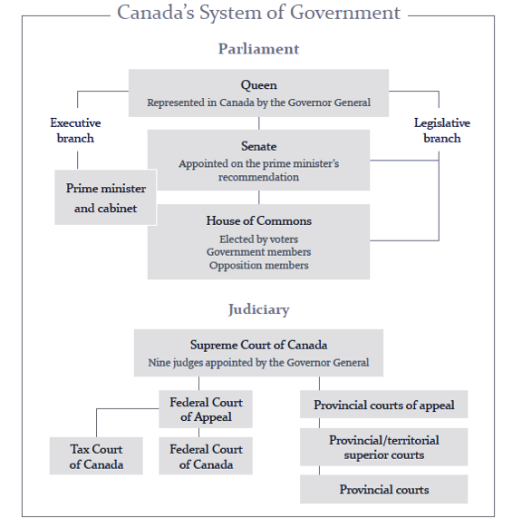

# LAW_V 509 99A 2025W1 Administrative Law: Introduction

## 1.0 Overview

- Topic 1: Administrative Law: What is it and Why Does it Matter?
- Topic 2: Executive Branch of Government in Canada
- Topic 3: The Canadian Administrative State: Origins & Significance

### Module Required Readings

- Administrative Law in Context, **pp 1-22** (I to VIII).
- “What is Administrative Law?” Justice Education Society of B.C

    <!-- Copy & Pasted from YouTube -->
    <iframe src="https://www.youtube.com/embed/2RwiOrYbBUA" frameborder="0" allowfullscreen></iframe>

- Hutchinson, A. “[Why I Don’t Teach Administrative Law (And Perhaps Why I Should?)](https://digitalcommons.osgoode.yorku.ca/cgi/viewcontent.cgi?article=3044&context=ohlj){:target=" \_blank"}” 2016 53(3) Osgoode Hall Law Journal 1033-1047Links to an external site.

## 1.1 What is it and Why Does it Matter?

This course will examine the main functions of Canadian administrative law under the following broad themes:

### Delegating Powers

Canada is a parliamentary system where in theory elected representatives make laws that govern the various relationships in society. Not surprisingly, the expansion of the Canadian state, along with most other modern nation-states, has meant that elected representatives cannot make laws to govern every possible relationship or situation that arises in modern society. This is where **delegation of law-making powers** comes into play. The **federal** government in Ottawa, along with **provincial** and **territorial** governments, delegate a large number of law-making, administration and implementation powers to **administrative agencies**. In Canada, administrative agencies reflect almost every area of government activity. Examples include liquor licensing, telecommunications regulation, housing permits, inter-provincial trade, along with various administrative tribunals that make decisions in these areas.

### Jurisdictional Issues & Remedies

**Administrative tribunals (and administrative decision-makers)** operate with a specific jurisdiction and delegated powers usually defined by the statute that created them. This is known as the **enabling statute**. Tribunals must not exceed the scope of the powers delegated to them by their enabling statute or they risk exceeding their jurisdiction. In such cases, regular courts may examine the tribunal’s enabling statute and other law, and may reverse an administrative tribunal’s decision. This is known as **judicial review** and depending on the clarity of the enabling statute’s language, issues of jurisdiction may not always be clear. In such cases, courts can be cautious in interfering with tribunal decisions because of the perceived expertise of their decision-makers.

### Procedural Fairness, Independence & Bias

There are some important grounds for judicial review of administrative actions that will be examined. One of the most important issues with administrative tribunals concerns **procedural fairness**. Administrative decisions must be fair. In legal terms, they must follow the proper procedure in coming to a decision. In many instances, an enabling statute may set out the basic procedures that consist of procedural fairness. Examples include the types of evidence a tribunal may receive, the amount of notice that must be given to a participant in a hearing, the right to represent themselves in a hearing or the right to counsel, etc. However, as with jurisdictional issues, in some cases an enabling statute does not clearly specify decision-making procedures. In these instances, courts will apply **common-law principles**, such as natural justice, in reviewing administrative decisions to establish that a decision was arrived at fairly. Natural justice principles guide courts in reviewing decisions for independence and impartiality. Administrative decisions must be independently arrived at and free of bias.

### The Standard of Review

An individual’s ability to challenge administrative decisions in a regular court depends on two factors. First, there must be availability of an appeal or judicial review. Enabling statutes or other legislation may provide for a route of appealing an administrative decision. In situations which are unclear, an appeal can be based on the traditional availability of appeal to higher courts of law in Canada to review the decision of inferior legal bodies. This is based on Canada’s hierarchical court system, with provincial trial and appeal courts and the highest appeal court being the Supreme Court of Canada. Second, the status of the individual who comes before the court is often at issue on whether a review of an administrative decision is available.

## 1.2 Executive Branch of Government in Canada

Administrative law in Canada is part of a broader body of law called Public Law. These bodies of law are considered Public Law when these areas of law have rules defining **scope and exercise of government power**. Administrative law by definition concerns government legislative action and is part of public law’s structuring of legal relationships between different branches of government. 

At the formal peak of those possessing prerogative or statutory powers is the Head of State. In Canada, this is **the Queen** in right of Canada and the various provinces almost invariably functioning through her royal representatives, the **governor general** or **the lieutenant governors** of the provinces. 

When we speaking of Executive power in Canada today, the effective apex of executive power is the **Prime Minister** (Federally) or the Provincial/Territorial **Premiers**. The Executive also includes the Federal & Provincial/Territorial **Cabinets**.

The way that Government departments are organized allows for Ministers to **delegate** their authority to subordinates. Ministers are presumed to act through responsible government **officers**.

> The types of legal limits to decision-makers using delegated executive authority are often stated in passive, vague language. Such statutes often use wording such as "The Minister may . . .", rather than "The Minister shall. ..." And along with this permissive language Statutes in Canada sometimes allow the Minister to delegate powers **without designating specific civil servants**.

Most of administrative law’s **limitations** on the exercise of statutory power are procedural and either based on Canadian Constitutional limitations or on the Enabling statute itself. Canada’s ***Charter of Rights and Freedoms*** is a frequent source of limiting power on administrative decisions. Procedural limitations other than those in **enabling statutes** can be found in **regulations, rules, and by-laws** created under the enabling authority. Sometimes **common law principles** prescribe limits on administrative actions based on rules of natural justice or procedural fairness.

## 1.3 The Canadian Administrative State

**Independent administrative tribunals or agencies** often operate in what has been described as “decentralized and expert-driven” bodies. In general, administrative decision-makers are given special powers to refine and apply the law under a statute what we’ve referred to as an “**enabling statute**.” 

Different purposes or functions an independent agency might serve:

- The legislature may determine that certain decisions are best made on a principled basis and should be **insulated from considerations of political**
- An agency might **administer government entitlement disputes** – in other words, acts as an adjudicator in settings where the government itself is a party; and, administer other important matters, such as economic matters, away from political
- A need may exist for a specialized body with a particular kind of **expertise/staff of experts**
- A public service may require **cross-jurisdictional coordination**

Administrative bodies will vary greatly in their functions, purposes and ‘character’ but **administrative independence** is generally critical to proper functioning of administrative tribunals and decision-making.

