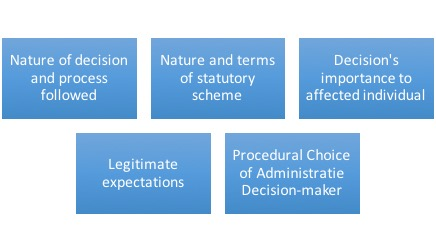

# Procedural Fairness

This Module covers another central administrative law concept, that of procedural fairness. The rules for procedural fairness vary according to the enabling statutes and subject-matter for the various tribunals. However, there are many commonalities among basic principles. For example, the procedural outlines for decision-makers used by Immigration, Refugees and Citizenship Canada frames basic requirements of **procedural fairness** for applicants:

- To be provided with a **fair and unbiased assessment** of their application
- To be **informed** of the decision-makers concerns, and
- To have a meaningful opportunity to provide a **response** to concerns about their application.

## 4.1 Sources & Development of Procedural Fairness

!!! note "Readings"

    - Textbook, pp. 178-195
    - ***Nicholson v. Haldimand-Norfolk Regional Police Commissioners***, [1978 CanLII 24 (SCC)](https://canlii.ca/t/1mkvl){:target=" \_blank"}

Five core principles that underlie the law of fair procedure in the administrative context:

### A . THE INHERENT VALUE OF FAIRNESS

Fair procedure is valuable because it expresses a **commitment to integrity** in exercises of public power and a **respect for the dignity** of the parties affected by state action. Fairness is, in this way, **an end worthy of pursuit** in and of itself.

**Extending the Reach of Procedural Obligations**

Historically, two branches of natural justice, namely **_audi alteram partem_** (“hear the other side”) and **_nemo judex in sua causa_** (“no person can be the judge in their own cause”).

In the later decades of the 20th century, the courts moved away from the distinction between judicial, quasi-judicial, and administrative decisions when determining which public actors must act fairly.

the duty of fairness is assessed on a **spectrum**. At the l**ow end** of the spectrum, a decision-maker is bound by a minimum level of procedural duties, such as simply providing notice that a decision will be made to affected parties. At the **high end**, a decision-maker must follow a more onerous set of procedures that may, in some cases, replicate the procedures followed in a civil or criminal trial.

**The Legal Consequences of Unfairness**

As a general rule, administrative decisions that are made unfairly **cannot stand**, even if the merits of the decisions are sound.

### B . THE RULE OF LAW AND ACCESS TO JUSTICE

the **rule of law** is a shared project in which public power is distributed across a sprawling, horizontal network of actors. Many **institutions**, legislatures, the executive, the courts, and the expanse of actors operating within the administrative state, participate in implementing, advancing, upholding and, at times, resisting and undermining the values that the rule of law seeks to protect. **Private** actors also play a role in upholding the rule of law by having high **expectations** of public actors and holding public decision-makers to **account** when those expectations are not met.

**Implications this conception of the democratic rule of law have for procedural justice:**

- First, upholding the democratic rule of law is a responsibility shared by a range of public institutions.
- Second, procedural design and interpretations of fairness can have a meaningful impact, either positive or negative, on access to justice.
  - administrative law should strive to ensure that the legal meaning of fairness is attentive to the **inextricable connection** between procedural integrity and the full participation of affected parties in public decision-making.
- Third, the democratic rule of law demands that those who wield public power are held accountable when they act unlawfully.
- A fourth and final response is that the democratic rule of law is upheld not merely by formal mechanisms of accountability and oversight, but also by a culture of decision-making that reflects fundamental **values and the norms** of good public administration.

      - A core element of the culture of the rule of law is justification; the democratic vision regards the “justificatory exercise of reason-giving ... as an essential component of the rule of law.
      - In **_Baker_**, the Court held that an administrative decision-maker is under a duty to provide “some form of reasons” when an administrative decision has “important significance.
      - In **_Vavilov_**, the Court described the significance of this commitment in terms of legitimacy at 81, "[W]here reasons are required, they are the primary mechanism by which administrative decision makers show that their decisions are reasonable." and at para 98, "[w]here a decision maker’s rationale for an essential element of the decision is not addressed in the reasons and cannot be inferred from the record, the decision will generally fail to meet the requisite standard of justification, transparency and intelligibility."

### C . ENFRANCHISEMENT AND FLEXIBILITY

Specific procedures that comprise a process that is fair, on the whole, will always depend on the **context**.

Every fair process must include steps that fall into two broad categories: **first**, steps concerned with “the quality of **participation** afforded to persons affected by [the] decision” and **second**, steps concerned with “the kinds of **reasons** which may be offered to justify the decision itself.

The law treats both **participatory rights** and **protections from bias** as vital to the integrity and fairness of public decision-making.

In **_Baker_**, **L’Heureux-Dubé J** articulated the **legal standard for assessing whether modes of participation are fair**. “Administrative decisions,” she held, must be “made using a fair and open procedure, appropriate to the decision being made and its statutory, institutional, and social context, with an opportunity for those affected by the decision to put forward their views and evidence fully and have them considered by the decision-maker.”

The **standard for disqualifying bias** is equally well-established. It was set out in **_Committee for Justice and Liberty et al. v. National Energy Board et al._**, [1976 CanLII 2 (SCC)](https://canlii.ca/t/1mk9k){:target=" \_blank"}, a case dealing with allegations of bias against the National Energy Board. **de Grandpré J** held that to determine whether a decision-maker is tainted by a reasonable apprehension of bias, we should ask what an “informed person, viewing the matter realistically and practically, and having thought the matter through, [would] conclude.”

There is no set or checklist of procedures that will automatically meet the standards
set in ***Baker*** or ***National Energy Board*** in all cases. ... the standards must be **sufficiently expansive** to capture all administrative decision-making contexts. The specific procedures that must be followed in order to satisfy the demands of fairness in each case will **always depend on the circumstances**.

However, as the stringency and complexity of procedural obligations expand, access to justice may diminish.

In **_Canada (Attorney General) v. Mavi_**, [2011 SCC 30 (CanLII)](https://canlii.ca/t/flsj3){:target=" \_blank"}, Binnie J wrote,

> **a balance must be struck**. Administering a “fair” process inevitably slows matters down and costs the taxpayer money. On the other hand, the public also suffers a cost if government is perceived to act unfairly, or administrative action is based on “erroneous, incomplete or ill-considered findings of fact, conclusions of law, or exercises of discretion.

### THE PRACTICES OF PROCEDURAL FAIRNESS

In order to determine the specific procedures that any administrative decision-maker must follow, we must always look to three types of sources: **statutes and subordinate instruments**, the **Constitution**, and the **common law**.

**PROCEDURAL OBLIGATIONS ARISING FROM STATUTE, REGULATIONS, RULES, AND GUIDELINES**

**Enabling Statutes and Internal Instruments**

Barring any constitutional concerns, the obligations set out in
the enabling statute will be binding on the decision-maker. It is rare for a decision-maker’s enabling statute to provide a complete procedural code. The procedures set out in the enabling
statute will usually be a minimum set that is then **supplemented** with additional obligations from additional regulation(s), the common law, internally made rules (see e.g. a discussion of “soft law” below), and, in some cases, constitutional law.

The legislature will **delegate** the authority to establish additional procedural obligations to an executive actor.

Research shows that soft law **instruments** developed by a decision-maker are powerful sources of authority for front-line decision-makers and have been treated as _de facto_ binding on the ground. However, guidelines, including procedural guidelines, are **not legally binding** on a decision-maker.

Guidelines established by an administrative decision-maker can give rise to **legitimate expectations** that a particular process will be followed. We see this at work in **_Agraira v. Canada (Public Safety and Emergency Preparedness)_**, [2013 SCC 36](https://canlii.ca/t/fz8c4){:target=" \_blank"}.

**General Procedural Codes**

Some administrative decision-makers are also subject to procedural obligations set out in **general procedural statutes**. General procedural codes have been enacted in four provinces: **Quebec, Ontario, Alberta, and British Columbia**. These statutes set out common procedures that govern the decision-making bodies that fall within the scope of the statutes.

**PROCEDURAL OBLIGATIONS ARISING FROM THE CONSTITUTION**

**First**, the **Charter** provides for some procedural safeguards in decision-making contexts to which it applies and when the relevant threshold is met.

The question in an administrative setting would be whether the Charter applies and whether the context constitutes a “proceeding.”

**Second**, statutory procedural obligations could be struck as contrary to the division of powers if _ultra vires_ the enacting legislature or to s 96 of the Constitution Act, 1867 if, in effect, they undermine the jurisdiction of the superior courts.

**Third**, an administrative decision-maker’s procedural obligations can be supplemented by virtue of the **rights guaranteed by s 35 of the Constitution Act, 1982** and the obligations flow-ing from the unwritten principle of the honour of the Crown.

**Fourth**, other **unwritten constitutional principles**, can be the source of procedural obligations for administrative decision-makers. For example, **judicial independence** has been held to be the source of administrative procedure.

### Module Content

It’s important to note for now that decision-making is now seen as existing on a **spectrum**. The type of administrative decision and the procedural obligation it triggers influences where it will fall on this spectrum and the types of procedural fairness requirements accorded.

Our case reading for this topic, **_Nicholson v. Haldimand Norfolk (Regional) Police Commissioners_**, illustrates the movement towards developing a “duty of fairness” that applied to all administrative decision-makers. As noted above this duty consists of a **spectrum** of procedural obligations **ranging from providing mere notice to following an exhaustive set of procedures akin to a criminal trial**.

The theory in **_Nicholson_**, that entitlements to basic fairness in procedure no longer depended completely on the nature of the tribunal, was subsequently developed in practice through various decisions.

## 4.2 Threshold Test & Trigger

!!! note "Readings"

    - Textbook, pp 23-25 (A); 201-203
    - ***Cardinal v. Director of Kent Institution***, [1985 CanLII 23 (SCC)](https://canlii.ca/t/1ftwk){:target=" \_blank"}

!!! info "_Cardinal v. Director of Kent Institution_, [1985 CanLII 23 (SCC)](https://canlii.ca/t/1ftwk){:target=" \_blank"}"

    - [1] Legal issue: whether the segregation was imposed or continued in breach of the requirements of procedural fairness?
    - [14] the Director was under a duty of procedural fairness in exercising the authority conferred by s. 40 of the Regulations with respect to administrative dissociation or segregation. This Court has affirmed that there is, as **a general common law principle**, a duty of procedural fairness lying on every public authority making an administrative decision which is not of a legislative nature and which affects the rights, privileges or interests of an individual.
    - [21] ... because of the serious effect of the Director's decision on the appellants, **procedural fairness required that he inform them of the reasons** for his intended decision and **give them an opportunity, however informal, to make representations** to him concerning these reasons and the general question whether it was necessary or desirable to continue their segregation for the maintenance of good order and discipline in the institution.
    - [23] I find it necessary to affirm that the **denial of a right to a fair hearing must always render a decision invalid**, whether or not it may appear to a reviewing court that the hearing would likely have resulted in a different decision. The right to a fair hearing must be regarded as an independent, unqualified right which finds its essential justification in the sense of procedural justice which any person affected by an administrative decision is entitled to have.

First, a court should ask itself what is called the **“threshold” question**: is this the kind of decision that should attract some kind of procedural right? At this stage, the court is not asking what those rights would encompass, but only the preliminary question of whether there should be any entitlement to procedural fairness at all.

Second, if a court determines that the threshold for some form of procedural fairness has been met, it must then address what those procedures will be.

The Supreme Court of Canada, in **_Baker_**, identified the following **five factors** as relevant in determining the general level of procedural fairness:

- the nature of the decision and the process followed in making it;
- the nature of the statutory scheme;
- the importance of the decision to the individual affected;
- the legitimate expectations of the parties; and
- the procedures chosen by the tribunal.

**PROCEDURAL OBLIGATIONS ARISING FROM THE COMMON LAW**

We must answer two questions in order to determine what procedural obligations an administrative decision-maker must follow.

First, is the duty of fairness triggered, i.e., is the decision being made one that must be made fairly?

If the answer is no, the decision-maker can, as a matter of law, proceed without the responsibility of common law obligations. If the answer is yes, we move to the second question:

What does the duty entail? As we will see, answering this question calls for a close assessment of the context. This framework is well-established in Canadian administrative law via the leading case of **_Baker v. Canada (Minister of Citizenship and Immigration)_**, [1999 CanLII 699 (SCC)](https://canlii.ca/t/1fqlk){:target=" \_blank"}.

**Step 1: Is the Duty of Fairness Triggered?**

As a general rule, first set out in **_Cardinal v. Director of Kent Institution_**, [1985 CanLII 23 (SCC)](https://canlii.ca/t/1ftwk){:target=" \_blank"}, the duty of fairness applies to “**every public authority making an administrative decision which is not of a legislative nature and which affects the rights, privileges or interests of an individual**."

There are some **limits** to the reach of the duty of fairness:

- First, as a general rule, **legislative decisions** and legislative decision-making processes do not trigger the duty of fairness.
- The duty of fairness also does not apply to decisions of a “**legislative nature**” or to decisions of an administrative decision-maker acting “in a legislative capacity to make rules of general application in the public interest.
- **public employees**, employed under contract and protected from wrongful dismissal, are not entitled to procedural protections at common law when they are dismissed from their jobs.

      - This may be somewhat surprising as the foundational cases on the duty of fairness are ***Nicholson and Knight***, both of which deal with the dismissal of public office holders and in both of which the duty of fairness applies.
      - But the more recent case of ***Dunsmuir*** held that “[w]here a public employee is protected from wrongful dismissal by contract, his or her remedy should be in **private law**, not in public law.”

**Step 2: What Does the Duty Entail?**

_The Purpose of Participatory Rights_:

> ensure that administrative decisions are made using a fair and open procedure, appropriate to the decision being made and its statutory, institutional, and social context, with an opportunity for those affected by the decision to **put forward their views and evidence fully and have them considered by the decision-maker**. (**_Baker_** at para 22)

_The Contextual Factors and the Spectrum of Fairness_

"**_Baker_** factors" (introduced above).
the goal of assessing the "**_Baker_** factors" is to gauge where a particular decision-making context falls on the **spectrum of fairness**.

_Identifying Specific Procedures_

The usual range of possibilities includes:

- processes for giving notice,
- providing disclosure,
- holding hearings (which raises questions about the form of the hearing: oral, written, electronic, open, closed, etc.),
- ensuring representation,
- establishing opportunities to call evidence and cross-examine witnesses,
- determining deadlines and the relevance of timeliness,
- providing reasons, and so on.

First, a core element of procedural fairness is **notice** that a decision is to be made.

Second, hearings in administrative contexts come in a variety of forms without compromising fairness. It is only in **rare** cases that the common law requires that a decision-maker hold **an oral hearing**.

Finally, it was “now appropriate to recognize that, in certain circumstances, the duty of procedural fairness will require the provision of a **written explanation for a decision**." (**_Baker_** at para 43)

### Module Content

Determining whether a decision must involve some procedural requirements and possess a duty of fairness involves the Court asking a “**threshold question**”: Are procedural requirements imposed in this kind of decision? It also involves asking the extent of those requirements, which encompasses the duty of fairness.

In **_Cardinal v Kent_**, the Supreme Court restated the general common law principle outlined in **_Nicholson_** and other cases, that a duty of procedural fairness lies on every public authority making an administrative decision “which is not of a legislative nature and which affects the rights, privileges or interests of an individual.”

As you read the case excerpt, the key question to consider is at paragraph 15, paraphrased here: What does the duty of procedural fairness reasonably require of a public authority [making administrative decisions] in the way of specific procedural rights in a particular legislative and administrative context and what should be considered to be a breach of fairness in particular circumstances?

One of the key points from **_Cardinal_** is that a non-legislative decision affecting “rights, privileges or interests of an individual” is **sufficient to trigger** the application of a duty of fairness.

## 4.3 Modern Test - Content

!!! note "Readings"

    - Textbook, pp 25-27; 199-201; 203-214
    - **_Baker v. Canada (Minister of Citizenship and Immigration)_**, [1999 CanLII 699 (SCC)](https://canlii.ca/t/1fqlk){:target=" \_blank"}

### CHALLENGING UNFAIRNESS

First, absent exceptional circumstances, the usual remedy for a finding of unfairness is a **quashing** of the administrative decision. Further, as the courts bear the constitutional responsibility to ensure that statutory decision-makers act within their jurisdiction, matters of unfair procedure could **not be protected by a privative clause**.

Second, traditionally, the black letter rule is that procedural decisions are reviewed on a **standard of correctness**.

But, who get to decide what type of procedures applies to a specific case?

The majority in **_Vavilov_** clearly states that its approach to standard of review only applies when the **merits of an administrative decision are under review**, and affirms that “[t]he duty of procedural fair-ness in administrative law is ‘eminently variable,’ inherently **flexible and context-specific**.” ... the specific procedural requirements that the duty imposes are determined with reference to all of the circumstances,” aided by an analysis of the non-exhaustive list of **factors in _Baker_**.

In summary, judicial review of procedural questions seems to entail a “free-standing” appraisal of the fairness of the decision-making process, one that can be most fairly labelled **correctness**.

### Module Content

!!! info "Baker’s Five Factors"

    

Flexibility and contextuality are key concepts which run through developing the procedural requirements to establish and satisfy a duty of fairness.

In terms of **flexibility**, Canadian courts have recognized a range of hearing processes that could satisfy common law procedural requirements that depend on the context. Flexiblity also extends to the form of decision reasons that would be acceptable.

However, **contextually** what was even more important was that the Court made it clear that it was not imposing a duty to give reasons in all situations. Whether the requirement existed in any particular case required a context-sensitive analysis. Relevant to this analysis were the nature of the interests at stake, whether there was a statutory right of appeal, and unspecified "other circumstances."

Note that there is flexibility even in the mandatory requirements. For example, the right to a hearing could mean no more than the opportunity to submit a written application and to have one's case actually considered and determined by reference to the criteria on which the application form questions are based. This may sound like a very minimal participation but it is still in a real sense a "hearing."
