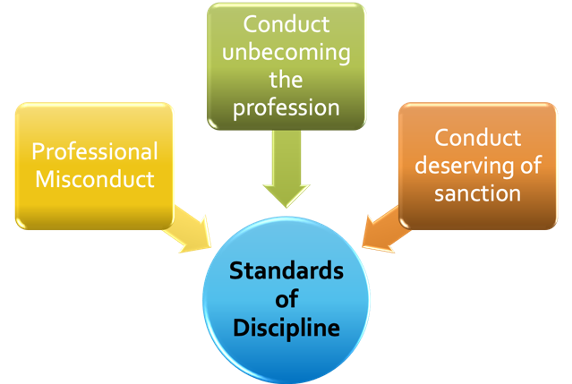
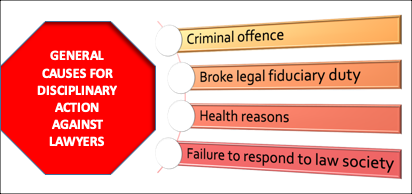
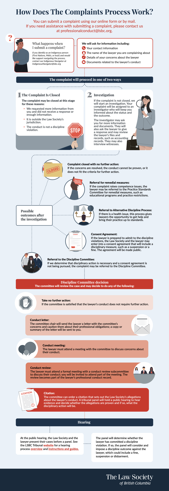

#  Regulation & the Legal Profession

<!-- 
**Commentary**
 -->

## 2.0: Overview

In the previous module we examined the sources of ethical conduct.  You learned that the main instruments relating to ethical conduct are expressed in legislation and regulatory codes, as well as various case law and tribunal decisions.  In this Module we examine more closely how these sources of ethical conduct and related instruments impact professional conduct in the practise of law in Canada. 

By the end of this module you will be able to:

- Identify sections of provincial legislation relevant to authority to practise law and dealing with public complaints
- Gain an understanding of the Canons of Legal Ethics contained in the BC Code
- Understand the process of discipline and regulation of legal practise in BC
- Apply specific sections of the B.C. Code to issues arising in a lawyer’s conduct and relationships with others

!!! note "Readings"

    - Woolley: 
        - Chapter 2: The Legal Profession and Lawyer Regulation in Canada
        - Chapter 11 - See Syllabus for Pages (Pages 797 - 846)
    - [BC Code](https://www.lawsociety.bc.ca/for-lawyers/act-rules-and-code/code-of-professional-conduct/){:target=" \_blank"}: 6.1, 6.2, 6.3; 7.1, 7.2, 7.3, 7.4, 7.5, 7.6, 7.7, 7.8
    - *Legal Profession Act*, [[SBC 1998] CHAPTER 9](https://www.bclaws.gov.bc.ca/civix/document/id/complete/statreg/98009_01){:target=" \_blank"}: ss 1 (“conduct unbecoming the profession”, “practice of law”), 3, 15, 16, 19, 26, 30
    - Article: Pue, “*Banned from Lawyering: Gordon Martin, Communist*”
    - Cases:
        - ***Martin v. Law Society of British Columbia***, [1950 CanLII 242 (BC CA)](https://canlii.ca/t/gwcb9){:target=" \_blank"}
        - ***Butterfield (Re)***, [2017 LSBC 2 (Canlii)](https://canlii.ca/t/gx2bv){:target=" \_blank"}

## 2.1 Lawyers & Self-Regulation in Theory & Practice

The **protection of the public** and the **integrity of the profession** are just some of the key theoretical principles underlying the regulation of the legal practise.  As a profession, l**awyers are largely self-regulated through the provincial law societies**, although, as we shall examine, there is room for judicial oversight of certain conduct.  

The text readings for this topic  explain the often-vague **concept of self-regulation**.  **Regarding lawyers, self-regulation refers to an administrative body** – a Law Society – which is **a public, administrative body** because it is a product of a provincial statute (in B.C., The *Legal Profession Act*).  Law Society proceedings and hearings are also part of public law and administrative law because they are supposed to serve the public interest.  The ***Code of Conduct*** also guides the Law Society in disciplinary proceedings. 

In general, without oversimplifying a diverse range of view, most lawyers view self-regulation as functioning adequately.  Some criticisms of the self-regulatory model argue that this is a natural result of the specialized, elite nature of the legal profession and especially inherent in attitudes on who is admitted into the profession. 

Keep in mind the following key points and questions as you read through this module:

- The structure and scope of self-regulation
- Entry requirements to practising law and how law societies regulate entry
- The arguments of law as an “industry” rather than a profession

**SELF-REGULATION**

**Why do lawyers regulate themselves?**

**Wes Pue** was a professor and legal historical here at UBC who passed away. He argued that lawyers, particularly in Western Canada, based their structures on an English model that was designed to promote lawyers dominance and control of their own profession. However, they were also influenced by developments in the United states, specifically the movement in the American legal profession in the early part of the 20th century influenced Canadian lawyers towards regulation of ethical standards of the profession in Canada.

So these characteristics:

- governance by an autonomous body disciplined by a tribunal of that autonomous administrative body; and
- extensive education leading to specialized knowledge in the profession, specifically in the members of the profession

all create the rationale for the “self regulated monopoly.” It is a profession that because of historical reasons and the existence of these structures **continues to self-regulate itself**.

Lawyers by and large are supportive of the self regulating structure but it is generalizing to say that all lawyers support all aspects of that self-regulation. In contrast to this view from lawyers from the inside of the profession, it is interesting to see what other experts in other areas like economists, for example have said.

 
**An Economic Perspective**

Economists tend to take a more objective view by looking at the historical context and applying it to the present situation.  **One view from the economic perspective is that law as a “profession” should be separated from law as an industry.**

This is an interesting dichotomy between law as a profession and law as an industry, in this view the legal profession refers to lawyers skills and training and their zealous and ethical representation of their clients.

**Looking at the profession**,  the economists view acknowledges the social contract to represent society by upholding the rule of law. For example, regulation of the profession of law from this perspective should focus on ethical practice standards to protect clients and society as a whole. This takes a holistic view and from this perspective, **lawyers are best placed to regulate the “profession.”**

However, there was an economic argument, largely that law is an “industry.” Industry being defined as the interdisciplinary technology driven by the global business of delivering legal services to various and diverse clients. It is about about providing legal services not only in person but increasingly online through virtual technology to help with access to justice issues. For example, using technology in situations such as globally with COVID-19 where traditional legal services could not be provided to clients. This is the legal industry and the economic argument is that **regulation of the industry of law is best served by providing the flexibility to structure delivery and economic models that align providers with legal buyers, enhance competition and promote innovation.**

The objectives of industry regulations should be to **promote competition**, for example encourage technological innovation and delivery of services to allow formation of delivery models that enhance access to an improved delivery of legal services.
 
This is part of the evolution of lawyers’ practice.  Practising law used to solely involve legal delivery. Law was about legal expertise and nothing else, so lawyers were well-suited to define and enforce practice standards. But over the last 25 years, and particularly in the last 10 years after the global economic crash – legal services and their delivery was impacted by businesses that were also streamlining their approach.  **Technology is a big part of this – it has changed legal services more to become products in many cases.**  So what is it to be a lawyer today and more importantly in the future? 

The argument here is that because of **technological innovation, which has outpaced self-regulation**, (and the argument self-regulation conflates practice and the industry (read delivery of services) ), **there is a growing crisis of access to justice by those cannot afford legal services.**
 
This example is drawn from the United States where state bars have repeatedly tried to go after companies like **LegalZoom** or **RocketLawyer** with unauthorized to practice complaints.  They’ve largely failed, but the important point is that most consumers were not complaining about these services, in fact consumers are largely satisfied with them, but rather it was the state bar associations that went after them, overruling consumers in this instance.

 
**Self-Regulated Monopoly**

The text gives **an overview of the history of lawyers’ ”self-regulated monopoly."** 

In particular some of the statements that Canadian societies make are an appeal to history of the profession and the importance of **maintaining an independent bar** is still the dominant expression in this area.  **Independence is linked with self-regulation to form a component of the Rule of Law**, which in Canada as you know is a constitutional principle.  And the SCC has supported this view in its decisions. 

**Self-regulation in Canada is carried out through provincial and territorial law societies, which control membership and are public bodies.**  Although in Canada lawyers are regulated provincially, **the Federation of Law Societies of Canada has become a sort of quasi-national focal point to coordinate regulation on a national basis.**  The need for more consistent movement of lawyers across Canada formed the basis for the National Mobility Protocol (enacted in 2013).  

Historically, lawyers in one province couldn’t easily practice in another province.  **The Federation has enhanced mobility of Canadian lawyers within Canada through setting common law degree standards** (that as you probably know are also applied to foreign law degrees).  The Federation followed the model of the American Bar Association in developing a national Code of Conduct, but the Federation’s work has more legal persuasiveness because the provincial law societies in Canada collectively produced it.

Self-regulation has been affected by provincial and national legislation, in particular the Federal Government’s money laundering legislation that was the subject of the ***Federation v Canada*** case that we just reviewed.  But notwithstanding these individual areas, **regulating the law profession primarily still mainly involves controlling who is allowed to formally enter the profession and how they conduct themselves.** 

So in terms of entering the profession, there are of course education requirements.  The text addresses this thoroughly and I think you are all very familiar with the education requirements to practice in Canada. 

**Good Character as a Requirement for Entry**

There is **no clear statutory definition** for “good character.”  This has lead to some inconsistency in how law societies have applied the standard. In addition, while the good character requirement applies to every applicant for law society admission, it results in the exclusion of very few. Based on a review of the cases and data provided by law societies, about six applicants to Canadian law societies were denied admission on the basis of character from 2006-2012. The good character requirement imposes a regulatory cost – in Ontario, e.g., 575 applications raised issues of character in 2006-2012, and 24 hearings were held – but it does not significantly change the composition of the profession.

While good character decisions are now published by most Canadian law societies, much of the process is private. It is not known, for example, on what basis the Law Society of Upper Canada decided to conduct hearings in 24 of the 575 cases in which a character issue was raised. It is also the case that most Canadian law societies do not independently verify applicant character. **Only a few law societies – Manitoba and Nova Scotia are two – have introduced mandatory criminal record checks.**  

Generally the outcome of hearings was greatly **dependent on whether the applicant admitted to the misconduct** that gave rise to the good character hearing.  **Overwhelming majority of those cases where applicant admitted their misconduct resulted in applicant being admitted.**  On the other hand, **applicants who refused to acknowledge their misconduct were almost always not admitted.**  Part of the reason for this is that the Balance of Probability is on the claimant in these hearings – and evidentiary rules are very loose, the Law Society can rely on hearsay and sometimes incomplete evidence, while the applicant can be subjected to cross-examination by Law Society counsel.

There also seems to be little or no evidence pointing to a correlation between good character hearings and future professional misconduct. 

**There are calls** to reform the good character requirement – the Federation has a proposal to consider “suitability” for legal practise, instead of good character. **Suitability** review would consider whether an applicant has the “honesty, integrity and candour that members of the profession must possess”. The Federation’s approach has the advantage of removing some of the vagueness around. “good character”. It would focus on what’s necessary to ensure ethical legal practice. At the same time, though, “**honesty, integrity and candour**” are **key parts** of the current definition of “character”, so it is not clear how much of a change suitability review would effect.

In particular, it is not clear how suitability review would eliminate some of the problems with the current approach – e.g., **the excessive reliance on applicants acknowledging their past misconduct.** The Federation’s recommendations also do not address the process for assessing character, in which applicants must demonstrate their character in the face of hearsay evidence and cross-examination.

**There are also calls** to simply abolish the requirement as a waste of scarce resources. 

Nevertheless the requirement remains, and in B.C. it can and does result in inquires and hearings.  Although there is no clear statutory definition of “good character” there are some previous decisions in other jurisdictions that have tried to define “good character.” I found one reference from Law Society of ***Upper Canada v. Schuchert***, [2001] LSDD No. 63 (considered by the Law Society of British Columbia in Application of ***De Jong (Re)***, [2017 LSBC 44 (CanLII)](https://canlii.ca/t/hp9t1){:target=" \_blank"}) where the definition of “good character” is summarized as

Character is that combination of qualities or features distinguishing one person from another. **Good character connotes moral or ethical strength**, distinguishable as an amalgam of virtuous attributes or traits which would include, among others, **integrity**, **candour**, **empathy** and **honesty**.

## 2.2: Anatomy & History of the Canons of Legal Ethics

!!! note "Readings"

    - Article: Wes Pue, “*Banned from Lawyering: Gordon Martin, Communist*”
    - Cases: ***Martin v. Law Society of British Columbia***, [1950 CanLII 242 (BC CA)](https://canlii.ca/t/gwcb9){:target=" \_blank"}

The historic self-regulation of lawyer conduct in common law jurisdictions, such as England, was originally conducted through the ethics expected of a “gentleman.”   These were loosely based on conduct expected of those members of society composed of barristers and solicitors.  

In Canada, lawyers’ expected conduct was first codified in writing in 1920, in the *Canadian Bar Association’s (CBA) Canons of Ethics*.  It was modelled on the existing *American Canons of Ethics* and very sparse by today’s standards.  By 1974, the CBA adopted a new Code of Professional Conduct that was used by provincial law societies but it was a minimalist document, something more like an appeal to lawyers to conduct themselves ethically using their own discretion, rather than a more binding code of ethics.  **It wasn’t until the 1990s that Canadian provinces, starting with Alberta, gradually began developing more detailed Codes of Conduct.**

**Model Code of Professional Conduct**

In 2009, the **Federation of Law Societies of Canada (FLSC)** developed its own model which has since been largely adapted with some local modifications across Canada. 

The move towards written codes of ethics for lawyers is largely a result of the need for clarity and certainty in an increasingly diverse profession.  Part of this is the need for written, specific rules rather that just general expressions for lawyers to exercise their discretion to act “ethically.”

Consider the notion that a written code of ethics makes sense for lawyers.  Lawyers are most comfortable applying specifically outlined, clear rules in solving legal problems generally so why should ethics be any different?  As noted in the text readings, statements of “general ideological principles” are not usually very helpful in the context of ethical issues in a practical way.  

The difficulty here lies in the need to gain broad acceptance of code of ethical rules, or **a general consensus**, among lawyers.  In order to gain this consensus you have to make a Code of Ethics “reasonable” to most lawyers, which often involves inserting more abstract language **that may inhibit enforcement**. 

The other more general criticism is the **difficult idea of a binding code of ethics**:  such a notion really involves morality and legislating morality can be problematic.  

More disturbing, there are arguments that historically codes of ethics can be used to **suppress elements of a profession that they do not approve of**. 

!!! info "Wes Pue, “*Banned from Lawyering: Gordon Martin, Communist*”"

    **Gordon Martin**, a war veteran and University of British Columbia law graduate, was denied admission to the practice of law by the Law Society of British Columbia in the late 1940s due to his communist beliefs. Although Martin openly acknowledged running as a candidate for the communist Labour Progressive Party, he presented evidence of his good character and testified that his views did not entail the violent overthrow of government. However, the Benchers of the Law Society ruled that his Marxist ideology made him dishonest, rendering him unable to take the required professional oath in good faith and thus failing the requirement of being a "person of good repute" under the *Legal Professions Act*.

    Martin challenged this exclusion through judicial review, but **Mr. Justice Coady** of the Supreme Court of British Columbia upheld the Benchers' ruling. Coady J. concluded that student apprenticeship conferred no vested right to practice and that the Benchers possessed absolute discretion to determine fitness, provided they acted without bad faith. Following legislative amendments establishing a right of appeal, Martin brought his case to the **British Columbia Court of Appeal**, where all five judges dismissed his appeal.

    The Court of Appeal's judgments contained strong anti-communist rhetoric, viewing **communism as a subversive fifth column** aimed at destroying Canadian constitutional democracy. Chief Justice **Sloan** and Mr. Justice **Sidney Smith** affirmed that the courts should defer to the administrative discretion and intuition of the Benchers rather than requiring strict legal proof of subversion. Mr. Justice **O'Halloran** authored an extensive opinion criticizing American liberal jurisprudence, specifically **Oliver Wendell Holmes**'s philosophy of a "free trade in ideas", arguing instead that Canadian lawyers have a positive duty to uphold absolute democratic values and protect the state from alien ideologies.

    The case reflected intense mid-century **Cold War anxieties** influenced by recent espionage revelations. Following his exclusion, Martin worked in a saw mill and ran a television repair shop before passing away in 1974. In 1998, fifty years after his exclusion, the Law Society of British Columbia issued a **formal apology**, acknowledging that **political beliefs no longer disqualify individuals from practicing law**.

!!! info "***Martin v. Law Society of British Columbia***, [1950 CanLII 242 (BC CA)](https://canlii.ca/t/gwcb9){:target=" \_blank"}"

    In *Martin v. Law Society of British Columbia* (1950), the British Columbia Court of Appeal unanimously dismissed W. J. Gordon Martin's appeal against the Law Society’s refusal to call him to the Bar or admit him as a solicitor. The Benchers of the Law Society had ruled that Martin, an avowed Marxist Communist and member of the Labour Progressive Party, was not a fit person and failed to satisfy the statutory requirement of being a person of "good repute" under the *Legal Professions Act*.

    Although Martin testified that he advocated social change strictly through education and organization rather than force or subversive acts, the Court upheld the Benchers' ruling. The judges articulated several key principles:

    - **Administrative Discretion:** The Benchers operate as an administrative body exercising broad discretion on matters of policy and expediency, where entry to the legal profession is a privilege rather than a right.
    - **Subversive Philosophy:** Marxism was defined as an alien philosophy inherently inimical in theory and practice to Canadian constitutional democracy.
    - **Conspiracy and Loyalty:** Active adherence to Communism was held to go beyond political opinion into conspiracy and divided loyalty, as the movement was linked to fifth-column infiltration, foreign allegiance, and the potential overthrow of government.
    - **Limits on Free Expression:** Democratic guarantees of free speech and personal liberty cannot be invoked to protect doctrines intended to destroy free society.

    Consequently, the Court concluded that the Benchers exercised proper lawful discretion in excluding Martin from legal practice.

### Module 2 - Discussion Activity

The Law Society of BC is currently in litigation with the Government of British Columbia. At issue is the BC government's *Legal Professions Act* (Bill 21) that passed in May 2024. The Law Society of BC argues that this law threatens the fundamental independence of the legal profession by creating **a single, government-influenced regulator** for lawyers, notaries, and paralegals. 

Written arguments for the Law Society and the Government of BC, and Intervenor's Arguments can be found [here](https://www.lawsociety.bc.ca/news-and-engagement/news/updates-and-timeline-single-legal-regulator-legislation/){:target=" \_blank"}.

On April 29, 2026, the Supreme Court of BC dismissed the Law Society's challenge to the constitutionality of the new *Legal Professions Act*. At issue was **whether the *Act* undermines the independence of the Bar by creating a new Regulatory body composed in part of non-lawyers**.

On May 5, 2026, the Law Society of BC filed a notice of appeal of this decision. Interesting, while dismissing the Law Society's challenge, Chief Justice **Skolrood** also held that 

> lawyers cannot be said to be truly independent if they are subject to regulation by a body which is itself controlled, or unduly influenced, by outside forces, particularly those exerted by the state.

The BCSC Decision: ***Law Society of British Columbia v British Columbia (Attorney General)***, [2026 BCSC 779](https://canlii.ca/t/kkn2g){:target=" \_blank"}. 

 
**Option 1**

Please comment on the decision as rendered by the BCSC. Do you agree or disagree with the conclusion? 

**Option 2**

Contemplate any one of the potential arguments that may be advanced by the Law Society of BC upon appeal to the SCC and the viability of such arguments.

In either Option you must come to a conclusion.

!!! quote "Answer"

    **Option 1**

    I disagree with the Court’s decision. My main concerns are with the Court’s *Charter* Section 7 and Section 8 analyses.

    **Section 7**

    First, I don’t find the distinction between a lawyer’s health condition and their conduct under s. 68(b) very convincing. The provision says incompetence can include practising in a manner that demonstrates “a health condition that prevents a licensee from practising law with reasonable skill and competence.” But what exactly qualifies as a sufficient health condition? The statute doesn’t provide much in the way of objective criteria or thresholds. That seems to leave the regulator with very broad discretion to decide when a health issue becomes “incompetence,” with obvious risks of arbitrary enforcement and stigma.

    Second, I have a similar problem with s. 88 and the Court’s treatment of mandatory treatment or counselling. The Court says there is no “forced medical intervention” because a lawyer can simply refuse treatment. But the Court also acknowledges that refusing may lead to serious consequences, including suspension or cancellation of the licence. Calling that a voluntary choice seems somewhat artificial. If the choice is between unwanted medical treatment and losing your licence and livelihood, there is obviously significant economic pressure to comply. That seems directly relevant to liberty, bodily autonomy, and security of the person.

    I’m also not persuaded by the Court’s reliance on ***Hoogerbrug***. The Court essentially says that losing the right to practise because of non-compliance with professional rules does not engage Section 7. But the constitutional issue here is whether the rules themselves are valid under the Charter. Using the validity of the regulatory scheme as part of the reasoning for why Section 7 is not engaged seems somewhat circular.

    **Section 8**

    I have similar concerns with the Court’s analysis of warrantless inspections under s. 78(1).

    Under ***R. v. Collins***, a warrantless search is presumptively unreasonable unless the search is authorized by law, the law itself is reasonable, and the search is carried out reasonably. But if the constitutional issue is whether s. 78(1) itself is an unreasonable search power, it seems problematic to rely on the regulatory context of that provision to rebut the presumption in the first place. In other words, the analysis risks assuming the very thing it is supposed to decide.

    I’m also not convinced by the Court’s treatment of solicitor-client privilege. The fact that Bill 21 says disclosure to the regulator does not constitute a breach of confidentiality or a waiver of privilege protects the lawyer from professional consequences. It doesn’t necessarily answer the separate question of whether the client’s privileged information should be exposed to a regulator without prior judicial authorization. That distinction matters. Solicitor-client privilege belongs to the client, and I’m not sure a statutory deeming provision can simply solve the constitutional concerns arising from warrantless access to privileged files.
    Finally, I’m concerned about the breadth of the inspection powers and the institutional safeguards. Allowing the regulator to enter law offices, inspect records, and observe practice without prior judicial authorization seems like a significant power. Judicial review after the fact may not be an adequate substitute for independent oversight beforehand, particularly where privileged client information is involved.

    I’m also uneasy about the Court’s conclusion that the composition of the governing board does not raise concerns about institutional independence. An independent, self-governing legal profession has traditionally played an important role in protecting solicitor-client privilege and the independence of lawyers. Having government appointees and non-lawyer members involved in the regulator’s governance potentially raises legitimate questions about that independence.
    
    Overall, I think the Court’s decision gives too much deference to the regulatory scheme and don’t fully grapple with the consequences for lawyers’ autonomy and, more importantly, clients’ privacy and solicitor-client privilege.
    

## 2.3: The BC Code and the Duties Owed

***Code of Professional Conduct for British Columbia* (the [BC Code](https://www.lawsociety.bc.ca/for-lawyers/act-rules-and-code/code-of-professional-conduct/){:target=" \_blank"})**

The BC ***Code***, like the ***Model Code*** is divided into Chapters which deal with specific topics.  The Code's purpose is outlined on the relevant page of the Society’s website:

> The rules in this ***Code*** should guide the conduct of lawyers, not only in the practice of law, but also in other activities.

As you go through this section, you may want to examine the relevant provisions of the ***Code***.

As noted in the course syllabus **you are responsible for knowing the commentaries** that appear in the ***Code*** provisions but **not the Annotations** in the online version.  The ***Code***, like the ***Model Code***, uses Mandatory Language in many of its Rules. 

The textbook looks at the duties in the ***Model Code*** under the duties owed to the legal profession and society and duties owed to clients, courts and other lawyers.  The ***Code*** is organized along the same lines. 

The Law Society of British Columbia notes that the ***Code*** is 

> based on and similar to the Federation of Law Societies ***Model Code*** of Professional Conduct, but differs from the ***Model Code*** in some areas to take account of the practice perspective of British Columbia lawyers.

We will examine Chapter 3 of the ***Code***: **Duties owed to Clients and Society** in general, separately in the next Module.  Here we will focus on Duties owed to the Profession, Courts and other lawyers including articling students and paralegals.  These are dealt with under Chapters 6 and Chapter 7 of the ***Code***.

## 2.4: Lawyer’s Relationship to Students, Employees & Others

!!! note "Readings"

    Code 6.1, 6.2, 6.3

**Chapter 6 - Relationship to Students, Employees & Others**

Chapter 6 of the ***Code*** deals generally with lawyers’ relationships to non-lawyers, and more specifically the relationship to law firm students and employees.  This section relates to **professional responsibility for all business entrusted to you as a lawyer**.  

When you are delegating tasks to a student or employee, there is **a different level of supervision** that is required.  The amount of supervision depends on the task and the person the task is given to.  More specifically, **it depends on the type of legal matter**, including the degree of standardization and repetitiveness of the matter, and the experience of the non-lawyer generally with regard to the matter in question. 

**The burden rests on the lawyer** to **educate** a non-lawyer concerning the duties that the lawyer assigns to the non-lawyer and then to **supervise** the way in which those duties are carried out. Lawyers should regularly **review** any delegated work and also **limit** the number of non-lawyers that they supervise, ensuring that there is enough time available for reviewing and supervising the work.

The delegation of work often occurs to a non-lawyer who has received specialized training or education, for example to a paralegal or legal assistant who may have received some additional legal training, education or experience in a particular area of law.

Any **lawyer** delegating work to a non-lawyer should **maintain a direct relationship with the client**. For example, if you are a lawyer working in a community legal clinic funded by a provincial legal aid plan you can delegate work to a qualified non-lawyer so long as you maintain direct supervision of the client’s case (in the case of provincial legal aid clinic it would be in accordance with the provincial requirements).

**When should you, as a lawyer, delegate work to a non-lawyer?**

Delegation of work to a non-lawyer generally usually depends on few **factors**:

- the distinction between any special knowledge of the non-lawyer
- the nature of the matter, and
- the professional and the legal judgment of the lawyer. 

In regard to ethics and professionalism, in the public interest you have to exercise your judgment as the lawyer whenever it is required.  **Direct responsibility of the lawyer remains a key component of delegation.**  The lawyer should ensure that any non-lawyer is identified in communications, not only with clients, but also with other lawyers and general public too.

There are some other specific considerations about delegating legal work to certain individuals and laws in B.C. and Canada that are explicitly outlined (or implicitly meant) in Chapter 6:

- **Paralegals are a distinct category of non-lawyer:** In B.C., they are not members of the Law Society.  However, they often have considerable experience and legal knowledge, particularly in specialized areas.  However, in general the same considerations about skill and training apply to delegating any work to a paralegal as they to any other non-lawyer.  There are few statutory exceptions that may from time to time authorize paralegals to perform certain types of legal work normally performed by lawyers, under certain conditions.  These exceptions have increasingly and frequently been updated as access to legal services becomes a more pressing issue in Canada.  You should familiarize yourself with all provincial statutes relating to paralegals performing certain types of legal work normally performed by lawyers.
    - In B.C. for example, there was until recently a pilot project for Paralegals to enable them to appear in court for certain family law cases. **This project has now been discontinued.** Similarly, in B.C. there is electronic registration of real estate documents that paralegals may in practise perform, but certain statements about legal compliance without registration of documents can only be made by a lawyer.  
    - Importantly you should not portray someone as a paralegal to client, or anyone else, unless they have the necessary qualifications (usually a Paralegal degree).  The **Law Society actually encourages the use of Designated Paralegals** to give legal advice and represent clients in a tribunal on certain matters that are permitted by some **administrative tribunals**.  
    - Interestingly, the BC ***Code*** does not prohibit paralegals from appearing in court, - however, **Courts in B.C. do not currently permit paralegals to represent clients in court.**  You may have seen the title “designated paralegal.” **A “designated paralegal” is a paralegal who can perform delegated work under a lawyer's direct supervision.**  Designated paralegals can give legal advice to clients or appear before tribunals as permitted.  The title “designated paralegal” does not move with the paralegal from job to job or from supervising lawyer to supervising lawyer. Designation is an active process by the supervising lawyer.  Although a designated paralegals’ appearance in court is limited, **the areas of law in which they may assist a lawyer are not limited**.

- **Articling Students:** A principal or supervising lawyer is responsible for the actions of students acting under their direction.  The code provisions in 6.2 outline this responsibility as involving “**meaningful training and exposure**” to work that will provide the student with knowledge of law and involve them in the practical legal work.  **Articling students are permitted to appear in court subject to limitations outlined in the Law Society Rules.**  The general delegation of work by lawyers to articling students often includes general appearances in small claims court, settlement hearings in small claims matters, and other provincial court proceedings.

- **Human Rights laws:** There is a “Special Responsibility” of a lawyer to comply with the requirements of human rights laws in force in Canada, its provinces and territories and, specifically, to honour the obligations enumerated in human rights laws. This falls under the “harassment and discrimination” code provisions in 6.2-3 and is generally meant to emphasize the need for lawyers to be aware of laws relating to harassment and discriminatory conduct and to avoid such conduct. The ***Butterworth*** disciplinary we will examine later in this Module touches on these principles and provisions.

## 2.5: Lawyer’s Relationship to the Society and Other Lawyers

!!! note "Readings"

    Code 1, 7.2, 7.3, 7.4, 7.5, 7.6, 7.7, 7.8

**Chapter 7 - Relationship to the Society and Other Lawyers**

Chapter 7 deals more directly with the lawyer’s relationship to other Lawyers and the Law Society in general.  There is a general professional duty as a lawyer to **meet financial obligations** incurred, assumed or undertaken on behalf of clients.  The **only exception** to this is clearly indicating, in writing, that any assumed financial obligation is not to be seen as a personal obligation. 

**Lawyer's Relationship to other Lawyers and Law Society**

The code distinguishes this obligation from any legal liability the lawyer may or may not have.  It is good practice when retaining experts or other consultants, to get the terms of any agreement in writing, including schedules specifying the fees, the nature of the services to be provided and who will pay the fees.

One area of law where it is common for lawyers to obtain the services of expert witness is in **personal injury cases**. The most common expert witnesses are medical doctors but often engineers, economists, and other specialists are retained, for two main purposes. Expert opinions can assist the judge or jury to understand the evidence called at trial.  And they can assist counsel in preparing the case for trial.  The important point to remember is that when experts are retained to assist counsel to prepare for trial **the communications between the expert and the lawyer are confidential and subject to privilege**.  We will examine confidentiality and privilege relating to ethics and professional conduct more in subsequent Modules of the course.

There are often occasions when a lawyer departs from proper professional conduct or competence and major damage ensues to them, other lawyers or clients.  If the issue is identified and appropriately treated at an early stage, loss or damage to clients or others may not ensue. It is encouraged (unless it is privileged or otherwise unlawful) for a lawyer to **report to the Law Society** of B.C., any instance involving a breach of Rule 7.1.  

**Rule 7.1-3 in particular outlines a number of concerns around lawyer behaviour:** a shortage of trust monies, a breach of undertaking or trust condition, participation in criminal activity related to a lawyer’s practice or just general conduct that a serious question as to the lawyer’s honesty, trustworthiness, or competency of a lawyer or where the lawyer’s clients might be prejudiced.  If a lawyer is in any doubt whether a report should be made, the lawyer can seek out the advice of the Law Society of B.C., directly or indirectly through another lawyer.  In cases where health and/or addiction issues are involved, the **Lawyers’ Assistance Program** is available on a confidential basis. 

Considering the code provisions in this section, many of them outline specific duties to other lawyers as well others in the legal process.  The Code frames this in the public interest:  **lawyers should deal with matters effectively and expeditiously, and lawyers who are fair and courteous dealing with each other contributes to this.** If a lawyer behaves otherwise, they are doing a disservice to their client.  In this paradigm, neglect of the rule impairs the ability of all lawyers to properly perform their functions.

This is perfectly fine in theory, but in practise this principle is often tested.  Legal work is deadline driven, often high-pressure work, with important issues at stake.  Not uncommonly, there can be bad blood between opposing parties in litigation.  A lawyer cannot allow this to affect their dealings with opposing counsel and any ill feeling that exists between clients should never be allowed to influence lawyers in their conduct and demeanour toward each other or the parties. The presence of personal animosity between lawyers involved in a matter may hinder the proper resolution of the matter. The Law Society has stated quite clearly that **personal remarks, insults, or other personally abusive tactics interfere with the orderly administration of justice and have no place in the Canadian legal system.**  

The Code and commentaries offer a number of suggestions for ethical and professional conduct towards other lawyers:

- **Avoid speaking badly of other lawyers.** In general it is never a good idea to offer unfounded criticism relating to the competence, conduct or advice of another lawyers. The Code does state though that a lawyer has to be prepared to advise and represent clients who may have complaints against other lawyers.
- **Don’t be unnecessarily difficult or stubborn.** Lawyers should agree to any reasonable requests from opposing counsel.  Such requests may involve trial dates, adjournments, the waiver of procedural formalities and similar matters that do not prejudice the rights of the client.
- **Do not “step over another lawyer” without notice.** If another lawyer has been consulted about an issue or case, you should not proceed by default in the matter without inquiry and reasonable notice.
- **Dealing with Corporate In-House and External Counsel.** The Code outlines some special considerations when a lawyer is acting for, or communicating with, corporations:  
    - Rule 7.2-8 and commentaries indicate that if you are retained to act on a matter involving a corporation or other organization represented by another lawyer **you must not approach an officer or employee of the organization with corporate authority or interests directly at stake in the matter “unless the lawyer representing the organization consents or the contact is otherwise authorized or required by law.”**   This rule applies to corporations and a range of other organizations like unions, government departments and agencies, tribunals, and regulatory bodies. The rule prohibits a lawyer representing another person or entity from communicating about the matter in question with persons likely involved in the decision-making process for a corporation or any of those other organizations. 

**Outside Interests and Practice of Law**

This area deals with a lawyer’s professional integrity and judgment.  Being involved in any outside interest, in such a way that makes it difficult to distinguish in which capacity the lawyer is acting in a particular transaction, could cause **a conflict of interest or duty to a client**.  The potential for conflicts of interest and obligation to disclose figure prominently in this area.  

**Rule 7.3-2** outlines the requirements for a lawyer to **avoid involvement in any outside interest to impair the exercise of their independent judgment on behalf of a client**.   Here, the term “**outside interest**” covers a broad range of possible activities, including:

- activities that may overlap or be connected with the practice of law such as engaging in the mortgage business,
- acting as a director of a client corporation or writing on legal subjects,
- activities that may be less connected to the practise of law, such as a career in business, politics, broadcasting or the performing arts.

**Rules 7.4 and 7.5 deal with lawyers in public office and in public appearances.**  A lawyer who holds public office has to adhere to standards of conduct in their official decisions as high as those the Code requires of a lawyer engaged in the practice of law. There is a further requirement for lawyers in their public appearances and public statements to conduct themselves in the same manner as they do with their clients, their fellow practitioners, the courts, and tribunals. 

Associated with this rule, lawyers must be cautious to not interfere with the process of a fair trial.  The Code and Commentaries outline the importance of **both the substance and appearance of a fair trial**:

> "Fair trials and hearings are fundamental to a free and democratic society. It is important that the public, including the media, be informed about cases before courts and tribunals. The administration of justice benefits from public scrutiny. It is also important that a person’s, particularly an accused person’s, right to a fair trial or hearing not be impaired by inappropriate public statements made before the case has concluded.” - *Rule 7.5-2, Commentary 1*

## 2.6: Undertakings & Trust Conditions

!!! note "Readings"

    [**Code**](https://www.lawsociety.bc.ca/support-and-resources-for-lawyers/act-rules-and-code/code-of-professional-conduct-for-british-columbia/){:target=" \_blank"}: 7.2-11.

The Black’s Law Dictionary definition of “**Undertaking**”:

> A promise, pledge or engagement...

> An **undertaking** is the entrance of two parties into such **relationship** as that one party, on account of the bare relationship unaided by any agreement, has a new duty to perform toward the other; he undertakes a new duty .... [T]he violation of an undertaking is not a tort, properly so called. It is a careful and exact use of legal language to call an undertaking a consensual obligation; it is a burden into which the obligor must voluntarily enter.

A very important area in the ethical code deals with **Undertakings and trust conditions**:

7.2-11  A lawyer must:

- (a) not give an undertaking that cannot be fulfilled;
- (b) fulfill every undertaking given; and
- (c) honour every trust condition once accepted.”

Undertakings and trust conditions are tools used by lawyers use to ensure that certain events take place:  events that affect their client’s case or settlement.  For example, if a separating couple agrees to transfer a home from one spouse to the other spouse in exchange for a settlement payment, trust conditions and undertakings are used to ensure that the spouse who receives the home makes the settlement payment to the other spouse.  The trust conditions and undertakings can prevent the home from being transferred without the settlement payment being made.

**Any undertaking should be clearly confirmed in writing.**  A written undertaking must be “absolutely unambiguous.” 

**If you, as a lawyer, are giving an undertaking and do not intend to accept personal responsibility, this should be stated clearly in the undertaking itself.** In the absence of such a statement, the person to whom the undertaking is given is entitled to expect that you, as the lawyer giving it, will honour it personally. The use of such words as **“on behalf of my client” or “on behalf of the vendor” does not relieve the lawyer** giving the undertaking of personal responsibility.

Undertakings and trust conditions are regarded as solemn promises.  Alleged breaches of an undertaking or trust condition can attract serious repercussions from the Law Society:

> "... undertakings are regarded as solemn, if not sacred, promises made by lawyers, **not only to one another, but also to members of the public** with whom they communicate in the context of legal matters.  These undertakings are integral to the practice of law and play a particularly important role in the area of real estate transactions as a means of expediting and simplifying those transactions.  When a lawyer’s undertaking is breached, it reflects not only on the integrity of that member, but also on the integrity of the profession as a whole." 
> ~ ***Hammond v. Law Society of British Columbia***, [2004 BCCA 560](https://canlii.ca/t/1j2bj){:target=" \_blank"}

!!! info ""

    Barbara Buchman is a lawyer, Queen’s Counsel, and Practice Advisor with the BC Law Society.  She wrote this about undertakings in 2011:

    > Some lawyers are giving or accepting undertakings that are **not within their ability to ­control**. This is an example of a bad undertaking:

    > - 'I undertake to have my client execute the document by December 31, 2011.’

    > This undertaking is not within the lawyer’s control because it’s up to the client whether or not the client executes the document. **If the client does not execute the document, the lawyer has breached the undertaking and is subject to being reported to the Law Society.**

    Buchman’s sound advice is to “**never give or accept an undertaking that is not within your control.** If a client is supposed to do something, be clear that you aren’t assuming the client’s obligations.”

**What are trust conditions?**

We have examined how promises by lawyers to carry out certain tasks or fulfill certain conditions are generally known as 'undertakings'.  A distinction is made when the lawyer’s role is to **hold certain property and/or documents in trust until the performance of certain conditions**.  **These conditions are called “trust conditions.”**  

For example, in real estate transactions trust conditions can safeguard the seller’s interests and the hold the signed transfer of land until such time as the transaction has closed and the funds have been released to the Seller’s solicitor for payment of any financial charges or contractual obligations of the Seller.  Trust conditions are generally specifically written for the context of the transaction.

In terms of trust conditions which are equivalent to undertakings, like undertakings they should be **clear**, **unambiguous** and **explicit** and should state **the time within which the conditions must be met**. 

Trust conditions should be sent in writing and communicated to the other party at the time the property is delivered. **Trust conditions should be accepted in writing and, once accepted, constitute an obligation on the accepting lawyer that the lawyer must personally honour.**   

The commentaries to Rule 7.2-11 outline that trust conditions must be reasonable and capable of being personally fulfilled.  Accepting property subject to trust conditions imposes serious obligations on the lawyer.  Further, a trust condition that is accepted by lawyer is binding upon that lawyer, **whether trust condition was imposed by another lawyer or by non-lawyer**.

## 2.7: Disciplinary Proceedings

!!! note "Reading"

    Cases: ***Butterfield (Re)***, [2017 LSBC 2 (CanLII)](https://canlii.ca/t/gx2bv){:target=" \_blank"}

Disciplinary procedures against lawyers may include processes that respond to public complaints to law societies as well as external regulation that may involve civil or criminal court sanctions.

**Public Complaints to Law Societies**

**Public complaints:**  complaints to law societies, or investigations initiated by a law society, are part of the discipline process for lawyers and is codified in statutory language.  Generally, standards of **discipline** are generally linked by statute to instances of “**professional misconduct**” or “**conduct unbecoming the profession**.”  This is the wording in B.C. although other provinces use other wording.  

In terms of “**conduct deserving of sanction**”, in B.C., it’s linked to S. 26 of the *Legal Profession Act* and includes practicing law “**incompetently**":

**Complaints from the public**

26 (1) A person who believes that

- (a) **a lawyer**, former lawyer or articled student has practised law **incompetently** or been guilty of **professional misconduct**, **conduct unbecoming the profession** or a breach of this *Act* or the rules, or
- (b) **a law firm** has been guilty of professional misconduct, conduct unbecoming the profession or a breach of this Act or the rules”

The B.C. *Legal Profession Act* allows the law society to punish lawyers for actions that **don’t directly constitute a violation** of the *Act* or the rules in the **Code**.  So this is where you go back to the **Code** as a guide but not an exhaustive list of actions that can be sanctioned by the Law Society.   

The B.C. **Code** does not directly define “**professional misconduct**.”  Instead, you will see in the code annotations and commentaries examples of conduct that has been found to constitute “professional misconduct.”  That are also previous tribunal and court decisions that illustrate examples of “professional misconduct.” In some ways this makes B.C. **Code** potentially even broader but also vaguer because there is no defined list in the **Code** of what amounts to professional misconduct. 

In the same way there is no set definition of “**conduct unbecoming the profession**,” there are many examples of past actions of that type of behaviour by lawyers.  You would have to look at past examples to guide you in determining “conduct deserving of sanction.” 

However, while the scope of discipline of lawyers is broad, the practical reality is quite different.  In practice this tends to result in lawyers being disciplined **mainly because they have been found guilty for one or more of these four reasons:**

- committing a **criminal offence** (theft, forgery, fraud, etc)
- violating a **legal fiduciary duty**, usually to their client: a duty imposed by law
- health reasons like physical or mental disability or a serious addiction **leading to some criminal act**.
- **Failing to respond** to law society communications. Inquiries from the law society should always be answered promptly. 

Does this mean that **Codes** and disciplinary hearings are not as useful as they could be?  We will examine disciplinary proceedings in a moment, but there are arguments that you can consider, for example that these types of matters are better addressed through civil and criminal actions.  Some lawyers tend to believe that a lawyer’s personal characteristics and the prevailing norms of the time heavily influence the conduct of disciplinary proceedings.  

The issue of competence for example is determined not only by a lawyer’s skill but also their values and personality and how they synthesize that knowledge and use it in a practical way to benefit their client.  There are many clients who have lost a case and blamed their lawyer for it.  **If the law society disciplined every lawyer based on complaints of incompetence from angry clients who just lost a case there would be very few lawyers left.**

Professional misconduct vs conduct unbecoming a lawyer is an interesting comparison: professional misconduct is tied to those four factors because they are linked to their professional activities as a lawyer and how they handled their client’s matters.  **Conduct unbecoming a lawyer refers more to personal or private behaviour of a lawyer calling into question the lawyer’s general honesty or ability to act with integrity.**  Generally private lives of lawyers do not give rise to disciplinary proceedings.  Having a ”deviant lifestyle” for example isn’t something that would attract discipline, unless it’s criminal.  Similarly having a bizarre personality doesn’t generally attract discipline as well ...

The Law Society receives and attempts to resolve complaints at an early stage.  If early resolution is not possible, a complaint proceeds through a series of steps known as “**Complaints Stage** -> **Investigation Stage** -> **Assessment Stage**.”

- A FLOWCHART OF THE COMPLAINT STEPS:

In more serious cases, the Law Society may issue a citation against the lawyer that is the subject of a complaint.  **A citation is a public document listing the allegations against the lawyer** that will be the subject of a public hearing and ruling. The matter will be heard before a panel at a public hearing and penalties can include the **lawyer being fined, suspended or disbarred**. 

- CLICK [HERE](https://www.lsbctribunal.ca/hearing-documents/){:target=" \_blank"} TO SEE CURRENT CITATIONS AND DISCIPLINE HEARINGS

**External Regulation via Courts - External Regulation of Lawyers**

Civil Actions - Lawyers can be sued in court for malpractice.  Generally, these court cases take the form of a breach of contract or negligence in tort action, or sometimes both.  These actions are for alleged incompetence or mistakes that the lawyer makes in its representation of the client.  Historically court actions against lawyers were solely based on the retainer agreement:  the contract between the client and lawyer.  There are express and implied terms in a contract and usually the specific extent of the lawyer’s duties to the client are an implied term of the retainer agreement.  Typically, the implied duty in a retainer agreement regarding client representation is that the lawyer will exercise the representation in a way that other lawyers would act in similar context (e.g. the “reasonable lawyer” standard).   The SCC has confirmed that in Canada a tort action can be filed concurrently with a breach of contract suit or by itself.  The action in tort is a simple negligence case – involving duty of care, causation, standard of care and breach, remoteness, and damages.  Again, the standard here is the “reasonable lawyer” and the elements can be difficult to prove.  Because the lawyer’s conduct is judged by the “reasonable standards” of lawyers in Canada,  it’s not a standard of perfection.  In fact, the Model Code or Alberta’s code of conduct specifically says that perfection isn’t the standard in representation and mistakes or omissions by lawyers acting reasonably will happen.  Courts do use Codes of Conduct as a guide here, although they aren’t bound by them.  Generally, all lawyers are judged against the same “reasonable lawyer” standard regardless of experience or specialized training although courts do take the context of a case into account.  Because of the danger of liability most practicing lawyers are required by law in Canada to maintain liability insurance, which is provided through the Law Society.  Exceptions to liability insurance requirements include government lawyers or some corporate in-house counsel.

Criminal actions – We will examine criminal actions later in the course, but lawyers can be charged in court with criminal offences like obstruction of justice, fraud and other offences in the criminal code.

## 
Legal Profession Act

!!! warning "s. 1"

    **Section 1 – Definitions**

    **"conduct unbecoming the profession"** includes a matter, conduct or thing that is considered, **in the judgment of the benchers, a panel or a review board**,

    - (a) to be **contrary to the best interest of the public or of the legal profession**, or

    - (b) to **harm the standing of the legal profession**;

    **"practice of law"** includes

    - (a) **appearing** as counsel or advocate,

    - (b) **drawing**, **revising** or **settling**

        - (i) a petition, memorandum, notice of articles or articles under the Business Corporations Act, or an application, statement, affidavit, minute, resolution, bylaw or other document relating to the incorporation, registration, organization, reorganization, dissolution or winding up of a corporate body,

        - (ii) a document for use in a proceeding, judicial or extrajudicial,

        - (iii) a will, deed of settlement, trust deed, power of attorney or a document relating to a probate or a grant of administration or the estate of a deceased person,

        - (iv) a document relating in any way to a proceeding under a statute of Canada or British Columbia, or

        - (v) an instrument relating to real or personal estate that is intended, permitted or required to be registered, recorded or filed in a registry or other public office,

    - (c) **doing an act or negotiating** in any way for the settlement of, or settling, a claim or demand for damages,

    - (d) agreeing to **place** at the disposal of another person the services of a lawyer,

    - (e) **giving** legal advice,

    - (f) making an **offer** to do anything referred to in paragraphs (a) to (e), and

    - (g) making a **representation** by a person that the person is qualified or entitled to do anything referred to in paragraphs (a) to (e),

    but **does not include**

    - (h) any of those acts if performed by a person who is **not a lawyer and not for or in the expectation of a fee**, gain or reward, direct or indirect, from the person for whom the acts are performed,

    - (i) the drawing, revising or settling of an instrument **by a public officer** in the course of the officer's duty,

    - (j) the lawful practice of **a notary public**,

    - (k) the usual business carried on by **an insurance adjuster** who is licensed under Division 2 of Part 6 of the *Financial Institutions Act*, or

    - (l) agreeing to do something referred to in paragraph (d), if the agreement is made under a prepaid legal services plan or other liability insurance program;

!!! warning "ss 15, 16, 19, 26 and 30"

    **Authority to practise law**

    15
    
    - (1) No person, other than a practising lawyer, is permitted to engage in the practice of law, **except**

        - (a) a person who is an individual party to a proceeding **acting without counsel** solely on the person's own behalf,

        - (b) as **permitted** by the *Court Agent Act*,

        - (c) an **articled student**, to the extent permitted by the benchers,

        - (d) an individual or articled student referred to in section 12 of the *Legal Services Society Act*, to the extent permitted under that *Act*,

        - (e) a **lawyer of another jurisdiction** permitted to practise law in British Columbia **under section 16 (2)(a)**, to the extent permitted under that section,

        - (f) a **practitioner of foreign law holding a permit under section 17 (1)(a)**, to the extent permitted under that section,

        - (g) a lawyer who is **not a practising lawyer**, to the extent permitted under the rules, and

        - (h) a person who is **exempt** from this provision under Division 1.1.

    - (2) A person who is employed by a practising lawyer, a law firm, a law corporation or the government and who **acts under the supervision of a practising lawyer** does not contravene subsection (1).

    - (3) A person **must not do** any act described in paragraphs (a) to (g) of the definition of "practice of law" in section 1(1), even though the act is not performed for or in the expectation of a fee, gain or reward, direct or indirect, from the person for whom the acts are performed, if

        - (a) the person is a member or former member of the society who is **suspended** or has been **disbarred**, or who, as a result of disciplinary proceedings, has **resigned** from membership in the society or otherwise **ceased** to be a member as a result of disciplinary proceedings, or

        - (b) the person is **suspended** or **prohibited** for disciplinary reasons from practising law in another jurisdiction.

    - (4) A person **must not falsely represent** themselves or any other person as being

        - (a) a lawyer,

        - (b) an articled student, a student-at-law or a law clerk, or

        - (c) a person referred to in subsection (1) (e) or (f).

    - (5) Except as permitted in subsection (1), a person must not commence, prosecute or defend a proceeding in any court.

    - (6) The benchers may make rules prohibiting lawyers from facilitating or participating in the practice of law by persons who are not authorized to practise law.

    **Inter-provincial practice**

    16
    
    - (1) In this section, "governing body" means the governing body of the legal profession in another province or a territory of Canada.

    - (2) The **benchers** may permit qualified lawyers of other Canadian jurisdictions to practise law in British Columbia and may promote cooperation with the governing bodies of the legal profession in other Canadian jurisdictions by doing one or more of the following:

        - (a) **permitting** a lawyer or class of lawyers of another province or a territory of Canada to practise law in British Columbia;

        - (b) **attaching conditions or limitations** to a permission granted under paragraph (a);

        - (c) **submitting disputes** concerning the inter-jurisdictional practice of law to an independent adjudicator under an arbitration program established by agreement with one or more governing bodies;

        - (d) **participating with one or more governing bodies** in establishing and operating a fund to compensate members of the public for misappropriation or wrongful conversion by lawyers practising outside their home jurisdictions;

        - (e) **making rules**

            - (i) establishing conditions under which permission may be granted under paragraph (a), including payment of a fee,

            - (ii) respecting the enforcement of a fine imposed by a governing body, and

            - (iii) allowing release of information about a lawyer to a governing body, including information about practice restrictions, complaints, competency and discipline.

    - (3) Parts 3 to 8 and 10 apply to a lawyer or class of lawyers given permission under this section.

    **Applications for enrolment, call and admission, or reinstatement**

    19
    
    - (1) No person may be enrolled as an articled student, called and admitted or reinstated as a member **unless the benchers are satisfied** that the person is of good character and repute and is fit to become a barrister and a solicitor of the Supreme Court.

    - (2) On receiving an application for enrolment, call and admission or reinstatement, the benchers may

        - (a) grant the application,

        - (b) grant the application subject to any conditions or limitations to which the applicant consents in writing, or

        - (c) order a hearing.

    - (3) **If an applicant for reinstatement is a person referred to in section 15 (3) (a) or (b), the benchers must order a hearing.**

    - (4) A hearing may be ordered, commenced or completed despite the applicant's withdrawal of the application.

    - (5) The benchers may vary conditions or limitations made under subsection (2) (b) if the applicant consents in writing to the variation.

    **Complaints from the public**

    26
    
    - (1) A person who believes that

        - (a) a lawyer, former lawyer or articled student has practised law incompetently or been guilty of professional misconduct, conduct unbecoming the profession or a breach of this Act or the rules, or

        - (b) a law firm has been guilty of professional misconduct, conduct unbecoming the profession or a breach of this Act or the rules

        may **make a complaint to the society**.

    - (2) The benchers may make rules authorizing an investigation into the conduct of a law firm or the conduct or competence of a lawyer, former lawyer or articled student, whether or not a complaint has been received under subsection (1).

    - (3) For the purposes of subsection (4), the benchers may designate an employee of the society or appoint a practising lawyer or a person whose qualifications are satisfactory to the benchers.

    - (4) For the purposes of an investigation authorized by rules made under subsection (2), an employee designated or a person appointed under subsection (3) may **make an order** requiring a person to do either or both of the following:

        - (a) **attend**, in person or by electronic means, before the designated employee or appointed person to answer questions on oath or affirmation, or in any other manner;

        - (b) **produce** for the designated employee or appointed person a record or thing in the person's possession or control.

    - (5) The society may **apply to the Supreme Court for an order**

        - (a) directing a person to comply with an order made under subsection (4), or

        - (b) directing an officer or governing member of a person to cause the person to comply with an order made under subsection (4).

    - (6) The failure or refusal of a person subject to an order under subsection (4) to

        - (a) attend before the designated employee or appointed person,

        - (b) take an oath or make an affirmation,

        - (c) answer questions, or

        - (d) produce records or things in the person's possession or control

        makes the person, on application to the Supreme Court by the society, **liable to be committed for contempt as if in breach of an order or judgment of the Supreme Court**.

    **Indemnification**
    
    30
    
    - (1) In this section, "trust protection indemnification" means indemnification for lawyers to compensate persons who suffer **pecuniary loss** as a result of **dishonest appropriation of money or other property entrusted to and received by a lawyer** in the lawyer's capacity as a barrister and solicitor.

    - (1.1) The benchers must make rules requiring lawyers to maintain professional liability and trust protection indemnification.

    - (2) The benchers may establish, administer, maintain and operate a professional liability indemnification program and may use for that purpose fees set under this section.

    - (2.1) The benchers

        - (a) must establish, administer, maintain and operate a trust protection indemnification program and may use for that purpose fees set under this section,

        - (b) may establish conditions and qualifications for a claim against a lawyer under the trust protection indemnification program, including time limitations for making a claim, and

        - (c) may place limitations on the amounts that may be paid out of the indemnity fund established under subsection (6) in respect of a claim against a lawyer under the trust protection indemnification program.

    - (3) The benchers may, by resolution, set

        - (a) the indemnity fee, and

        - (b) the amount to be paid for each class of transaction under subsection (4) (c).

    - (4) The benchers may make rules to do any of the following:

        - (a) permit lawyers to pay the indemnity fee by instalments on or before the date by which each instalment of that fee is due;

        - (b) establish classes of membership for indemnification purposes and exempt a class of lawyers from the requirement to maintain professional liability or trust protection indemnification or from payment of all or part of the indemnity fee;

        - (c) designate classes of transactions for which a lawyer must pay a fee to fund the professional liability or trust protection indemnification program.

    - (5) The benchers may use fees set under this section to act as the agent for the members in obtaining professional liability or trust protection indemnification.

    - (6) The benchers must establish an indemnity fund, comprising fees set under this section and other income of the professional liability and trust protection indemnification programs, and the **fund**

        - (a) must be accounted for separately from other funds,

        - (b) is **not subject to any process of seizure or attachment by a creditor of the society**, and

        - (c) is **not subject to a trust in favour of a person** who has sustained a loss.

    - (7) Subject to rules made under section 23 (7), **a lawyer must not practise law unless the lawyer has paid the indemnity fee when it is due, or is exempted from payment of the fee.**

    - (8) A lawyer must immediately surrender to the executive director the lawyer's practising certificate and any proof of professional liability or trust protection indemnification issued by the society, if

        - (a) the society has, on behalf of the lawyer,

            - (i) paid a deductible amount under the professional liability indemnification program in respect of a claim or potential claim under that program, or

            - (ii) made an indemnity payment under the trust protection indemnification program in respect of a claim under that program, and

        - (b) the lawyer has not reimbursed the society at the date that the indemnity fee or an instalment of that fee is due.

    - (9) The benchers may waive or extend the time

        - (a) to pay all or part of the indemnity fee, or

        - (b) to repay all or part of a deductible amount paid under the professional liability indemnification program or an indemnity payment made under the trust protection indemnification program on behalf of a lawyer.

    - (10) If the benchers extend the time for a payment under subsection (9), the later date for payment is the date when payment is due for the purposes of subsections (7) and (8).

    - (11) **A payment made from the indemnity fund** established under subsection (6) in respect of a claim against a lawyer under the trust protection indemnification program

        - (a) may be **recovered from the lawyer** or former lawyer on whose account it was paid, or from the estate of that person, as a debt owing to the society, and

        - (b) if collected, is the property of the society and must be accounted for as part of the fund.

## 
**Code Reference**

!!! warning "6.1  Supervision"
    
    **Direct supervision required**
    
    6.1-1  A lawyer has **complete professional responsibility** for all business entrusted to them and must directly supervise staff and assistants to whom the lawyer delegates particular tasks and functions. 

    
**Commentary**

    - [1]  **A lawyer may permit a non-lawyer to act only under the supervision of a lawyer.** The extent of supervision will depend on the type of legal matter, including the degree of standardization and repetitiveness of the matter, and the experience of the non-lawyer generally and with regard to the matter in question. The burden rests on the lawyer to **educate** a non-lawyer concerning the duties that the lawyer assigns to the non-lawyer and then to **supervise** the manner in which such duties are carried out. A lawyer should **review** the non-lawyer’s work at sufficiently frequent intervals to enable the lawyer to ensure its proper and timely completion. The number of non-lawyers that a lawyer supervises must be **limited** to ensure that there is sufficient time available for adequate supervision of each non-lawyer.

    - [2]  If a non-lawyer has received specialized training or education and is competent to do independent work under the general supervision of a lawyer, a lawyer may delegate work to the non-lawyer.

    - [3]  A lawyer in private practice may permit a non-lawyer to perform tasks delegated and supervised by a lawyer, so long as the **lawyer maintains a direct relationship with the client**. A lawyer in a community legal clinic funded by a provincial legal aid plan may do so, so long as the lawyer maintains direct supervision of the client’s case in accordance with the supervision requirements of the legal aid plan and assumes full professional responsibility for the work.

    - [4]  Subject to the provisions of any statute, rule or court practice in that regard, the question of **what the lawyer may delegate** to a non-lawyer generally turns on the distinction between any special knowledge of the non-lawyer and the professional and legal judgment of the lawyer, which, **in the public interest, must be exercised by the lawyer whenever it is required**.

    **Definitions**

    6.1-2  In this section,

    - “**designated paralegal**” means an individual permitted under Code rule 6.1-3.3 to give legal advice and represent clients before a court or tribunal;

    - “**non-lawyer**” means an individual who is neither a lawyer nor an articled student;

    - “**paralegal**” means a non-lawyer who is a trained professional working under the supervision of a lawyer.

    **Delegation**

    6.1-3  A lawyer must **not permit** a non-lawyer to:

    - (a) accept new matters on behalf of the lawyer, **except** that a non-lawyer may receive instructions from established clients if the supervising lawyer approves before any work commences;

    - (b) **give legal advice**;

    - (c) give or accept undertakings or accept trust conditions, **except** at the direction of and under the supervision of a lawyer responsible for the legal matter, providing that, in any communications, the fact that the person giving or accepting the undertaking or accepting the trust condition is a non-lawyer is disclosed, the capacity of the person is indicated and the lawyer who is responsible for the legal matter is identified;

    - (d) act finally without reference to the lawyer in matters involving professional legal judgment;

    - (e) be held out as a lawyer;

    - (f) appear in court or actively participate in formal legal proceedings on behalf of a client **except** as set forth above or except in a supporting role to the lawyer appearing in such proceedings;

    - (g) be named in association with the lawyer in any pleading, written argument or other like document submitted to a court;

    - (h) be remunerated on **a sliding scale** related to the earnings of the lawyer or the lawyer’s law firm, **unless the non-lawyer is an employee of the lawyer or the law firm**;

    - (i) conduct negotiations with third parties, **other than** routine negotiations if the client consents and the results of the negotiation are approved by the supervising lawyer before action is taken;

    - (j) take instructions from clients, **unless** the supervising lawyer has directed the client to the non-lawyer for that purpose and the instructions are relayed to the lawyer as soon as reasonably possible;

    - (k) sign correspondence containing a legal opinion; 

    - (l) sign correspondence, **unless**

        - (i) it is of a routine administrative nature,

        - (ii) the non-lawyer has been specifically directed to sign the correspondence by a supervising lawyer, 

        - (iii) the fact the person is a non-lawyer is disclosed, and

        - (iv) the capacity in which the person signs the correspondence is indicated;

    - (m) forward to a client or third party any documents, other than routine, standard form documents, **except** with the lawyer’s knowledge and direction; 

    - (n) perform any of the duties that only lawyers may perform or do things that lawyers themselves may not do; or

    - (o) issue statements of account. 

    
**Commentary**

    - [1]  A lawyer is responsible for any undertaking given or accepted and any trust condition accepted by a non-lawyer acting under the lawyer's supervision.

    - [2]  A lawyer should ensure that the non-lawyer is identified as such when communicating orally or in writing with clients, lawyers or public officials or with the public generally, whether within or outside the offices of the law firm of employment.

    - [3]  In real estate transactions using a system for the electronic submission or registration of documents, a lawyer who approves the electronic registration of documents by a non-lawyer is responsible for the content of any document that contains the electronic signature of the non-lawyer.

    6.1-3.1  The limitations imposed by Code rule 6.1-3 (Delegation) **do not apply** when a non-lawyer is:

    - (a) a community advocate funded and designated by the Law Foundation;

    - (b) a student engaged in a legal advice program or clinical law program run by, associated with or housed by a law school in British Columbia; or

    - (c) with the approval of the Executive Committee, a person employed by or volunteering with a non-profit organization providing free legal services.

    6.1-3.2  A lawyer may employ as a **paralegal** a person who

    - (a) possesses adequate **knowledge of substantive and procedural law** relevant to the work delegated by the supervising lawyer;

    - (b) possesses the **practical and analytic skills** necessary to carry out the work delegated by the supervising lawyer; and

    - (c) carries out their work in **a competent and ethical manner**. 

    
**Commentary**

    - [1] A lawyer must not delegate work to a paralegal, nor may a lawyer hold a person out as a paralegal, unless the lawyer is satisfied that the person has sufficient knowledge, skill, training and experience and is of sufficiently good character to perform the tasks delegated by the lawyer in a competent and ethical manner. 

    - [2] In arriving at this determination, lawyers should be guided by Appendix D.

    - [3] **Lawyers are professionally and legally responsible for all work delegated to paralegals.** Lawyers must ensure that the paralegal is adequately trained and supervised to carry out each function the paralegal performs, with due regard to the complexity and importance of the matter.

    6.1-3.3  Despite Code rule 6.1-3 (Delegation), where a designated paralegal has the necessary skill and experience, a lawyer may permit **the designated paralegal**

    - (a) to give legal advice;

    - (b) to represent clients before a court or tribunal, other than a family law arbitration, as permitted by the court or tribunal; or

    - (c) to represent clients at a family law mediation.

    
**Commentary**

    - [1]  Law Society Rule 2-13 limits the number of designated paralegals performing the enhanced duties of giving legal advice, appearing in court or before a tribunal or appearing at a family law mediation.

    - [2]  Where a designated paralegal performs the services in this Code rule, the supervising lawyer must be available by telephone or other electronic means, and any agreement arising from a family law mediation must be subject to final review by the supervising lawyer.

    **Suspended or disbarred lawyers**

    6.1-4  Without the express approval of the lawyer’s governing body, a lawyer **must not** retain, occupy office space with, use the services of, partner or associate with or employ in any capacity having to do with the practice of law **any person** who, **in any jurisdiction**,

    - (a) has been **disqualified or disbarred** and struck off the Rolls,

    - (b) is **suspended**,

    - (c) has undertaken **not to practise**,

    - (d) has been involved in disciplinary action and been permitted to **resign** and has not been reinstated or readmitted,

    - (e) has failed to complete a Bar admission program for reasons relating to **lack of good character** and repute or fitness to be a member of the Bar,

    - (f) has been the **subject of a hearing** ordered, whether commenced or not, with respect to an application for enrolment as **an articled student, call and admission, or reinstatement**, unless the person was subsequently enrolled, called and admitted or reinstated in the same jurisdiction, or

    - (g) was required to **withdraw or was expelled from a Bar admission program**.

    **Electronic registration of documents**
    
    6.1-5  A lawyer who has personalized encrypted electronic access to any system for the electronic submission or registration of documents **must not**

    - (a) permit others, including a non-lawyer employee, to use such access; or

    - (b) disclose their password or access phrase or number to others. 

    6.1-6  When a non-lawyer employed by a lawyer has a personalized encrypted electronic access to any system for the electronic submission or registration of documents, the lawyer must ensure that the **non-lawyer does not**

    - (a) permit others to use such access; or

    - (b) disclose their password or access phrase or number to others. 

    
**Commentary**

    - [1] The implementation of systems for the electronic registration of documents imposes special responsibilities on lawyers and others using the system. The integrity and security of the system is achieved, in part, by its maintaining a record of those using the system for any transactions. Statements professing compliance with law without registration of supporting documents may be made only by lawyers in good standing. It is, therefore, important that lawyers should maintain and ensure the security and the exclusively personal use of the personalized access code, diskettes, etc., used to access the system and the personalized access pass phrase or number.

    - [2] In a real estate practice, when it is permissible for a lawyer to delegate responsibilities to a non-lawyer who has such access, the lawyer should ensure that the non-lawyer maintains and understands the importance of maintaining the security of the system.

    **Real estate assistants**

    6.1-7  In Code rules 6.1-7 to 6.1-9,

    - “purchaser” includes a lessee or person otherwise acquiring an interest in a property;

    - “sale” includes lease and any other form of acquisition or disposition;

    - “show”, in relation to marketing real property for sale, includes:

        - (a) attending at the property for the purpose of exhibiting it to members of the public;

        - (b) providing information about the property, other than preprinted information prepared or approved by the lawyer; and

        - (c) conducting an open house at the property.

    6.1-8  A lawyer may employ an assistant in the marketing of real property for sale in accordance with this chapter, provided:

    - (a) the assistant is employed in the office of the lawyer; and

    - (b) the lawyer personally shows the property.

    6.1-9 A real estate marketing assistant may: 

    - (a) arrange for maintenance and repairs of any property in the lawyer’s care and control;

    - (b) place or remove signs relating to the sale of a property;

    - (c) attend at a property without showing it, in order to unlock it and let members of the public, real estate licensees or other lawyers enter; and

    - (d) provide members of the public with preprinted information about the property prepared or approved by the lawyer.

!!! warning "6.2  Students"

    **Recruitment and engagement procedures**
    
    6.2-1  A lawyer must observe any procedures of the Society about the recruitment and engagement of articled or other students.

    **Duties of principal**
    
    6.2-2  A lawyer acting as a principal to a student must provide the student with m**eaningful training and exposure** to and involvement in work that will provide the student with knowledge and experience of the practical aspects of the law, together with an appreciation of the traditions and ethics of the profession. 

    
**Commentary**

    - [1] A principal or supervising lawyer is responsible for the actions of students acting under the principal or supervising lawyer's direction.

    **Duties of articled student**

    6.2-3  While articling, the **articled student must act in good faith** in fulfilling and discharging all the commitments and obligations arising from the articling experience.

!!! warning "6.3 Harassment and discrimination"

    **Discrimination**
    
    6.3-1  A lawyer must not, directly or indirectly, discriminate against a colleague, employee, client or any other person.

    
**Commentary**

    
    - [1]  Lawyers are expected to respect the dignity and worth of all persons. A lawyer has a special responsibility to respect and uphold the principles and requirements of **human rights and workplace health and safety laws**, and to stay apprised of developments in the law pertaining to discrimination and harassment, applicable to them.

        The principles of human rights, workplace health and safety laws, and related case law apply to the interpretation of this Code rule and to Code rules 6.3-2 (Harassment) to 6.3-4 (Reprisal). **What constitutes discrimination, harassment, and protected grounds continues to evolve over time and may vary by jurisdiction.**

    - [2]  A lawyer engaging in discriminatory or harassing behaviour undermines confidence in the legal profession and our legal system. A lawyer should foster a professional environment that is respectful, accessible, and inclusive, and should strive to recognize their own biases and take particular care to avoid engaging in practices that would reinforce those biases, when offering services to the public and when organizing their workplace.

    - [3]  As a result of the history of the colonization of Indigenous peoples in Canada, including ongoing repercussions of the colonial legacy, systemic factors, and biases, Indigenous peoples experience unique challenges in relation to discrimination and harassment. Lawyers should guard against engaging in, allowing, or being willfully blind to actions that constitute discrimination or any form of harassment against Indigenous peoples.

    - [4]  Lawyers should be aware that discrimination includes adverse effects and systemic discrimination, that can arise from organizational policies, practices and cultures that create, perpetuate, or unintentionally result in unequal treatment of a person or persons. Lawyers should consider the distinct needs and circumstances of their colleagues, employees, and clients, and should be alert to biases that may inform these relationships and that serve to perpetuate systemic discrimination and harassment. Lawyers should guard against any express or implicit assumption that another person’s views, skills, capabilities, and contributions are necessarily shaped or constrained by their gender, race, Indigeneity, disability or other personal characteristic.

    - [5]  **Discrimination can be defined as the distinction, intentional or not, based on grounds related to actual or perceived personal characteristics of an individual or group**, that has the effect of imposing burdens, obligations or disadvantages on the individual or group that are not imposed on others, or which withhold or limit access to opportunities, benefits and advantages that are available to other members of society. Harassment may constitute or be linked to discrimination. **Distinctions based on personal characteristics attributed to an individual solely on the basis of association with a group will typically constitute discrimination.** Human rights laws recognize some actions based on grounds related to actual or perceived personal characteristics of an individual or group are **not discriminatory, including for example, establishing or providing programs, services or activities that have the object of ameliorating conditions of those individuals or groups.** It is important to recognize that people are multi-faceted, and the intersection of overlapping and interdependent systems of discrimination they may experience.

    - [6]  Discrimination can arise in many different circumstances. The following examples are intended to provide illustrations of circumstances that are likely to constitute discrimination. **The examples are not exhaustive.**

        - (a)  refusing to employ or to continue to employ any person on the basis of any personal characteristic protected by applicable law;

        - (b)  refusing to provide legal services to any person on the basis of any personal characteristic protected by applicable law;

        - (c)  charging higher fees on the basis of any personal characteristic protected by applicable law;

        - (d)  assigning lesser work or paying an employee or staff member less on the basis of any personal characteristic protected by applicable law;

        - (e)  using derogatory racial, gendered, or religious language to describe a person or group of persons;

        - (f)  failing to provide reasonable accommodation to the point of undue hardship;

        - (g)  applying policies regarding leave that are facially neutral (i.e. that apply to all employees equally), but which have the effect of penalizing individuals who take parental leave, in terms of seniority, promotion or partnership;

        - (h)  providing training or mentoring opportunities in a manner that has the effect of excluding any person from such opportunities on the basis of any personal characteristic protected by applicable law;

        - (i)  providing unequal opportunity for advancement by evaluating employees on facially neutral criteria that fail to take into account differential needs and needs requiring accommodation;

        - (j)  comments, jokes or innuendos that cause humiliation, embarrassment or offence, or that by their nature, and in their context, are clearly embarrassing, humiliating or offensive; or

        - (k)  instances when any of the above behaviour is directed toward someone because of their association with a group or individual with certain personal characteristics.

    - [7]  Lawyers are expected to not condone or be willfully blind to conduct in their workplaces that constitutes discrimination.

    - [8]  Lawyers are reminded that dishonourable or questionable conduct on the part of a lawyer in either private life or professional practice will reflect adversely upon the integrity of the profession and the administration of justice. **Whether within or outside the professional sphere, if the conduct is such that knowledge of it would be likely to impair a client’s trust in the lawyer, the Society may be justified in taking disciplinary action.** Generally, however, the Society will not be concerned with the purely private or extra-professional activities of a lawyer that do not bring into question the lawyer’s professional integrity (see Code rule 2.2-1 (Integrity), commentaries [3] and [4]).

    **Harassment**

    6.3-2 A lawyer must not harass a colleague, employee, client or any other person.

    
**Commentary**

    - [1]  **Harassment can be defined as an incident or a series of incidents involving physical, verbal or non-verbal conduct (including electronic communications) that might reasonably be expected to cause humiliation, offence or intimidation to the person who is subjected to the conduct.** The intent of the lawyer engaging in the conduct is not determinative. Harassment may constitute or be linked to discrimination.

    - [2]  Harassment can arise in many different circumstances. The following examples are intended to provide illustrations of circumstances that are likely to constitute harassment. The examples are not exhaustive.

        - (a) objectionable or offensive behaviour that is known or ought reasonably to be known to be unwelcome, including comments and displays that demean, belittle, intimidate or cause humiliation or embarrassment;

        - (b) behaviour that is degrading, threatening or abusive, whether physically, mentally or emotionally;

        - (c) bullying;

        - (d) verbal abuse;

        - (e) abuse of authority where a lawyer uses the power inherent in their position to endanger, undermine, intimidate, or threaten a person, or otherwise interfere with another person’s career;

        - (f) comments, jokes or innuendos that are known or ought reasonably to be known to cause humiliation, embarrassment or offence, or that by their nature, and in their context, are clearly embarrassing, humiliating or offensive; or

        - (g) assigning work inequitably.

    - [3]  **Bullying**, including cyberbullying, is a form of harassment. It may involve physical, verbal or non-verbal conduct. It is characterized by **conduct that might reasonably be expected to harm or damage the physical or psychological integrity of another person, their reputation or their property.** Bullying can arise in many different circumstances. The following examples are intended to provide illustrations of circumstances that are likely to constitute bullying. The examples are not exhaustive.

        - (a) unfair or excessive criticism;

        - (b) ridicule;

        - (c) humiliation;

        - (d) exclusion or isolation;

        - (e) constantly changing or setting unrealistic work targets; or

        - (f) threats or intimidation.

    - [4]  Lawyers are expected to not condone or be willfully blind to conduct in their workplaces that constitutes harassment.

    - [5]  Lawyers are reminded that dishonourable or questionable conduct on the part of a lawyer in either private life or professional practice will reflect adversely upon the integrity of the profession and the administration of justice. Whether within or outside the professional sphere, if the conduct is such that knowledge of it would be likely to impair a client’s trust in the lawyer, the Society may be justified in taking disciplinary action. Generally, however, the Society will not be concerned with the purely private or extra-professional activities of a lawyer that do not bring into question the lawyer’s professional integrity (see Code rule 2.2-1 (Integrity), commentaries [3] and [4]).

    **Sexual harassment**
    
    6.3-3  A lawyer must not sexually harass a colleague, employee, client or any other person.

    
**Commentary**

    - [1]  **Sexual harassment can be defined as an incident or series of incidents involving unsolicited or unwelcome sexual advances or requests, or other unwelcome physical, verbal, or nonverbal conduct (including electronic communications) of a sexual nature.** Sexual harassment can be directed at others based on their gender, gender identity, gender expression, or sexual orientation. The intent of the lawyer engaging in the conduct is not determinative. Sexual harassment may occur:

        - (a)  when such conduct might reasonably be expected to cause insecurity, discomfort, offence, or humiliation to the person who is subjected to the conduct;

        - (b)  when submission to such conduct is implicitly or explicitly made a condition for the provision of professional services;

        - (c)  when submission to such conduct is implicitly or explicitly made a condition of employment;

        - (d)  when submission to or rejection of such conduct is used as a basis for any employment decision, including;

            - (i)  loss of opportunity;

            - (ii)  the allocation of work;

            - (iii)  promotion or demotion;

            - (iv)  remuneration or loss of remuneration;

            - (v)  job security; or

            - (vi)  benefits affecting the employee;

        - (e)  when such conduct has the purpose or the effect of interfering with a person's work performance or creating an intimidating, hostile, or offensive work environment;

        - (f)  when a position of power is used to import sexual requirements into the workplace and negatively alter the working conditions of employees or colleagues; or

        - (g) when a sexual solicitation or advance is made by a lawyer who is in a position to confer any benefit on, or deny any benefit to, the recipient of the solicitation or advance, if the lawyer making the solicitation or advance knows or ought reasonably to know that it is unwelcome.

    - [2]  Sexual harassment can arise in many different circumstances. The following examples are intended to provide illustrations of circumstances that are likely to constitute sexual harassment. The examples are not exhaustive.

        - (a)  displaying sexualized or other demeaning or derogatory images;

        - (b)  sexually suggestive or intimidating comments, gestures or threats;

        - (c)  comments, jokes that cause humiliation, embarrassment or offence, or which by their nature, and in their context, are clearly embarrassing, humiliating or offensive;

        - (d)  innuendoes, leering or comments about a person’s dress or appearance;

        - (e)  gender-based insults or sexist remarks;

        - (f)  communications with sexual overtones;

        - (g)  inquiries or comments about a person’s sex life;

        - (h)  sexual flirtations, advances, propositions, invitations or requests;

        - (i)  unsolicited or unwelcome physical contact or touching;

        - (j)  sexual violence; or

        - (k)  unwanted contact or attention, including after the end of a consensual relationship.

    - [3]  Lawyers are expected to not condone or be willfully blind to conduct in their workplaces that constitutes sexual harassment.

    - [4]  Lawyers are reminded that dishonourable or questionable conduct on the part of a lawyer in either private life or professional practice will reflect adversely upon the integrity of the profession and the administration of justice. Whether within or outside the professional sphere, if the conduct is such that knowledge of it would be likely to impair a client’s trust in the lawyer, the Society may be justified in taking disciplinary action. Generally, however, the Society will not be concerned with the purely private or extra-professional activities of a lawyer that do not bring into question the lawyer’s professional integrity (see Code rule 2.2-1 (Integrity), commentaries [3] and [4]).

    **Reprisal**

    6.3-4  A lawyer must not engage or participate in reprisals against a colleague, employee, client or any other person because that person has:

    - (a)  inquired about their rights or the rights of others;

    - (b)  made or contemplated making a complaint of discrimination, harassment or sexual harassment;

    - (c)  witnessed discrimination, harassment or sexual harassment; or

    - (d)  assisted or contemplated assisting in any investigation or proceeding related to a complaint of discrimination, harassment or sexual harassment.

    
**Commentary**

    - [1]  The purpose of this Code rule is to enable people to exercise their rights without fear of reprisal. **Conduct that is intended to retaliate against a person, or discourage a person from exploring their rights, can constitute reprisal.** Reprisals can arise in many different circumstances. The following examples are intended to provide illustrations of circumstances that are likely to constitute reprisals. The examples are **not exhaustive**.

        - (a)  refusing to employ or to continue to employ any person;

        - (b)  penalizing any person with respect to that person’s employment or changing, in a punitive way, any term, condition or privilege of that person’s employment;

        - (c)  intimidating, retaliating against or coercing any person;

        - (d)  imposing a pecuniary or any other penalty, loss or disadvantage on any person;

        - (e)  changing a person’s workload in a disadvantageous manner, or withdrawing opportunities from them; or

        - (f)  threatening to do any of the foregoing.

!!! warning "7.1  Responsibility to the Society and the profession generally"

    **Regulatory compliance**

    7.1-1  A lawyer must

    - (a) reply promptly and completely to any communication from the Society;

    - (b) provide documents as required to the Society;

    - (c) not improperly obstruct or delay Society investigations, audits and inquiries;

    - (d) cooperate with Society investigations, audits and inquiries involving the lawyer or a member of the lawyer’s law firm;

    - (e) comply with orders made under the *Legal Profession Act* or *Law Society Rules*; and

    - (f) otherwise comply with the Society’s regulation of the lawyer’s practice.

    **Meeting financial obligations**
    
    7.1-2  A lawyer must promptly **meet financial obligations** in relation to their practice, including payment of the deductible under a professional liability indemnity policy, when called upon to do so. 

    D**uty to report**
    
    7.1-3  **Unless** to do so would involve a breach of solicitor-client confidentiality or privilege, a lawyer must report to the Society, in respect of that lawyer or any other lawyer:

    - (a) a shortage of trust monies;

    - (a.1) a breach of undertaking or trust condition that has not been consented to or waived;

    - (b) the abandonment of a law practice;

    - (c) participation in criminal activity related to a lawyer’s practice;

    - (d) [rescinded]

    - (e) conduct that raises a substantial question as to the honesty, trustworthiness, or competency of a lawyer; and

    - (f) any other situation in which a lawyer’s clients are likely to be materially prejudiced. 

    **Encouraging client to report dishonest conduct**
    
    7.1-4  A lawyer must encourage a client who has a claim or complaint against an apparently dishonest lawyer to report the facts to the Society as soon as reasonably practicable.

!!! warning "7.2  Responsibility to lawyers and others"
    
    **Courtesy and good faith**
    
    7.2-1  A lawyer must be courteous and civil and act in good faith with all persons with whom the lawyer has dealings in the course of their practice. 

    
**Commentary**

    - [1]  The public interest demands that matters entrusted to a lawyer be dealt with effectively and expeditiously, and fair and courteous dealing on the part of each lawyer engaged in a matter will contribute materially to this end. The lawyer who behaves otherwise does a disservice to the client, and neglect of this Code rule will impair the ability of lawyers to perform their functions properly.

    - [2]  Any ill feeling that may exist or be engendered between clients, particularly during litigation, should never be allowed to influence lawyers in their conduct and demeanour toward each other or the parties. The presence of personal animosity between lawyers involved in a matter may cause their judgment to be clouded by emotional factors and hinder the proper resolution of the matter. Personal remarks or personally abusive tactics interfere with the orderly administration of justice and have no place in our legal system.

    - [3]  A lawyer should avoid ill-considered or uninformed criticism of the competence, conduct, advice or charges of other lawyers, but should be prepared, when requested, to advise and represent a client in a complaint involving another lawyer.

    - [4]  A lawyer should agree to reasonable requests concerning trial dates, adjournments, the waiver of procedural formalities and similar matters that do not prejudice the rights of the client.

    - [5]  A lawyer who knows that another lawyer has been consulted in a matter must not proceed by default in the matter without inquiry and reasonable notice.

    **Sharp practice and taking unfair advantage**
    
    7.2-2  A lawyer must avoid sharp practice and must not take advantage of or act without fair warning upon slips, irregularities or mistakes on the part of other lawyers not going to the merits or involving the sacrifice of a client’s rights.

    **Recording communications**
    
    7.2-3  A lawyer **must not use any device to record** a conversation between the lawyer and a client or another lawyer, even if lawful, **without first informing** the other person of the intention to do so.

    **Communications generally**
    
    7.2-4  A lawyer must not, in the course of a professional practice, send correspondence or otherwise communicate to a client, another lawyer or any other person in a manner that is **abusive, offensive**, or otherwise inconsistent with the proper tone of a professional communication from a lawyer.

    **Communicating with lawyer**
    
    7.2-5 A lawyer must answer with reasonable promptness all professional letters and communications from other lawyers that require an answer, and a lawyer must be punctual in fulfilling all commitments.

    **Communicating with a represented person**
    
    7.2-6  Subject to Code rules 7.2-6.1 (Communicating with a person represented on a limited scope retainer) and 7.2-7 (Second opinions), **if a person is represented by a lawyer in respect of a matter, another lawyer must not, except through or with the consent of the person’s lawyer**:

    - (a) approach, communicate or deal with the person on the matter; or

    - (b) attempt to negotiate or compromise the matter directly with the person.

    **Communicating with a person represented on a limited scope retainer**
    
    7.2-6.1  Where a person is represented by a lawyer under a limited scope retainer on a matter, another lawyer may, without the consent of the lawyer providing the limited scope legal services, approach, communicate or deal with the person directly on the matter **unless the lawyer has been given written notice** of the nature of the legal services being provided under the limited scope retainer and the approach, communication or dealing falls within the scope of that retainer.

    
**Commentary**

    
    [1]  Where notice as described in this Code rule has been provided to a lawyer for an opposing party, the opposing lawyer is required to communicate with the person’s lawyer, but only to the extent of the limited representation as identified by the lawyer. **The opposing lawyer may communicate with the person on matters outside of the limited scope retainer.**

    **Second opinions**
    
    7.2-7  A lawyer who is not otherwise interested in a matter may give a second opinion to a person who is represented by a lawyer with respect to that matter. 

    
**Commentary**

    
    - [1]  Code rule 7.2-6 (Communicating with a represented person) applies to communications with any person, whether or not a party to a formal adjudicative proceeding, contract or negotiation, who is represented by a lawyer concerning the matter to which the communication relates. **A lawyer may communicate with a represented person concerning matters outside the representation.** This Code rule does not prevent parties to a matter from communicating directly with each other.

    - [2]  The prohibition on communications with a represented person applies only where the lawyer knows that the person is represented in the matter to be discussed. This means that the lawyer has actual knowledge of the fact of the representation, but actual knowledge may be inferred from the circumstances. **This inference may arise when there is substantial reason to believe that the person with whom communication is sought is represented in the matter to be discussed. Thus, a lawyer cannot evade the requirement of obtaining the consent of the other lawyer by ignoring the obvious.**

    - [3]  This Code rule deals with circumstances in which a client may wish to obtain a second opinion from another lawyer. While a lawyer should not hesitate to provide a second opinion, the obligation to be competent and to render competent services requires that the opinion be based on sufficient information. In the case of a second opinion, such information may include facts that can be obtained only through consultation with the first lawyer involved. **The lawyer should advise the client accordingly and, if necessary, consult the first lawyer unless the client instructs otherwise.**

    **Communicating with an officer or employee**
    
    7.2-8  A lawyer retained to act on a matter involving a corporate or other organization represented by a lawyer **must not approach an officer or employee of the organization**:

    - (a) who has the authority to bind the organization;

    - (b) who supervises, directs or regularly consults with the organization’s lawyer; or

    - (c) whose own interests are directly at stake in the representation,

        in respect of that matter, **unless the lawyer representing the organization consents or the contact is otherwise authorized or required by law**. 

    
**Commentary**

    - [1]  This Code rule applies to corporations and other organizations. **“Other organizations”** include partnerships, limited partnerships, associations, unions, unincorporated groups, government departments and agencies, tribunals, regulatory bodies and sole proprietorships. This rule prohibits a lawyer representing another person or entity from communicating about the matter in question with persons likely involved in the decision-making process for a corporation or other organization. **If an agent or employee of the organization is represented in the matter by a lawyer, the consent of that lawyer to the communication will be sufficient for purposes of this Code rule.** **A lawyer may communicate with employees or agents concerning matters outside the representation.**

    - [2]  **A lawyer representing a corporation or other organization may also be retained to represent employees of the corporation or organization.** In such circumstances, the lawyer must comply with the requirements of section 3.4 (Conflict), and particularly Code rules 3.4-5 (Joint retainers) to 3.4-9. A lawyer must not represent that the lawyer acts for an employee of a client, unless the requirements of section 3.4 (Conflict) have been complied with, and must not be retained by an employee solely for the purpose of sheltering factual information from another party.

    **Communicating with an unrepresented person**
    
    7.2-9  When a lawyer deals on a client’s behalf with **an unrepresented person**, the lawyer must:

    - (a) urge the unrepresented person to obtain independent legal representation;

    - (b) take care to see that the unrepresented person is not proceeding under the impression that their interests will be protected by the lawyer; and

    - (c) make it clear to the unrepresented person that the lawyer is acting exclusively in the interests of the client. 

    
**Commentary**

    
    - [1] If an unrepresented person requests the lawyer to advise or act in the matter, the lawyer should be governed by the considerations outlined in this Code rule about **joint retainers**.

    **Coming into possession of materials belonging to others**
    
    7.2-10  A lawyer who has access to or comes into possession of a document that the lawyer has reasonable grounds to believe belongs to or is intended for an opposing party and was not intended for the lawyer to see, must:

    - (a) in the case of a paper document, return it unread and uncopied to the party to whom it belongs,

    - (b) in the case of an electronic document, delete it unread and uncopied and advise the party to whom it belongs that that was done, or

    - (c) if the lawyer reads part or all of the document before realizing that it was not intended for them, cease reading the document and promptly return it or delete it, uncopied, to the party to whom it belongs, advising that party:

        - (i) of the extent to which the lawyer is aware of the contents, and

        - (ii) what use the lawyer intends to make of the contents of the document. 

    
**Commentary**

    - [1]  For purposes of this Code rule, “electronic document” includes email or other electronic modes of transmission subject to being read or put into readable form, such as computer hard drives and memory cards.

    **Undertakings and trust conditions**
    
    7.2-11  A lawyer must:

    - (a) not give an undertaking that cannot be fulfilled;

    - (b) fulfill every undertaking given; and

    - (c) honour every trust condition once accepted. 

    
**Commentary**

    
    - [1]  Undertakings should be written or confirmed in writing and should be absolutely unambiguous in their terms. **If a lawyer giving an undertaking does not intend to accept personal responsibility, this should be stated clearly in the undertaking itself.** **In the absence of such a statement, the person to whom the undertaking is given is entitled to expect that the lawyer giving it will honour it personally.** The use of such words as “on behalf of my client” or “on behalf of the vendor” does not relieve the lawyer giving the undertaking of personal responsibility.

    - [2]  Trust conditions, which are equivalent to undertakings, should be clear, unambiguous and explicit and should state the time within which the conditions must be met. Trust conditions should be imposed in writing and communicated to the other party at the time the property is delivered. Trust conditions should be accepted in writing and, once accepted, constitute an obligation on the accepting lawyer that the lawyer must honour personally. The lawyer who delivers property without any trust condition cannot retroactively impose trust conditions on the use of that property by the other party.

    - [3]  The lawyer should not impose or accept trust conditions that are unreasonable, nor accept trust conditions that cannot be fulfilled personally. When a lawyer accepts property subject to trust conditions, the lawyer must fully comply with such conditions, even if the conditions subsequently appear unreasonable. It is improper for a lawyer, after accepting a trust condition, to ignore or breach it on the basis that the condition is not in accordance with the contractual obligations of the clients. It is also improper to unilaterally impose cross conditions respecting one’s compliance with the original trust conditions.

    - [4]  If a lawyer is unable or unwilling to honour a trust condition imposed by someone else, the subject of the trust condition should be immediately returned to the person imposing the trust condition, unless its terms can be forthwith amended in writing on a mutually agreeable basis.

    - [5]  Trust conditions can be varied with the consent of the person imposing them. Any variation should be confirmed in writing. Clients or others are not entitled to require a variation of trust conditions without the consent of the lawyer who has imposed the conditions and the lawyer who has accepted them.

    - [6]  **Any trust condition that is accepted is binding upon a lawyer**, whether imposed by another lawyer or by a lay person. A lawyer may seek to impose trust conditions upon a non-lawyer, whether an individual or a corporation or other organization, but great caution should be exercised in so doing since such conditions would be enforceable only through the courts as a matter of contract law and not by reason of the ethical obligations that exist between lawyers.

    **Trust cheques**
    
    7.2-12  Except in the most unusual and unforeseen circumstances, which the lawyer must justify, a lawyer who withdraws or authorizes the withdrawal of funds from a trust account by cheque undertakes that the cheque

    - (a) will be paid, and

    - (b) is capable of being certified if presented for that purpose. 

    
**Commentary**

    - [1]  Unless funds are to be paid under an agreement that specifically requires another form of payment or payment by another person, a lawyer must not refuse to accept another lawyer’s uncertified cheque for the funds. **It is not improper for a lawyer, at that lawyer's own expense, to have another lawyer’s cheque certified.**

    R**eal estate transactions**
    
    7.2-13  If a lawyer acting for a purchaser of real property accepts the purchase money in trust and receives a registrable conveyance from the vendor in favour of the purchaser, then the lawyer is deemed to have undertaken to pay the purchase money to or as directed by the vendor on completion of registration.

    
!!! warning "7.3  Outside interests and the practice of law"
    
    **Maintaining professional integrity and judgment**
    
    7.3-1  A lawyer who **engages in another profession, business or occupation concurrently** with the practice of law must not allow such outside interest to jeopardize the lawyer’s professional integrity, independence or competence. 

    
**Commentary**

    
    - [1]  A lawyer must not carry on, manage or be involved in any outside interest in such a way that makes it difficult to distinguish in which capacity the lawyer is acting in a particular transaction, or that would give rise to a conflict of interest or duty to a client.

    - [2]  When acting or dealing in respect of a transaction involving an outside interest, the lawyer should be mindful of a potential conflict and the applicable standards referred to in the Code's conflict of interest rules and disclose any personal interest.

    7.3-2  A lawyer must not allow involvement in an outside interest to impair the exercise of the lawyer’s independent judgment on behalf of a client. 

    
**Commentary**

    - [1]  The term “outside interest” covers the widest possible range of activities and includes activities that may overlap or be connected with the practice of law such as engaging in the mortgage business, acting as a director of a client corporation or writing on legal subjects, as well as activities not so connected, such as a career in business, politics, broadcasting or the performing arts. In each case, the question of whether and to what extent the lawyer may be permitted to engage in the outside interest will be subject to any applicable law or rule of the Society.

    - [2]  When the outside interest is **not related** to the legal services being performed for clients, **ethical considerations will usually not arise** unless the lawyer’s conduct might bring the lawyer or the profession into disrepute or impair the lawyer’s competence, such as if the outside interest might occupy so much time that clients’ interests would suffer because of inattention or lack of preparation.

!!! warning "7.4  The lawyer in public office"
    
    **Standard of conduct**

    7.4-1  A lawyer who holds public office must, in the discharge of official duties, adhere to standards of conduct as high as those required of a lawyer engaged in the practice of law. 

    
**Commentary**

    - [1] This Code rule applies to **a lawyer who is elected or appointed to a legislative or administrative office** at any level of government, regardless of whether the lawyer attained the office because of professional qualifications. Because such a lawyer is in the public eye, the legal profession can more readily be brought into disrepute by a failure to observe its ethical standards.

    - [2] Generally, the Society is not concerned with the way in which a lawyer holding public office carries out official responsibilities, but conduct in office that reflects adversely upon the lawyer’s integrity or professional competence may be the subject of disciplinary action.

    - [3] **Lawyers holding public office are also subject to the provisions of section 3.4 (Conflict) when they apply.**

!!! warning "7.5  Public appearances and public statements"
    
    **Communication with the public**

    7.5-1  Provided that there is **no infringement** of the lawyer’s obligations to the client, the profession, the courts, or the administration of justice, **a lawyer may communicate information to the media and may make public appearances and statements**. 

    
**Commentary**

    - [1]  Lawyers in their public appearances and public statements should conduct themselves in the same manner as they do with their clients, their fellow practitioners, the courts, and tribunals. Dealings with the media are simply an extension of the lawyer’s conduct in a professional capacity. The mere fact that a lawyer’s appearance is outside of a courtroom, a tribunal or the lawyer’s office does not excuse conduct that would otherwise be considered improper.

    - [2]  A lawyer’s duty to the client demands that, before making a public statement concerning the client's affairs, the lawyer must first be satisfied that any communication is in the best interests of the client and within the scope of the retainer.

    - [3]  Public communications about a client’s affairs should **not be used for the purpose of publicizing the lawyer** and should be free from any suggestion that a lawyer’s real purpose is self-promotion or self-aggrandizement.

    - [4]  Given the variety of cases that can arise in the legal system, particularly in civil, criminal and administrative proceedings, it is impossible to set down guidelines that would anticipate every possible circumstance. Circumstances arise in which the lawyer should have no contact with the media, but there are other cases in which the lawyer should contact the media to properly serve the client.

    - [5]  Lawyers are often involved in non-legal activities involving contact with the media to publicize such matters as fund-raising, expansion of hospitals or universities, programs of public institutions or political organizations. They sometimes act as spokespersons for organizations that, in turn, represent particular racial, religious or other special interest groups. **This is a well-established and completely proper role for lawyers to play in view of the obvious contribution that it makes to the community.**

    - [6]  Lawyers are often called upon to **comment publicly** on the effectiveness of existing statutory or legal remedies or the effect of particular legislation or decided cases, or to offer an opinion about cases that have been instituted or are about to be instituted. This, too, is an important role the lawyer can play to assist the public in understanding legal issues.

    - [7]  Lawyers should be aware that, when they make a public appearance or give a statement, they ordinarily have no control over any editing that may follow or the context in which the appearance or statement may be used or under what headline it may appear.

    **Interference with right to fair trial or hearing**

    7.5-2  A lawyer must not communicate information to the media or make public statements about a matter before a tribunal if the lawyer knows or ought to know that the information or statement will have a substantial likelihood of materially prejudicing a party’s right to a fair trial or hearing. 

    
**Commentary**

    - [1]  **Fair trials and hearings are fundamental to a free and democratic society.** It is important that the public, including the media, be informed about cases before courts and tribunals. The administration of justice benefits from public scrutiny. It is also important that a person’s, particularly an accused person’s, **right to a fair trial or hearing not be impaired by inappropriate public statements** made before the case has concluded.

!!! warning "7.6  Preventing unauthorized practice"
    
    7.6-1  A lawyer must assist in preventing the unauthorized practice of law. 

    
**Commentary**

    - [1]  Statutory provisions against the practice of law by unauthorized persons are **for the protection of the public**. Unauthorized persons may have technical or personal ability, but they are immune from control, from regulation and, in the case of misconduct, from discipline by the Society. Moreover, the client of a lawyer who is authorized to practise has the protection and benefit of the lawyer-client privilege, the lawyer’s duty of confidentiality, the professional standard of care that the law requires of lawyers, and the authority that the courts exercise over them. Other safeguards include mandatory professional liability indemnification, the assessment of lawyers’ bills, regulation of the handling of trust monies and the maintenance of compensation funds.

!!! warning "7.7  Retired judges returning to practice"

    7.7-1  A judge who returns to practice after retiring, resigning or being removed from the bench **must not**, for **a period of three years**, unless the governing body approves on the basis of exceptional circumstances, **appear as a lawyer before the court** of which the former judge was a member or before any courts of inferior jurisdiction to that court or before any administrative board or tribunal over which that court exercised an appellate or judicial review jurisdiction in any province in which the judge exercised judicial functions.  

!!! warning "7.8  Errors and omissions"

    **Informing client of errors or omissions**

    7.8-1  When, in connection with a matter for which a lawyer is responsible, a lawyer discovers an error or omission that is or may be damaging to the client and that cannot be rectified readily, the lawyer must:

    - (a) promptly **inform the client** of the error or omission **without admitting** legal liability;

    - (b) **recommend** that the client obtain **independent legal advice** concerning the matter, including any rights the client may have arising from the error or omission; and

    - (c) **advise** the client of the possibility that, in the circumstances, the lawyer may **no longer be able to act for the client**.

    
**Commentary**

    - [1]  Under Condition 4.1 of the *Lawyers Compulsory Professional Liability Indemnity Policy*, a lawyer is contractually required to **give written notice to the indemnitor immediately** after the lawyer becomes aware of any actual or alleged error or any circumstances that could reasonably be expected to be the basis of a claim or suit covered under the policy. This obligation arises whether or not the lawyer considers the claim to have merit. Code rule 7.8-2 (Notice of claim) imposes an ethical duty to report to the indemnitor or insurer. This Code rule should not be construed as relieving a lawyer from the obligation to report to the indemnitor before attempting any rectification.
    
    **Notice of claim**

    7.8-2  A lawyer must give **prompt notice** of any circumstances that may reasonably be expected to give rise to a claim **to an indemnitor or insurer** so that the client’s protection from that source will not be prejudiced. 

    
**Commentary**

    - [1]  The introduction of **compulsory indemnification coverage** has imposed additional obligations upon a lawyer, but these obligations must not impair the relationship and duties of the lawyer to the client. A lawyer has an obligation to comply with the provisions of the indemnity policy. The indemnitor's rights must be preserved, and the lawyer, in informing the client of an error or omission, should be careful not to prejudice any rights of indemnity that either of them may have under an insurance, client’s protection or indemnity policy, or otherwise. There may well be occasions when a lawyer believes that certain actions or a failure to take action have made the lawyer liable for damages to the client when, in reality, no liability exists. Further, in every case, a careful assessment will have to be made of the client’s damages arising from a lawyer’s negligence.

    **Co-operation**

    7.8-3  A lawyer facing a claim or potential claim of professional negligence must not fail to **assist and co-operate with the indemnitor or insurer** to the extent necessary to enable the claim or potential claim to be dealt with promptly.

    **Responding to client’s claim**

    7.8-4  If a lawyer is not indemnified for a client’s errors and omissions claim or to the extent that the indemnity may not fully cover the claim, the lawyer must expeditiously deal with the claim and must not take unfair advantage that would defeat or impair the client’s claim.

    7.8-5  If liability is clear and the indemnitor or insurer is prepared to pay its portion of the claim, **a lawyer has a duty to pay the balance**. (See also Code rule 7.1-2 (Meeting financial obligations).)

