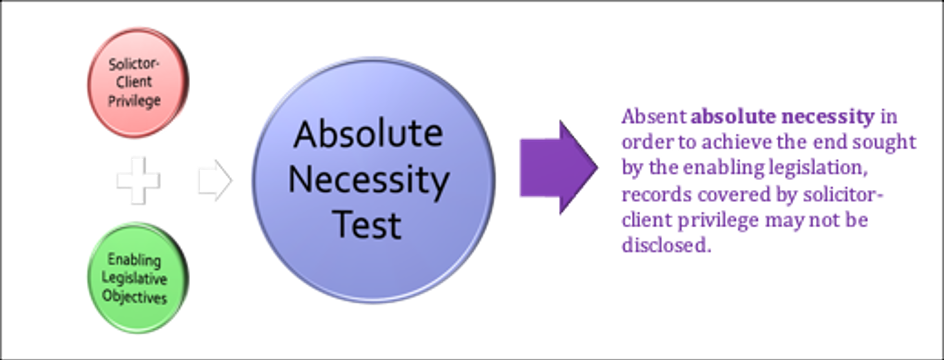

#  Confidentiality

<!-- 
**Commentary**
 -->

## 4.0: Overview

This Module explores in more depth a significant a significant component of that relationship:  **Confidentiality**.  Confidentiality forms the core of the lawyer-client relationship.  Without it you can’t have effective client representation.  The lawyer relies on confidentiality to build their case while the client is reassured that their information remains private unless they give explicit permission to share it. 

We will analyze the **distinct concepts** of the ethical duty of confidentiality and confidentiality as expressed in the legal concept of solicitor/client privilege. As we will review, confidentiality also serves the interests of the legal profession and society in building trust in lawyers.  

In addition to the **Code** and **Statutory provisions** relating to confidentiality and privilege,  there are number of important court **cases** in this area, including Supreme Court of Canada decisions, that we will examine.

!!! note "Readings"

    - Woolley Chapter 3: Confidences Pages 167 - 230 (4th Edition)
    - Code: 3.3-1, 3.3-2, 3.7-9.1, 5-1-2.1, 7.2
    - Cases:
        - ***Descôteaux et al. v. Mierzwinski***, [1982 CanLII 22 (SCC)](https://canlii.ca/t/1lpc6){:target="_blank"}
        - ***Smith v. Jones***, [1999 CanLII 674 (SCC)](https://canlii.ca/t/1fqp9){:target="_blank"}
        - ***R. v. McClure***, [2001 SCC 14](https://canlii.ca/t/5228){:target="_blank"}
        - ***Goodis v. Ontario (Ministry of Correctional Services)***, [2006 SCC 31](https://canlii.ca/t/1nw4f){:target="_blank"}
        - ***Law Society of Saskatchewan v. Merchant***, [2008 SKCA 128](https://canlii.ca/t/216ss){:target="_blank"}
        - ***R. v. Cunningham***, [2010 SCC 10](https://canlii.ca/t/28tlt){:target="_blank"}
        - ***R. v. Murray***, [2000 CanLII 22378 (ON SC)](https://canlii.ca/t/1w0w5){:target="_blank"}

## 4.1: Ethical Duty of Confidentiality & Solicitor Client Privilege

To better understand issues of confidentiality, it may help to frame the legal and ethical obligations as two distinct categories within the overall paradigm of lawyer-client confidentiality.  

- When we speak of **legal protections of communications** between a lawyer and their client, we are referring to **solicitor-client privilege**.  Case law forms common law privilege rights that may be circumscribed through statutes such as the *Legal Profession Act*.  

- The ethical and professional obligations related to **confidentiality** are articulated in the **codes of conduct**, such as the BC **Code**, but may also be elaborated on in case law such as tribunal discipline decisions.  

We will examine both concepts since they touch on ethics and professionalism.

!!! note "Activities"

    Please watch the following video lecture for an overview concepts of confidentiality relating to lawyer-client communications.  We will examine the **similarities and differences** between the ethical duty of **confidentiality vs solicitor-client privilege**.  We will also examine the rationale for preserving client confidences expressed through these principles.

Video Transcript

You’ll see particularly in some of the cases we cover that general principle of **lawyer-client confidentiality is subjected to both state interference and public criticisms**.  

The state, through some laws sometimes dealing with national security or other criminal acts like money laundering, has tried to limit confidentiality of lawyer-client relations in some areas.  The non-lawyer public, often because of the way that the media treats those issues, doesn’t always look favourably on lawyers maintaining absolute confidentiality of a client’s information.  In other words there are times when legal ethics collide with societal ethics and you might have a difficult decision to make regarding which ones take precedence. 

Since the *Charter* came into effect in 1982 you’ve seen a greater number of SCC decisions that expand on **solicitor-client privilege**, elevated it to what **Adam Dodek** calls ”a quasi-constitutional right” and as we’ll see the SCC has called it **a principle of fundamental justice**.  

... the **justifications** for lawyer-client confidentiality and the **differences** between confidentiality and various forms of privilege, and to what extent should these concepts be **discretionary**, from an ethical perspective especially.

So I wanted to highlight first that **privilege is a different concept than confidentiality**.  

- **Privilege is based on law**, and courts are the source of law for issues surrounding privilege.  Traditional issues of privilege involved **evidence issues** like whether some types of communications between lawyers and their clients could be entered into evidence in a trial.  
- **Confidentiality by contrast derives its source from the Code of Conduct** and the interpretation of those rules by Law Society Tribunals. 

The ethical duty of confidentiality is outlined in the BC **Code**, **3.3 – Confidentiality**.

The commentary actually distinguishes this rule from the evidentiary rule of lawyer and client privilege, which it notes is also a constitutionally protected right concerning oral or documentary communications passing between the client and the lawyer.

- The ethical rule is broader and **it applies without regard** to the **nature** of information or **source** of the information or the **fact** that others may share the knowledge.  
- It also **applies to every client** without exception and whether or not the client is a continuing or casual client. Unlike privilege, the confidentiality duty **survives the professional relationship** and continues indefinitely after the lawyer has ceased to act for the client. 
- A lawyer also owes a duty of confidentiality through **an informal relationship**, to anyone seeking legal advice or assistance on a matter invoking a lawyer’s professional knowledge even if they don’t retain you.  So you have to be careful here and confidentiality duty requires you not to disclose that someone has consulted you on a particular matter.  
    - So avoid indiscreet conversations and communications and what the commentaries call “gossip”.  “Apart altogether from ethical considerations or questions of good taste, indiscreet shoptalk among lawyers, if overheard by third parties able to identify the matter being discussed, could result in prejudice to the client.”  Because the **confidentiality duty is broader than privilege**, the Client’s permission to discuss certain matters can be inferred in many situations, like court proceedings. 

There is also the **future harm/public safety exception**. Disclosure without the client’s permission might be warranted because the lawyer is satisfied that truly serious harm of the types identified is imminent and cannot otherwise be prevented. The commentary says these situations will be extremely rare and we’ll look at the case of ***Smith v Jones*** later, where the SCC considers serious harms in this context.  

Generally, disclosure of confidential information is justified based on looking at how you obtained this information and analyzing the likelihood and seriousness of the potential injury to others if the prospective harm occurs and the absence of any other way to prevent the injury. 

So the **Duty of Confidentiality** is quite **broad** and **long-lasting**.  Think of Privilege as not a Duty but a Right.  John Wignore’s description of privilege here is pretty useful:

Where legal advice of any kind is sought from a professional legal adviser, in his capacity as such, the communications relating to that purpose, made in confidence by the client, are at his instance permanently protected from disclosure by himself or by the legal adviser, except the privilege be waived.

- So the differences here with duty of confidentiality are in **types of communications** protected:
    - **privilege only protects the legal advice provided**.
    - Contrast that with **confidentiality duty to protect** “**all information** concerning the business and affairs of a client acquired in the course of the professional relationship.”
- The other difference is **where the information comes from**.  
    - The duty of **confidentiality applies no matter where** the information comes from (although where the information comes from is considered under the exception for public safety).  
    - **Privilege only applies to client communications to lawyer (and vice versa)**. Keep in confidence all information concerning the business and affairs of a client acquired in the course of the professional relationship.

Despite these differences, there is **some overlap** between the two:

- Retainer requirement
    - Requirement of **a lawyer-client relationship for the privilege protection to exist**. 
    - For the confidentiality duty this can be tricky because there’s no clear definition by the Law Society or in case law. The ethical duty of **confidentiality doesn’t require a retainer** as we mentioned it can be someone coming into your office informally or even information disclosed at a meeting at a hotel lounge.  It includes prospective clients.  Basically if you look at the commentaries form the **Code**, if in doubt it’s best not to disclose anything told to you, especially if you don’t need to.

- The other overlapping feature is **the ability of the client to waive confidentiality or privilege**. The waiver can be **explicit or implied** although its always best, particularly with issues of privilege, to get an explicit client waiver.
    - This area become **complicated** when the legal entity you are representing is **a corporation or other organization**, in those cases you have to ensure that the individual waiving confidentiality/privilege has the authority to do so on behalf of the legal entity that you’re representing.  
    - The **scope of the waiver** is another issue.  Clients have the right to grant a waiver to disclose only part of other confidential or privileged information but **it’s generally not lawful to do self-serving partial disclosures**, particularly regarding privileged documents that may benefit one party but not telling the entire story by disclosing all privileged communications.  Both confidentiality and privilege are subject to certain exceptions that we’ll cover in a bit later.

Think of the duty of confidentiality as the core obligation of your relationship as a lawyer with the client.

The excerpt from **Layton** & **Proulx**’s both on *Ethics & Criminal Law* is a good, succinct summary of the rationale for maintaining client confidence through confidentiality.

Scope is broad, but there is both **exclusion and exceptions from confidentiality**, even mandatory exceptions where duty of confidentiality not only permits you but mandates you, obligates, that you break confidentiality and reveal client information. 

Apart from these exceptions and exclusion, the **broad applicability of confidentiality is generally assumed to allow clients to reveal everything** to you as the lawyer that you need to defend them to best of your ability.

**Solicitor client privilege, and by extension the ethical duty of confidentiality, is enhanced in criminal law.**  When you are defending someone accused of a crime, they are facing the power and resources of the state directed against them.  The state is the opposing party and confidentiality becomes critically important to your client’s defense and ability to possibly use constitutional rights in defending themselves.  This is part of the distinction in criminal law where the state is involved as the ”singular antagonist.”  The SCC has said for example that,

In general, judicial deference to government legislation is inappropriate in the criminal law context, where “the government is the singular antagonist of the individual whose constitutional right has been infringed."

Hand in hand with this goes the **enhanced need to protect privilege in the criminal law context**. 
 
## 4.2: Exclusion & Exceptions in Common Law

In this section we will examine those **cases that allow for an exclusion or exceptions from confidentiality or privilege.**  These Supreme Court of Canada cases often explain why this should or should not be done, in what instances it may be appropriate to lift the protections of lawyer-client communications.

This section on exclusion and exceptions from confidentiality can be framed as ”**1 exclusion and 2 exceptions.**"  There are three important Supreme Court of Canada decisions that have illustrated these concepts of exclusion and exemption.

!!! info "***Descôteaux et al. v. Mierzwinski***, [1982 CanLII 22 (SCC)](https://canlii.ca/t/1lpc6){:target="_blank"}"

    The exclusion is known as the **“Crime fraud or criminal communications exception [or exclusion]”** and it is dealt with in the case of ***Descoteaux v Mierzwinski***.  The court held in ***Descoteaux*** that 
    
    > **solicitor-client privilege** was a substantive right that even **existed outside of a court proceeding**.

    The central **issue** generally involved the scope of and procedures for police authority to search lawyers' offices and seize records containing lawyer communications with clients and other confidential information from client files.  The questions involved when **the rights of solicitor-client privilege** arose, as well as the **scope of that privilege when documents themselves were in issue as material evidence**.  
    
    - Is the privilege only triggered after a retainer agreement has been signed?  
    - If there is an exemption to the right of privileged communications, how far should that exemption go?

    Paragraph 27 of the decision formulated and explained the **substantive rule of the right of confidentiality** and how any exclusion from that right applies:

    - The **confidentiality** of communications between solicitor and client **may be raised in any circumstances** where such communications are likely to be disclosed without the client's consent.

    - Unless the law provides otherwise, when and to the extent that the legitimate exercise of a right would interfere with another person's right to have his communications with his lawyer kept confidential, the **resulting conflict should be resolved in favour of protecting the confidentiality**.

    - When the law gives someone the **authority to do something** which, in the circumstances of the case, might interfere with that confidentiality, the decision to do so and the choice of means of exercising that authority should be determined with a view to **not interfering with it except to the extent absolutely necessary in order to achieve the ends sought by the enabling legislation**.

    - **Acts** providing otherwise in situations under paragraph 2 and enabling legislation referred to in paragraph 3 **must be interpreted restrictively**.

    The Supreme Court decided that the communications made by Ledoux relating to his financial means were criminal in themselves since they constituted the material element of the crime that he was charged with. **These specific communications were therefore exempted by the rule of privilege.** The court decided that the police followed the proper and valid procedure during the seizure of the material. 

    Paragraph 71 summarizes the decision.  Information given in confidence for the purposes of obtaining legal advice **attracts confidentiality protections attached to solicitor-client privilege.** This confidentiality applies to any communications of solicitor-client type relationship.  It applies to the lawyer and also applies to their employees as well, since the communications made to employees may directly relate to obtaining legal services or advice.  **It may arrive even before the retainer is established and may be invoked in any circumstances where such communications are likely to be disclosed without the client's consent.** 
    
    The exemption concerns communications which are **inherently criminal** or that are specifically made with the intent of obtaining legal advice **to facilitate the commission of a crime**, those communications will **not be privileged**.

!!! info "***Smith v. Jones***, [1999 CanLII 674 (SCC)](https://canlii.ca/t/1fqp9){:target="_blank"}"

    This case is related to the commentary in **Rule 3.3**, which references the Supreme Court of Canada’s consideration of the meaning of “serious bodily harm” in situations that may help a lawyer assess whether disclosure of confidential information is warranted.  

    The accused attempted to keep secret the professional opinion of a psychologist who had been retained for part of his trial for assaulting a prostitute. The Psychiatrist, the respondent in this appeal, was seeking to publish his opinion of the Appellant's psychology because he felt that the Appellant posed a serious danger to society.  Although he was not the accused’s lawyer the case raised the **issue of solicitor-client confidentiality based on a concern for public safety**.

    The case basically revolves around the psychiatrist’s relationship with the accused in the context of solicitor-client confidentiality.  Although as a psychiatrist he would normally be subject to doctor-patient confidentiality in this case the psychiatrist was acting as an expert for a lawyer.  Privilege was claimed for the client’s conversations with the psychiatrist whom his lawyer retained as an expert to help build the accused’s defence case.  In conversations with the psychiatrist the accused confessed that he had in fact committed the aggravated sexual assault with which he was charged.  **He also revealed to the psychiatrist that he planned to kidnap, rape, and murder more prostitutes in future.**

    The psychiatrist ... filed an affidavit with the court describing the accused’s confession, intending for the information to be made public.  However, the affidavit was sealed, and the psychiatrist then initiated court action to release information, with appeals ultimately leading to the Supreme Court of Canada.

    Consider the issue here, that the psychiatrist’s duty in this case was not merely one of doctor-patient confidentiality, but also consisted of **an “extension” of solicitor-client privilege to expert witnesses**.  In ***Smith***, the court was forced to consider that client communications with defence experts used by lawyers for the purpose of preparing their defence are protected by solicitor-client privilege, **the extension and possible limitations of solicitor-client privilege in this type of situation involving public safety is a main issue in this case.**

    Returning to the BC **Code** **Rule 3.3**, the commentary specifically refers to the decision in ***Smith*** noting that serious psychological harm may constitute serious bodily harm if it substantially interferes with the health or well-being of the individual. 

    Extrapolating the rationale from ***Smith***, the **Code** then advises lawyers considering a disclosure of privileged information to consider a number of factors, including:

    - the **seriousness of the potential injury** to others if the prospective harm occurs;
    - the **likelihood** that it will occur and its imminence;
    - the **apparent absence of any other feasible way** to prevent the potential injury; and
    - the **circumstances** under which the lawyer acquired the information of the client’s intent or prospective course of action.
    
    The Court in ***Smith*** cited a **“public safety exception.”**  It is a limited exception of privileged information, **limited to disclosure only of information deemed necessary to protect public safety.**  As the court stated:
    
    > ... the file will be unsealed and the ban on the publication of the contents of the file is removed, except for those parts of the affidavit of the doctor which do not fall within the public safety exception.

!!! info "***R. v. McClure***, [2001 SCC 14](https://canlii.ca/t/5228){:target="_blank"}"

    The questions before the Supreme Court of Canada in ***McClure*** included:

    - Should the **solicitor-client privilege ever give way to an accused’s right** to full answer and defence?  If so, under what circumstances?
    - If the solicitor-client privilege can be breached, what is the **appropriate test**?
    - Should the **civil litigation file be disclosed** in the circumstances of this case?
    
    To answer the first question, the court examined the **two recognized categories of privilege**:

    - relationships falling within a traditionally protected class: the **“class privilege”** (thereby warranting a *prima facie* presumption of inadmissibility). Examples of class privileges are **spousal privilege** and informer privilege. and 
    - those that are not protected by a class privilege but that may be protected on a case-by-case basis: **“case by case relationship privilege.”** Examples of “case-by-case” relationships include **doctor-patient**, **psychologist-patient**, **journalist-informant** and **religious communications**. 
    
    The court, then references the **Wigmore theory and test**.  Wigmore is not a case, he was an American lawyer and legal scholar.  The 4 part **Wigmore test** dealt with communications made in confidence by a client to a lawyer, relating to legal advice sought from a lawyer and provide the rationale for permanently protecting that communication from disclosure except when the client’s waives privilege.

    However, in Canada there is a *Charter* right for **an accused to have “full answer and defence” as part of  the right to a fair trial.**  This constitutional right stems from Sections 7 and 11 of the *Charter*.  However, the standard in that the right is not perfection.  The court notes that an accused’s right to a fair hearing is not the most favourable procedure that “could possibly be imagined.”

    All of this leads the court in ***McClure*** to conclude that **solicitor-client privilege should only be breached in the “most unusual circumstances.”**  The court then considers the **“Innocence at Stake” exception as the appropriate test** to apply here in considering a breach of solicitor-client privilege.  The court briefly summarizes, at paragraph 46, that **both the right to a fair hearing and solicitor-client privilege are both principles of fundamental justice**, requiring a test to see which one should prevail in certain circumstances:
    
    > The **appropriate test** by which to determine whether to set aside solicitor-client privilege is the **innocence at stake test**.

**The 2 Stages of the “Innocence at Stake” Test**

The “innocence at stake” test is very stringent.  Before the test is even considered, the accused must establish that the information they are seeking in the solicitor-client file is **not available from any other source** and they are **otherwise unable to raise a reasonable doubt** as to his guilt in any other way. That is why it is called the “innocence at stake” test.

The test is applied in two stages: 

- **Stage 1 Evidentiary basis of claim:** Trial Judge Must ask: Is there **some evidentiary basis** for the claim that a solicitor-client communication exists that could raise a reasonable doubt about the guilt of the accused? This is **a threshold requirement designed to prevent fishing expeditions**.

    If Stage 1 is met, then there is a requirement that the communication sought by the accused could raise a reasonable doubt to his guilt. It is likely that the accused has had no access to the file sought and may only provide a description of a possible communication. It would be difficult to produce and unfair to demand anything more precise. It is only at stage 2 that a court determines conclusively that such a communication actually exists.

- **Stage 2 Content of Communications:** Is there something in the solicitor-client communication that is likely to raise a reasonable doubt about the accused’s guilt?

    Unless the solicitor-client communication **goes directly to one of the elements of the offence**, it will not be sufficient to meet Stage 2. Simply providing evidence that advances ancillary attacks on the Crown’s case will generally not be sufficient to meet this requirement.  The trial judge does not have to conclude that the file information **definitely will raise a reasonable doubt**, but the information must **likely raise a reasonable doubt** as to the accused’s guilt in order for Stage 2 to be met.

In ***McClure***, the court held that the circumstances did not justify breaching the solicitor-client privilege. 

You will want to review the ***R. v. Fox***, [2026 SCC 4](https://canlii.ca/t/kj15r){:target="_blank"} decision which applies ***McClure*** and the innocence at stake exception. 

!!! info "***R. v. Fox***, [2026 SCC 4](https://canlii.ca/t/kj15r){:target="_blank"}"

    As part of an investigation by the RCMP into cocaine trafficking, a judge authorized a wiretap to intercept the phone calls of several individuals. The wiretap authorization contained several standard terms to protect solicitor‑client privilege, including a requirement that any person monitoring an intercepted call should discontinue the interception if they reasonably believed that a lawyer was a party to the communication. 
    
    During the investigation, the entirety of a call between F, a criminal defence lawyer, and her client was recorded. As well, a civilian monitor employed by the police listened to the call live for several minutes. After reviewing the recording of the call, a judge ruled that the first part of the call (lasting 2 minutes and 25 seconds) was not protected by solicitor‑client privilege and could be accessed by the RCMP, but that the second part (the remaining 4 minutes and 15 seconds) was privileged and could not be accessed by anyone, including F, without further order of the court. **Based on the non‑privileged part of the call, F was charged with obstruction of justice.** The Crown alleged that F had warned her client about potential police searches and that she had counselled her client to remove or destroy evidence of criminal conduct.

    F applied to the trial judge to exclude from evidence the non‑privileged part of the call, on the basis that the civilian monitor breached the wiretap authorization, and thus infringed F’s right to be free from unreasonable search and seizure under s. 8 of the *Charter*. F also argued that the admission into evidence of the non‑privileged part of the call, when she could not access the privileged part to defend herself, deprived her of the right to a fair trial under ss. 7 and 11(d) of the *Charter*.

    The majority of the SCC held that **a lawyer charged with a criminal offence can invoke the innocence at stake exception to solicitor‑client privilege to seek access to their client’s privileged communications for use in their own defence**. The procedure outlined in ***R. v. McClure***, 2001 SCC 14, [2001] 1 S.C.R. 445, can be adapted for this purpose. 

## Discussion Activity

In ***R. v. Fox***, [2026 SCC 4](https://canlii.ca/t/kj15r){:target="_blank"}, the Supreme Court of Canada determined that **solicitor-client privilege**, while a cornerstone of the legal profession and "near-absolute", **must yield to an accused's constitutional right to make full answer and defence.**  As such, a lawyer charged with an offence may apply for access to their client's privileged communications if it is necessary to defend against the charge. 

Consider whether this decision to have a court-controlled "innocence at stake" exception is a necessary balance for ensuring fundamental justice or whether it weakens public confidence in solicitor-client privilege too much, given the perception of lawyers defending their own? Do you agree or disagree with the conclusion of the SCC? Why or why not?

!!! quote "Answer"

    I believe SCC’s approach in ***R. v. Fox*** to grant an exception based on "innocence at stake" strikes a necessary balance between two fundamental principles, namely, solicitor-client privilege and an accused’s right to make full answer and defence when facing a criminal charge.

    Historically, courts have been the main source of the law of solicitor-client privilege. More recently, solicitor-client privilege has come to be featured in case law as a substantive legal principle and, moreover, has now achieved constitutional status as a “principle of fundamental justice” for the purposes of section 7 of the *Charter*.

    It is also a *Charter* right for an accused to have “full answer and defence” as part of the right to a fair trial in the criminal context. This constitutional right stems from Sections 7 and 11 of the *Charter*. It does not only protect the accused individual, but also protects the integrity of the justice system.

    When the court is evaluating the weight of these two conflicting constitutional rights, the right to a fair trial in the criminal context prevails, which is where the name “innocence at stake” phrase comes from.

    It should also be noted that no other rights can easily overtake solicitor-client privilege. In ***Goodis v. Ontario***, SCC applied the “absolutely necessary” test formulated in ***Descorteaux*** that a judge must not interfere with the confidentiality of communications between solicitor and client “except to the extent absolutely necessary in order to achieve the ends sought by the enabling legislation."

The reason behind the logic of this different approach is that the "innocence at stake" test exists to resolve a conflict between two constitutional principles of fundamental justice. While in ***Goodis***, there was no competing constitutional right to a fair trial in the criminal context. The court confirmed that administrative fairness and statutory disclosure regimes do not override solicitor-client privilege unless the narrow threshold of absolute necessity is met.

## 4.3: Statutory Exceptions

By its very nature confidential and privileged information is important to safeguard in all cases but especially in criminal law.  It is not an unusual situation for police to think that a lawyer may have relevant information about a crime.  We reviewed these concerns in the ***Descoteaux*** case.  Despite these concerns by law enforcement, solicitor-client privilege has continued to be strengthened in Canada into a constitutionally protected principle of fundamental justice based on the legal and ethical importance of the privilege.

However, **governments still have legislative objectives and policy priorities.**  Parliament or provincial legislatures have enacted legislation that tries to **set aside or limit the right** to confidentiality in certain situations.  Because of the controversial nature of this legislation, and the fact that Parliament is essentially pushing the limits of constitutionally protected rights and also challenging many lawyers, it is not a surprise that legislation that tries to limit solicitor-client privilege usually ends up in Court.

!!! info "***Goodis v. Ontario (Ministry of Correctional Services)***, [2006 SCC 31](https://canlii.ca/t/1nw4f){:target="_blank"}"

    

    ***Goodis*** and the absolute necessity test concern **statutory exceptions to solicitor-client privilege**.  
    
    The brief overview of ***Goodis*** involves a journalist applying for access to all records re allegations of sexual abuse of offenders by probation officers of Ontario Correctional Services in Cornwall Ontario.  The Ontario Correctional Ministry claimed solicitor-client privilege to almost all relevant documents.  The Ministry also claimed that the privacy legislation in Ontario explicitly allowed discretion to refuse disclosure of any information protected by solicitor-client privilege.  **One of the main issues therefore involved whether the relevant records could be disclosed to the journalist’s lawyer.**  

    The Court cited the rule from ***Descorteaux***:
    
    > The substantive rule laid down in ***Descôteaux*** is that a judge **must not interfere** with the confidentiality of communications between solicitor and client **“except to the extent absolutely necessary in order to achieve the ends sought by the enabling legislation."**
    
    The court held that in case such as this, the **“absolutely necessary” test** must be applied when deciding on an application for disclosure of records on which solicitor-client privilege is claimed. The absolute necessity test has a high threshold and, **although “absolute necessity” was not clearly defined, it was described as just “short of an absolute prohibition in every case.”**

    When applied to the facts of the case, the court found that the absolute necessity test was not met.  The attempt by the journalist’s lawyer to reinterpret privilege in this case was rejected.  
    
    There is only one test when interpreting whether legislation allows for the abrogation of solicitor-client privilege, and that test is the “absolute necessity” test.  The test is just short of an absolute prohibition. **Absent “absolute necessity” in order to achieve the end sought by the enabling legislation, records covered by solicitor-client privilege may not be disclosed.**

**Comment:**

The "innocence at stake" test from ***R. v. McClure***, 2001 SCC 14 does not apply in ***Goodis v. Ontario (Ministry of Correctional Services)***, 2006 SCC 31 for three core reasons:

- Context: **Civil Administrative Request vs. Criminal Liberty Threat**
    - The "Innocence at Stake" Exception: Arises strictly in the criminal law context. It is rooted in Sections 7 and 11 of the *Charter*, protecting an accused person's right to make a full answer and defense when their liberty is threatened by potential wrongful conviction.
    - The ***Goodis*** Context: ***Goodis*** was a civil/administrative request under freedom of information legislation (*Freedom of Information and Protection of Privacy Act*). The request was made by a journalist seeking access to Ministry records regarding allegations of abuse. Because no individual was facing criminal prosecution or loss of liberty, liberty was not at stake.
- Legal Standard: "Innocence at Stake" vs. "Absolute Necessity"
    - "Innocence at Stake" (***McClure***): Requires showing that the privileged communication goes directly to an element of the offense or is necessary to raise a reasonable doubt as to an accused's guilt.   
    - "Absolute Necessity" (***Descôteaux*** / ***Goodis***): In **civil cases** involving statutory access/exceptions to solicitor-client privilege, the Supreme Court held that the applicable standard is the "absolute necessity" test derived from ***Descôteaux v. Mierzwinski***, 1982 CanLII 22 (SCC). Under this test, statutory provisions or administrative orders cannot abrogate solicitor-client privilege unless it is absolutely necessary to achieve the legislative ends.
- **Nature of the Right** Being Asserted
    - The "innocence at stake" test exists to resolve **a conflict between two constitutional principles** of fundamental justice: solicitor-client privilege vs. a criminal defendant's right to a fair trial.
    - In ***Goodis***, there was **no competing constitutional fair-trial right**. The court confirmed that **administrative fairness and statutory disclosure regimes do not override solicitor-client privilege** unless the narrow threshold of absolute necessity is met.   

!!! info "***Law Society of Saskatchewan v. Merchant***, [2008 SKCA 128](https://canlii.ca/t/216ss){:target="_blank"}"

    The Merchant case involves a provision of the *Saskatchewan Legal Profession Act*, 1990, specifically section 63(1):

    > **Investigation of records**, *etc*. 

    > 63(1) Every member and every person who keeps any of a member’s records or other property shall comply with a demand of a person designated by the society to produce any of the member’s records, or other property, that the designated person reasonably believes are required for the purposes of an investigation pursuant to this Act.

    This is another court case involving an investigation of **Anthony Merchant**. Merchant’s refusal to disclose the information was based on solicitor-client privilege.  The **ex-wife** then learned that Merchant had made 2 payments to **Hunter**, in violation of the order, and informed the Law Society, which began an investigation and requested information from **Merchant** about his dealings with **Hunter**.  **Merchant** refused based on solicitor-client privilege and the Law Society applied to court for an order to physically enter **Merchant**’s office and seize records relevant to the complaint. 

    **So the issues here involved disclosure of privileged information and application of the “absolutely necessity” test.**
    
    - Does disclosure of privilege information to the law society constitute a breach of the privilege?  **The court said that the Law Society is not inside the “envelope” of solicitor-client privilege, so disclosing information is a breach of solicitor-client privilege.**  
    - However, the next question was:  Is a breach and therefore disclosure **“absolutely necessary”** for the law society to fulfill its statutory responsibilities?  The court said that in this case, the answer was: **Yes**. 

    The Court’s decision here turned on an analysis of the relevant provision of the law society’s home statute, the 1990 Saskatchewan *Legal Profession Act*, specifically section 63(1) of that act.  S. 63(1) clearly expresses legislative intention to empower the Law Society demand access to a lawyer’s records or materials.   This creates statutory authorization to records, but those records are still subject to solicitor and client privilege, so you have to analyze it further and apply the “absolute necessity test.”

    The court then analyzed the facts and circumstances of the case and applied the test, authorizing only narrow, limited law society access to Merchant’s file with **Hunter**, specifically access to information only relevant to the **ex-wife**’s complaint of monies paid to **Hunter** directly instead of into the court. 

**Parliament Attempts to Codify Legislative Exceptions to Solicitor-Client Privilege** 

Law enforcement has always had a tension with solicitor-client privilege.  But the tensions were greatly enhanced after the September 11th terrorist attacks.  It’s more accurate to speak of “national security” here rather than "normal" law enforcement, since the Federal Government is usually involved in these matters, and the issue is of national importance rather than a local policing one.  Even in the “national security” context, the Federal Govt usually crafts legislation taking into account the importance of solicitor-client privilege but **because of national security concerns there is a greater likelihood to try to not only circumscribe but also permit more disclosure of lawyer-client communications.**  There was an increased desire after 9/11 to try to legislatively codify exceptions to solicitor-client privilege, **particularly in the context of national security.**

Following the September 11th attacks, and also following the Supreme Court recommendation for legislative action in this area in ***Descôteaux***, Parliament enacted section 488.1 of the *Criminal Code*.  

Section 488.1 did not attempt to deal with the process for authorizing the search of law offices but merely with **the manner in which they are carried out**. Section 488.1(2) required an officer executing a search warrant who was about to seize or examine a document not to examine the document, but to seize it and seal it as if it was in the possession of a lawyer who claimed that a named client of his had a solicitor-client privilege in respect of the document.

The following amendments to Section 488 of the *Criminal Code* of Canada represented Parliament’s attempt to codify **legislative exemption** in context of law enforcement:

!!! warning "488.1"

    (1) In this section,

    **custodian** means a person in whose custody a package is placed pursuant to subsection (2);

    **document**, for the purposes of this section, has the same meaning as in section 321; 

    **judge** means a judge of a superior court of criminal jurisdiction of the province where the seizure was made; 
    **lawyer** means, in the Province of Quebec, an advocate, lawyer or notary and, in any other province, a barrister or solicitor; 

    **officer** means a peace officer or public officer. 

    **Examination or seizure of certain documents where privilege claimed**

    (2) Where an officer acting under the authority of this or any other Act of Parliament is about to examine, copy or seize a document in the possession of a lawyer who claims that a named client of his has a solicitor-client privilege in respect of that document, the officer shall, **without examining or making copies of the document**,

    (a) seize the document and place it in a package and suitably seal and identify the package; **and** 
    (b) place the package in the custody of the sheriff of the district or county in which the seizure was made or, if there is agreement in writing that a specified person act as custodian, in the custody of that person.

In ***R. v. Fink***, [2002 SCC 61](https://canlii.ca/t/51rj){:target _blank}, the Supreme Court of Canada stuck down **s. 488.1 as unconstitutional**.  The court found, among other things, that the requirement that the lawyer claim privilege, and that he name the client, infringed s.8 of the *Charter*.  In the course of so holding, the Court also added to the common law and made 10 procedural suggestions, on which Crown counsel now generally relies upon, as to how the police and courts should proceed in the absence of legislation.

You can see the 10 suggestions (or recommendations) below: 

!!! info "[PROTECTION OF LEGAL PRIVILEGE AND SEIZURE OF ELECTRONIC DATA](https://gowlingwlg.com/en/insights-resources/articles/2020/the-protection-of-legal-privilege-electronic-data/){:target="_blank"}"

    - **No search warrant** can be issued with regard to documents that are known to be protected by solicitor-client privilege.
    - Before searching a law office, the investigative authorities must satisfy the issuing justice that there exists **no other reasonable alternative to the search**.
    - When allowing a law office to be searched, the issuing justice must be rigorously demanding so to afford **maximum protection** of solicitor-client confidentiality.
    - Except when the warrant specifically authorizes the immediate examination, copying and seizure of an identified document, **all documents in possession of a lawyer must be sealed** before being examined or removed from the lawyer's possession.
    - Every effort must be made to **contact the lawyer and the client** at the time of the execution of the search warrant. Where the lawyer or the client cannot be contacted, a representative of the Bar should be allowed to oversee the sealing and seizure of documents.
    - The investigative officer executing the warrant should **report to the justice** of the peace the efforts made to contact all potential privilege holders, who should then be given a reasonable opportunity to assert a claim of privilege and, if that claim is contested, to have the issue judicially decided.
    - If notification of potential privilege holders is not possible, the lawyer who had custody of the documents seized, or another lawyer appointed either by the Law Society or by the court, should examine the documents to **determine whether a claim of privilege should be asserted**, and should be given a reasonable opportunity to do so.
    - The Attorney General may make submissions on the issue of privilege, but should not be permitted to inspect the documents beforehand. **The prosecuting authority can only inspect the documents if and when it is determined by a judge that the documents are not privileged.**
    - Where sealed documents are **found not to be privileged**, they may be used in the normal course of the investigation.
    - Where documents are found to be privileged, they are to be **returned immediately** to the holder of the privilege, or to a person designated by the court.

The court went on to say after listing these suggestions that “Parliament's prerogative to legislate anew in this area of criminal law enforcement would be better exercised, with the benefit of further consultation with those charged or affected by its interpretation and application.”

The court then concluded with this important statement: 

Solicitor-client privilege is a rule of evidence, an important civil and legal right and a principle of fundamental justice in Canadian law. 

While the public has an interest in effective criminal investigation, it has no less an interest in maintaining the integrity of the solicitor-client relationship. Confidential communications to a lawyer represent an important exercise of the right to privacy, and they are central to the administration of justice in an adversarial system. Unjustified, or even accidental infringements of the privilege erode the public's confidence in the fairness of the criminal justice system. 

This is why all efforts must be made to protect such confidences.

In the last 20 years successive governments have not made efforts to change the provisions in the *Criminal Code* relating to search and seizure and privileged information.  **Section 488.1, although struck down, technically remains in the *Criminal Code* of Canada.**

## 4.4: Special Cases

For our final topic in this Module, we will examine two special cases relating to confidentiality and privilege.  

The first involves situations when you are withdrawing from client representation. Are ethical duties of confidentiality and/or solicitor-client privilege engaged here? We have previously reviewed the code provisions in Rule 3.7 dealing with withdrawal generally, and in a criminal context. Here we are concerned specifically with the provision dealing with **Withdrawal and Confidentiality**, which is at **Rule 3.7-9**. The commentary for this provision explictly mentions ***R v Cunningham*** as one of the exceptions contemplated by this provision.  

Specifically, ***Cunningham*** establishes that, in a criminal case, if the disclosure of information related to the payment of the lawyer’s fees is unrelated to the merits of the case, and does not prejudice the accused’s case, the lawyer may properly disclose such information to the court. 

The second case, ***Murray***, involves a client giving his lawyer instructions relating to finding and concealing evidence in a murder case.  ***Murray*** involves important questions of a lawyer's duty to their client and to society involving issues of solicitor-client privilege in a very high-profile criminal trial.

!!! info "***R. v. Cunningham***, [2010 SCC 10](https://canlii.ca/t/28tlt){:target="_blank"}"

    ***R v Cunningham*** dealt with an attempt by a lawyer to withdraw from a case because of non-payment of fees.  The court considered the question of the extent, if any, of a lawyer’s obligations to disclose the reasons for the application to withdraw and the extent to which the disclosure might compromise confidentiality or privilege.  **Paragraph 31** is key passage here and it is located at the middle of p. 282 of the Woolley text excerpt:

    
Disclosure of non-payment of fees in cases where it is unrelated to the merits and will not cause prejudice to the accused is **not an exception to privilege**, such as the innocence at stake or public safety exceptions (see generally ***R. v. McClure***, 2001 SCC 14 and ***Smith v. Jones***, [1999] 1 S.C.R. 455). Rather, non-payment of legal fees in this context does not attract the protection of solicitor-client privilege in the first place. 
    
    However, nothing in these reasons, which address the application, or non-application, of solicitor-client privilege in disclosures to a court, should be taken as affecting counsel’s ethical duty of confidentiality with respect to payment or non-payment of fees in other contexts.

    The court made some interesting comments at the end about withdrawal for ethical reasons: the court ”must grant withdrawal” in those cases.  But it did no go into significant detail on that point.  Much of ***Cunningham*** apart from the confidentially/privilege issue concerns the lawyer withdrawal issue in context of criminal cases.  The **general rule** is that **“[a] court has the authority to require counsel to continue to represent an accused when the reason for withdrawal is non-payment of fees.”** The **two qualifications** to this rule are that the **authority “must be exercised sparingly**, and **only when necessary** to prevent serious harm to the administration of justice.”

One of the most serious situations involving disclosure of client communications arises for a defence counsel when they take custody or have control over real physical evidence linked with the commission of a crime.  This is the point where the concept of “zealous advocacy” on behalf of a client can turn into “hyper zeal.” **Possessing evidence of a commission of a crime is different than the other types of client-lawyer communication** and raises even more serious ethical issues and considerations of what a lawyer should do for their client vs what to do for the profession, and even society as a whole. 

The case of ***R v Murray***, involves client-lawyer communications and solicitor-client privilege, since Murray’s client **Bernardo** was giving him instructions on where tapes relevant to his murder trial were located and how to use them.

!!! info "***R. v. Murray***, [2000 CanLII 22378 (ON SC)](https://canlii.ca/t/1w0w5){:target="_blank"}"

    **Murray**, after being retained and instructed in writing by Bernardo, retrieved six videotapes from the bathroom ceiling on the second floor of the house that Bernardo had occupied with his wife, Karla Homolka.  Murray was with his junior associate and a law clerk when they went to the house and they made a pact not to reveal to anyone what they had found.

    This was proven to have occurred after Murray was retained to defend Bernardo for domestic assault and a number of rapes in Scarborough, and while a police investigation was ongoing for two murders.  

    The facts and the subsequent obstruction of justice case are excerpted in Woolley.   If you read it in Module 1 you want to read it again and in particular consider the facts here:  the removal of the videotapes, the Homulka resolution agreement and Bernardo’s subsequent murder charge; the advice given to Murray’s associate by another lawyer warning against going to the Crown with the evidence.   What was Murray’s plan here?  Was there any clear, coherent plan on what to do with the tapes?

    Consider the ethical, professional and moral dilemmas that Murray faced in this case.  **For criminal lawyers, possessing physical evidence that might incriminate their clients can present serious ethical problems.** 

    **Justice Gravely:**

    [In ***R. v. Murray***, Justice Gravely of the Ontario Superior Court of Justice provided a landmark legal analysis balancing a lawyer's professional duties to a client against the public interest in the administration of justice.]

    - **Solicitor-Client Privilege** vs. **Physical Evidence**
        - Privilege applies only to communications: Solicitor-client privilege protects confidential communications between a lawyer and a client.
        - **Physical items are not protected:** Real, physical evidence of a crime (such as videotapes depicting criminal acts) is not a communication and pre-exists the solicitor-client relationship. While discussions between a lawyer and client regarding physical evidence remain privileged, the physical objects themselves are not privileged.
    - **Duty of Confidentiality** vs. **Public Interest in Justice**
        - No legal right to conceal evidence: Although a lawyer owes a strict duty of confidentiality to their client, **absent solicitor-client privilege, confidentiality provides no legal justification for concealing physical evidence.**
        - Equal standing with ordinary citizens: **Defence counsel has no higher right than any other citizen to conceal evidence or obstruct police investigations.** Taking active steps to hide physical evidence is unlawful regardless of client instructions.
        - Inculpatory vs. Exculpatory nature: Concealment cannot be justified on the grounds that evidence might hold potential exculpatory or tactical value for the defence when it is overwhelmingly inculpatory.
    - The **Three Legally Justifiable Options**. The court established that once a lawyer comes into possession of physical evidence of a crime and discovers its overwhelming significance, **they cannot continue to hide it or follow client directions to keep it suppressed**. The lawyer is left with only **three lawful courses of action**:
        - **Immediately turn over** the evidence to the prosecution (**either directly or anonymously**);
        - **Deposit the evidence with the trial judge** in a sealed packet; or
        - **Disclose the existence of the evidence** to the prosecution and prepare to litigate its retention or admissibility
    - **Interference with the "Course of Justice"** (s. 139(2) *Criminal Code*)
        - Broad scope of protection: Section 139(2) prohibits **improper interference with any part of the justice** system, extending from police investigations to prosecutorial decision-making and trial proceedings.
        - Systemic harm of concealment: Secreting evidence obstructs police investigations, misleads prosecutors during key decisions (such as plea bargains with co-accused), and risks depriving the court and jury of vital admissible facts.

## 4.5: Summary

As you have seen in this module confidentiality is a concept that is central to our legal system.  It's a broad ethical duty but it is also a legal right and privilege that in Canada is a principle of fundamental justice.  

Quite simply, without solicitor-client privilege lawyers would not be able to do their jobs, clients would not be able to communicate effectively with counsel and the public at large would likely lose faith in the system’s ability to function.  Justice demands the ability for confidential communications between lawyers and clients.  Justice also calls for some narrow exceptions to solicitor-client privilege but only in the most extreme cases of absolute necessity and generally only to the extent to permitted by statute.

## Module 4 Quiz

!!! danger "Quiz"

    1. You are a tax lawyer.  In 2001 you successfully defended a then unknown actor against tax evasion charges.  That person does not retain you for any further legal matters.  By 2019 that person has become a famous movie star and his tax struggles are long forgotten.  By 2019 you are still practising but want to delve into the literary field and decide to write an autobiography of that individual.  According to Rule 3.3-2 and associated commentary, which of the following would be the **most acceptable course of action**:
        - [ ] Without that individual’s permission, you write a chapter on that individual’s tax struggles but only using publicly available information, including public news reports about the tax case that you handled, many of which paint the actor in quite a bad way.
        - [x] You write a chapter about the individual’s tax case, using some details of your conversations with the actor, but you obtain his explicit permission in writing to do so.
        - [ ] You write a completely different account of the individual’s tax case not using confidential information but instead using explained fictional anecdotes to paint the actor in the most positive way, without obtaining the actor’s permission.
        - [ ] None of the above.

    2. When the law gives someone the authority to do something which, in the circumstances of the case, might interfere with that confidentiality, the decision to do so and the choice of means of exercising that authority should be determined with a view to not interfering with it except to the extent absolutely necessary in order to achieve the ends sought by the enabling legislation.
        - [x] True
        - [ ] False
    > This statement reflects the commentary under Rule 3.3-1 (Confidentiality) in the Model **Code** / BC **Code** regarding statutory authority. When enabling legislation grants authority that may intrude upon client confidentiality, the decision to exercise that authority and the choice of method must be strictly limited to what is minimally necessary to satisfy the statutory objectives.

    3. Which of the following is more indicative of the ethical **duty of confidentiality** rather than **solicitor-client privilege**?
        - [ ] It is a legal obligation that is a principle of fundamental justice
        - [x] It is a broad obligation in terms of the types of communications covered and how they may affect a client
        - [ ] There is no ethical duty of confidentiality as all confidentiality is rooted in solicitor-client privilege.
        - [ ] It is aimed to protect only private conversations with a client conducted once a legal relationship has been established through signing a retainer agreement.
    > The ethical duty of confidentiality (Rule 3.3-1) applies broadly to all information concerning the business and affairs of a client acquired during the professional relationship, regardless of source. In contrast, solicitor-client privilege is narrower, applying specifically to confidential communications made for the purpose of seeking or giving legal advice, and is recognized as a rule of evidence and a principle of fundamental justice.

    4. According to ***R. v. Cunningham***, when applying to withdraw, Counsel may provide the following reasons without violating solicitor-client privilege:
        - [ ] Ethical reasons
        - [ ] Non-payment of fees
        - [ ] Another specific reason (e.g. workload of counsel)
        - [x] All of the above
    > In ***R. v. Cunningham***, 2010 SCC 10, the Supreme Court of Canada held that counsel seeking to withdraw from a criminal matter may cite ethical reasons, non-payment of fees, or other specific operational reasons (such as workload or illness) without breaching solicitor-client privilege.

    5. According to our readings, what type of legislation would most likely contain provisions to circumscribe solicitor-client privilege?
        - [x] New federal anti-terrorism & money laundering legislation
        - [ ] New federal anti-pollution & environmental standards legislation
        - [ ] New provincial legislation aimed at cracking down on gang related drug violence
        - [ ] New provincial legislation targeted at drunk driving

    6. ***R. v. Murray*** stands for the following concepts:
        - [ ] ***R v McClure***
        - [ ] Solicitor-client privilege protects the retention of physically incriminating documents
        - [x] Relates to Rule 5.1-2A in the **Code**
    > *R. v. Murray* (2000) dealt with a lawyer taking possession of physical evidence (the Bernardo videotapes). The principles established in Murray directly inform Rule 5.1-2A of the Model **Code** / BC **Code**, which addresses a lawyer's duties when in possession of physical evidence of a crime. (Note: Solicitor-client privilege does not protect the possession or concealment of physical evidence of a crime).

    7. The following case dealt with the issue of whether and how the solicitor-client privilege could be breached due to a public safety exception.
        - [ ] ***R v McClure***
        - [x] ***Smith v Jones***
        - [ ] ***Goodis v Ontario***
    > In ***Smith v. Jones***, [1999] 1 S.C.R. 455, the Supreme Court of Canada established the public safety exception to solicitor-client privilege, setting out **a three-part test** (clarity, seriousness of threat, and imminent danger) to determine when privilege must yield to prevent serious bodily harm or death.

## Textbook Summary 167-230

**CHAPTER 3 THE LAWYER’S DUTY TO PRESERVE CLIENT CONFIDENCES**

**Solicitor-Client Privilege:**

**Courts are the source of the law of solicitor-client privilege.** Historically, the common law on solicitor-client privilege tended to arise in relation to evidentiary questions (like, for example, whether a particular communication between a lawyer and their client could be tendered as evidence in court). More recently, however, solicitor-client privilege has come to be featured in case law as a substantive legal principle and, moreover, **has now achieved constitutional status as a “principle of fundamental justice”** for the purposes of section 7 of the *Canadian Charter of Rights and Freedoms*.

**The Duty of Confidentiality:**

**Professional conduct rules** established by law societies and their interpretation by law society tribunals determine the parameters of a lawyer’s professional obligation to preserve client confidences. Breaches of the professional conduct rules governing client confidentiality can result in a lawyer being investigated and potentially disciplined by the law society of which they are a member.

**Differences between Solicitor-Client Privilege and the Duty of Confidentiality**

One difference between solicitor-client privilege and the duty of confidentiality relates to **the nature of the communication**. To be privileged, a lawyer-client communication must be made for the purpose of providing legal advice. In contrast, “all information concerning the business and affairs of a client acquired in the course of the professional relationship” attracts the lawyer’s professional duty of confidentiality.

A second important difference relates to the **source of the information or communication**. Solicitor-client privilege attaches only to information that comes from the client or, in some cases, an agent of the client. In contrast, “[u]nder the codes of conduct it is clear that the lawyer’s obligation of c**onfidentiality applies irrespective of where information came from**.”

