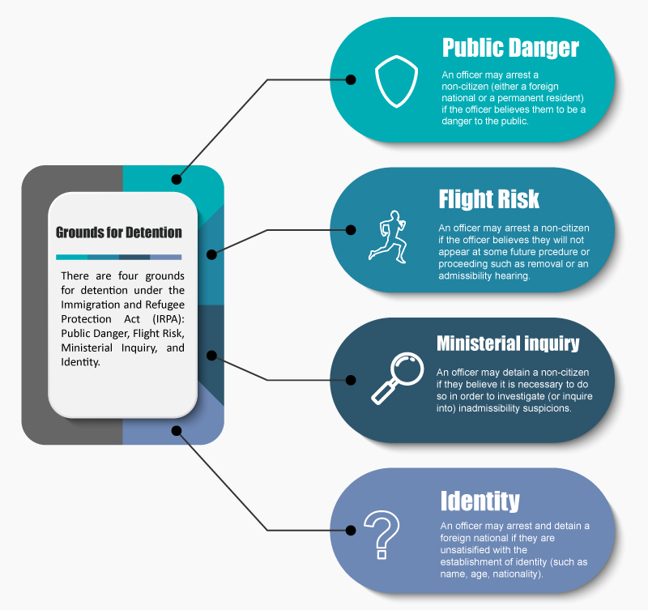

# Module 5: Legal Framework for Immigration Detention

## Notes

??? note "Tutorial notes"

    - Wednesday 4:00pm.

??? note "Readings and Resources"

    - Raj Sharma & Aris Daghighian, *Inadmissibility and Remedies* (Toronto: Emond, 2021). Chapter 3: Process and Procedure, Part III (C or “Arrest”)
    - IRPA, ss 54-60
    - IRPR, ss 244-250
    - Immigration and Refugee Board of Canada, Guideline 2, Guideline of Detention, [Online](https://irb.gc.ca/en/legal-policy/policies/Pages/GuideDir02.aspx){:target="\_blank"}. **Guideline 2 is required reading for Modules 5, 6 and 7. It is central to the second half of this course and must be studied in detail.**
    - ***Sahin v. Canada (Minister of Citizenship and Immigration) (T.D.)***, [1994 CanLII 3521 (FC)](https://canlii.ca/t/4gkx){:target="\_blank"}
    - ***Brown v Canada (Citizenship and Immigration)***, [2020 FCA 130 (CanLII)](https://canlii.ca/t/j93cf){:target="\_blank"}

??? note "Grounds for Detention"

    - Immigration detention is an administrative (not criminal) process. It involves the state holding non-citizens (foreign nationals and permanent residents) in custody. Detainees can be held in custody in jails (even where they have never committed a crime) and immigration holding centres.
    - The Immigration Division holds hearings, called “detention reviews”, at regularly prescribed intervals where the Minister must show that detention continues to be required.
    - two parts of the analysis that occur in every detention review: 
        - Step 1: is there a ground for detention (IRPA 55, 58; IRPR 245-247; other factors)? 
        - Step 2: if so, is detention justified (s. 248 IRPR)?   
    - While the Immigration Division does have authority to detain an individual under **s. 58(2)** of the Act, in almost all circumstances it is **a CBSA officer** who first detains a person for immigration purposes.  Section **55(1)** of the Act sets out the grounds on which a CBSA officer can **issue a warrant** for the arrest and detention of any non-citizen - including permanent residents. 
    - Section **55(2)** sets out the grounds on which a foreign national (other than a protected person) can be detained **without a warrant**.These grounds do not apply to permanent residents of Canada.
    - CBSA officers also have the ability to detain any non-citizen **upon their arrival** into Canada (either by land or by air).  These grounds are set out in **s. 55(3)** of the IRPA. At subsection 55(3) of the Act, we see the power of arrest for **examination or investigation**, which applies to all non-citizens equally, including to permanent residents and protected persons. This arrest power is often referred to as the **“Ministerial inquiry” ground of detention**. 
    - The Minister also has authority under **s. 20.1** of the IRPA to designate groups of persons arriving in Canada as “**designated foreign nationals**”. This provision covers situations where an officer believes that there has been human smuggling or where the officer cannot conduct an examination of a group of people (e.g., for identity/admissibility) in a timely manner. In these circumstances, an officer can designate the group to be “designated foreign nationals”. One consequence of this designation, stipulated at ss. 55(3.1) and 56(2) of the IRPA is **mandatory detention**.

    

??? note "Scenarios for Release"

    - Once a person is arrested and detained under section 55 of the Act, there are two potential scenarios for release: 
        - **Release by a CBSA Officer.**  Subsection 56(1) of the Act provides that, within the first 48 hours, the detainee can be released by an Officer (i.e., by the CBSA), who can also impose any conditions of release deemed necessary.  Although it is less common, counsel may be called upon by a client (especially if it is an existing client) to assist with release negotiations with a CBSA officer right after their client has been detained.  In such circumstances, you would want to discuss with the CBSA officer why the person’s detention should not be continued and/or put together a release plan if possible and negotiate release terms and conditions.  
        - **Release by the Immigration Division.**  Subsection 56(1) also provides that once the Immigration Division holds its first detention review, which must occur within the first 48 hours of detention, it is then only the Immigration Division that can order release or continued detention.  This is the stage where counsel most often gets involved and will be the focus of the rest of this module.   
    - The **Minister bears the burden** of establishing on **a balance of probabilities** that detention should be continued.  In practice, this is a two-step process.  
        - First, the Minister must demonstrate that at least one of the enumerated grounds under s. 58 has been established.  Indeed, **s. 58** mandates that the Division must order release of a person unless it is satisfied that at least one of the enumerated grounds for detention has been made out. 
        - Once the Minister establishes a ground for detention, the Division must then assess each of the factors set out in **s. 248** of the Regulations (referred to as “the s. 248 factors”). In most instances a detained person will be released pursuant to this part of the analysis, not because the Division finds that a ground for detention does not exist.   
    
??? note "Step 1: Is there a ground of detention?"

    - Subsection **58(1)** of the Act sets out the four grounds on which the Division can maintain a person’s detention.
    - Regulation s. 245 provides factors for assessing a non-citizen’s flight risk. Section 246 provides factors for assessing danger to the public. And s. 247 provides factors for assessing identity.
    - ==Danger to public==
        - A danger opinion. A danger opinion written against them for being a danger to the security of Canada under either s. 101(2)(b); 113(d)(i) or (ii) or section 115(2)(a) or (b) of the Act.  It is important for counsel to raise relevant considerations such as the **age of the opinion**, and any **rehabilitation** or other **material changes** that have occurred since the opinion was issued or any other factors that weren’t taken into consideration in the opinion.
        - Association with a criminal organization. However, counsel can work to mitigate any potential association by setting out whether:
            - that association was dated 
            - the individual took steps to leave the association
            - the individual took any rehabilitative steps 
            - the association was at a low level. 
        - People smuggling or trafficking in persons. It is important to put any potential smuggling activities into context (for example, did the person concerned assist in a smuggling endeavor to help themselves escape to safety?). 
        - Previous criminal convictions for specified offences. The factors include convictions inside or outside Canada or pending charges outside of Canada for **sexual** offences, offences involving **violence** or **weapons**, many drug offences including trafficking, importing/exporting and producing a **prohibited substance** under the Controlled Drugs and Substances Act or the Cannabis Act. The Minister often relies on a much **broader range** of criminal convictions to ground their assertion that a person is a danger to the public. Case law is clear that a conviction alone is not enough to ground a danger finding. The Division must also assess factors surrounding a conviction
    - ==Flight Risk== the Division will look at whether the Minister has established on a **balance of probabilities** that the person will not show up for either a **proceeding** (like an admissibility hearing or Minister’s Delegate Review) or, more often, for their **removal** from Canada. This is by far the most common ground of detention that comes before the Immigration Division.
        - Whether the person is a fugitive from justice from another jurisdiction. As counsel it’s important to make sure that any offence they are alleged to have committed is an **offence** in Canada as well, and that the Minister provides evidence that they are actually a **fugitive**. 
        - Whether a person has voluntarily complied with any: previous departure orders, required appearances at an immigration or criminal proceeding, conditions imposed with respect to their entry into Canada, their release from immigration or criminal custody, and conditions imposed along with any stay of removal. 
        - Whether the person has, or has attempted to, avoid an examination or escape from custody. 
        - Whether the person has been involved in smuggling or trafficking of persons or is vulnerable to being influenced or coerced by an organization involved in such an operation such that they are likely not to appear. 
        - Whether the person demonstrates strong ties to a community in Canada. 
    - ==Identity== There are three parts to this assessment.
        - First, the Minister has to establish that they are of the opinion that the identity of a foreign national **has not been and may be established**.
        - Second, the Minister must demonstrate that the person’s identity may be established.  That is, that **there are steps that can be taken** either by the Minister or the person concerned that could result in the person’s identity being established. 
        - Finally, the Minister must demonstrate that either the person concerned is **not cooperating** by providing the Minister with relevant information or that the Minister is making **reasonable efforts** to establish their identity.
        - Regulation **247** sets out the factors that must be assessed when the Division is assessing whether the identity ground has been set out.
        - Whether they have taken steps to obtain evidence of their identity
        - Whether the person is a refugee claimant and whether they or the Minister can obtain identity documents without divulging their personal information to government officials in their home country 
        - Whether the foreign national destroyed their identity or travel document or used false identity documents to mislead CBSA officials  
        - Whether the information that the person concerned has provided is reliable
        - there are many places from where it is impossible to have identity documents, and in such cases, secondary identity evidence should suffice. See: 
            - Warsame v. Canada (Immigration, Refugees and Citizenship), [2019 FC 118](https://canlii.ca/t/hxb9p){:target="\_blank"}
            - Sow v. Canada (Citizenship and Immigration), [2015 FC 295](https://canlii.ca/t/gh3tc){:target="\_blank"}
    - ==Ministerial Inquiry== The Ministerial Inquiry ground is the least common ground of detention (besides detention on the basis of being a designated foreign national). The Minister must demonstrate that they have a reasonable suspicion that the person is **inadmissible** on one of the enumerated grounds **(security s. 34, violating international human rights s. 35, criminality (s. 36) or organized criminality (s.37))**. Typically, the Minister just has to **give a reason for their suspicion**. Once the Minister has demonstrated a reasonable suspicion, the assessment turns to whether or not the Minister is **taking the necessary steps** to investigate the inadmissibility. 

??? note "Step 2: Is detention justified?"

    - If the Immigration Division finds that there is at least one ground of detention under **s. 58** of the IRPA, it must still decide whether detention is actually justified. It does this by considering each of the factors set out in **s. 248** of the Regulations.  
    - The factors set out in IRPR subsections 248(a)-(e) were inserted following a 1994 Federal Court judgment called [*Sahin*](https://canlii.ca/t/4gkx){:target="\_blank"}, in which the Federal Court held that these are among the factors that must be considered in order for a detention to remain consistent with section 7 of the Charter. 
    - the list of s. 248 factors is mandatory (i.e. **every factor in s. 248 must be considered by the Member**), but it is not exhaustive.
    - s. 248 factors explained
    - (a) reasons for detention
        - This factor always weighs in favour of detention, it just depends how much.  When assessing the weight to be given to this factor, the Member must assess which ground they are detaining on as well as the severity of that ground.
    - (b) Length of time in detention
        - As the length of a person’s detention increases it will quickly start to weigh in favour of release.
    - (c) Anticipated length of time in detention
        - An assessment of this factor can take into consideration a variety of factors, but typically looks at how long it is going to be before the procedure or proceeding that the person is being detained for will occur. Simple estimates, not backed by any evidence, should be called into question by counsel, especially as the length of a person’s detention increases.  If a person’s probable length of detention cannot be determined on an ongoing basis, enforcement of a removal order may become illusory, in which case the person should be released.
    - (d) Unexplained delays or lack of diligence
        - This factor can weigh for or against detention.  If the person concerned is not cooperating or is responsible for delay, it can weigh in favour of their detention.  If, however, the Minister is responsible for the delay or has not diligently done what they were supposed to do (for example in investigating a person’s identity), then this factor can weigh in favour of release. 
    - (e) Alternatives to detention
        - This factor requires the Member to look at potential alternatives to a person’s detention to determine if they offset the risks created by the grounds of detention.
    - (f) Best interests of a directly affected child
        - Typically, this will be the person’s children, though it can also be a person’s grandchild, niece or nephew even a neighbour or friend’s child. 
        - There are specific sub-factors that have to be considered by the Member when determining how much weight to accord to this factor. These are outlined in Regulation **248.1(1)** and include: 
            - the child’s physical, emotional and psychological well-being; 
            - their healthcare and educational needs; 
            - the importance of maintaining relationships and the stability of a family environment; 
            - the care protection and safety needs of the child; 
            - and the child’s view and preferences depending on their ability to provide them. 
        - Evidence include a **statement** from the child if they are able to provide one, medical and psychiatric **documentation** and **letters** from friends/family/schools etc. 

## Quizzes

??? note "Module 5: Grounds and Factors for Detention"

    1. Will the FN be detained under the IRPA?
        - [ ] Yes
        - [ ] No
        - [x] Whether or not she is detained is at the discretion of the CBSA

    2. What are the possible ground(s) for the FN's detention? (Check all that apply.)
        - [x] Flight risk
        - [ ] Ministerial inquiry 
        - [x] Identity
        - [ ] Danger to the public

??? note "Module 5: Legal Framework for Immigration Detention"

    1. When addressing the s. 248 factors, which of the following is true: 
        - [x] Each of the s. 248 factors should be addressed at a hearing, even if they do not weigh in favour of release. 
        - [ ] Typically, the s. 248 factors are only addressed if there is an alternative to detention to put forward or detention is lengthy. 
        - [x] The s. 248 factors do not have to be addressed at all if the Minister does not establish a ground for detention. 

    2. Within how many hours would a detention review be held by the Immigration Division after an individual has been taken into detention?  
        - [ ] 24 hours
        - [x] 48 hours
        - [ ] 72 hours
        - [ ] 7 days

    3. On what grounds can a protected person be arrested without a warrant?
        - [x] Ministerial inquiry
        - [ ] Identity
        - [ ] Flight risk
        - [ ] Danger to the public
    > Section 55(3), however, allows for the detention of any foreign national (which would include a protected person who is not yet a permanent resident) for examination or where there are grounds to suspect an inadmissibility. It makes no mention of a warrant.

    4. An arrest warrant under the IRPA is issued by:
        - [x] An Officer
        - [ ] A judge
        - [ ] A member of the Immigration Division
        - [ ] The Minister of Public Safety

    5. Which class(es) of persons can be arrested without a warrant on danger or flight risk grounds?
        - [ ] All
        - [ ] None
        - [x] **Foreign nationals**
        - [ ] Permanent residents
    > Only **s. 55(2) of the IRPA speaks to arrest without a warrant, and it applies only to foreign nationals**.

    6. If a detainee is brought before the Division and the CBSA alleges that identity is not but may be established and argues for continued detention on the ground that the detainee is not cooperating in establishing their identity, invoking ss. 247(1)(a), the Division must …
        - [x] Consider this factor in determining whether the Minister is making reasonable efforts to establish identity
        - [ ] Order continued detention
        - [ ] Order the detainee to cooperate with the CBSA
        - [ ] Order release

    7. The factors listed under s. 248 of the IRPA are:
        - [ ] Mandatory and exhaustive
        - [x] Mandatory but not exhaustive
        - [ ] Optional
        - [ ] None of the above

    8. What is the effect of a conviction for sexual assault on the Division’s determination of whether the person concerned (PC) is a danger to the public?
        - [x] It is a factor that must be considered
        - [ ] It justifies continued detention
        - [ ] It shifts the burden to the detainee to show they have been rehabilitated
        - [ ] It need not be considered if it occurred more than ten years ago

    9. What does Guideline 2 apply to? 
        - [ ] The conduct of CBSA when they decide to issue a warrant to detain somebody
        - [x] How the Immigration Division conducts a detention review
        - [x] How the Immigration Division should apply the various legislative factors when deciding to detain or release. 

    10. On what grounds can a permanent resident be detained without a warrant?
        - [x] Ministerial inquiry
        - [ ] Identity
        - [ ] Flight risk
        - [ ] Danger to the public
    > Section **55(2)** of the IRPA ("Arrest and detention without warrant") applies only the **foreign nationals**. Section **55(3)**, however, allows for the detention of permanent residents for examination or where there are grounds to suspect an inadmissibility. It makes no mention of a warrant.

    11. If Minister is of the opinion that a foreign national’s identity is not but can be established and the Division is satisfied that the Minister is making reasonable efforts to establish identity, the detention must be maintained?
        - [ ] True
        - [x] False
    > False: members must always consider whether release is warranted and must **always consider all of the s. 248 factors** to that end, regardless of the ground of detention.

    12. If a detainee is brought before the Division and the CBSA alleges they are a danger to the public, invoking s. 246(d)(ii) IRPR and the detainee’s past conviction for armed robbery, the Division must …
        - [x] Consider this factor in determining whether the person concerned poses a danger to the public
        - [ ] Order continued detention
        - [ ] Obtain the courts records to verify the conviction
        - [ ] Question the detainee about the circumstances of the offence

    13. True or false: The Division is required to consider the best interests of an affected child only when either the child or the child’s parent are detained?
        - [ ] True
        - [x] False

    14. The CBSA retains the authority to release a detainee until:
        - [x] The 48-hour detention review
        - [ ] They are satisfied that the person will appear at their next hearing
        - [ ] Until the Ministerial Inquiry is complete
        - [ ] A sufficient bond is paid

    15. Which ground of detention applied by the Immigration Division is inapplicable to PRs?
        - [x] Identity
        - [ ] Flight risk
        - [ ] Ministerial inquiry
        - [ ] Danger to the public

    16. Josephine is counsel for Mori, who has an upcoming detention review hearing. In preparing for the hearing, Josephine knows the onus of proof rests on:  
        - [ ] Mori 
        - [x] The Minister
        - [ ] The Minister bears the burden of proof to demonstrate there is a ground of detention but then the burden shifts to Mori. 
        - [ ] Mori bears the burden of proof to demonstrate that there is no ground for detention, but the Minister bears the burden to demonstrate that detention is still justified. 

    17. Where a ground for detention is found to be present, the Division has jurisdiction to order release on conditions….
        - [x] In all cases
        - [ ] Where the detainee presents a viable release plan
        - [ ] When the detention has become unduly lengthy
        - [ ] When the CBSA consents to release
